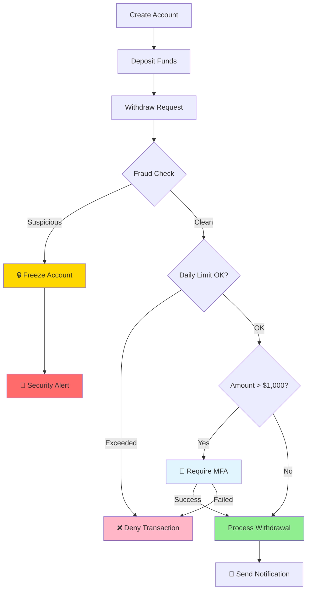
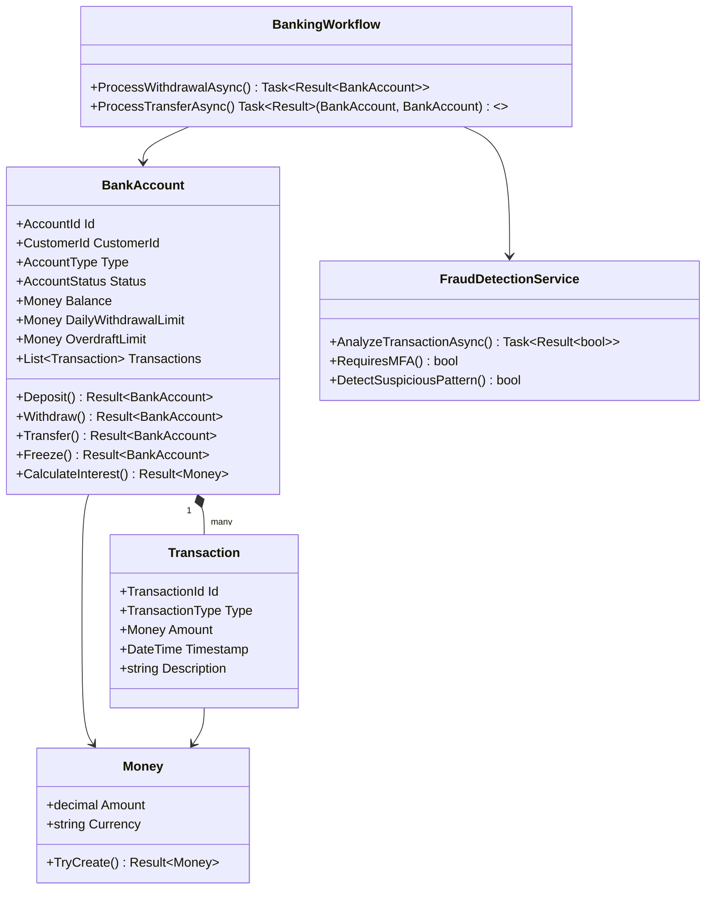
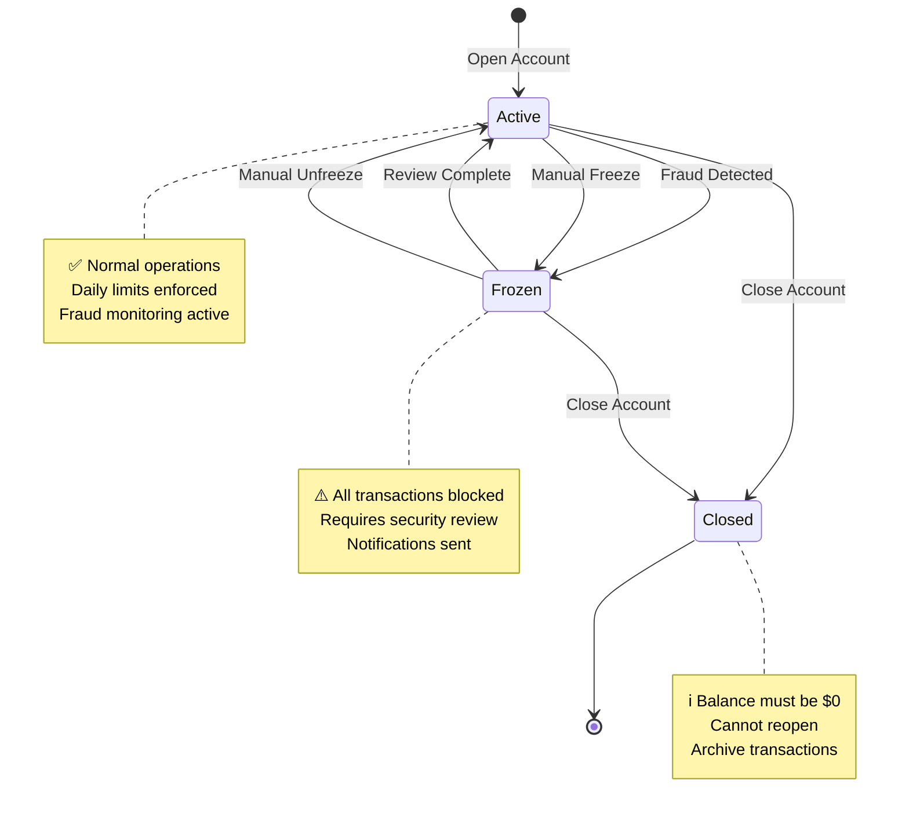
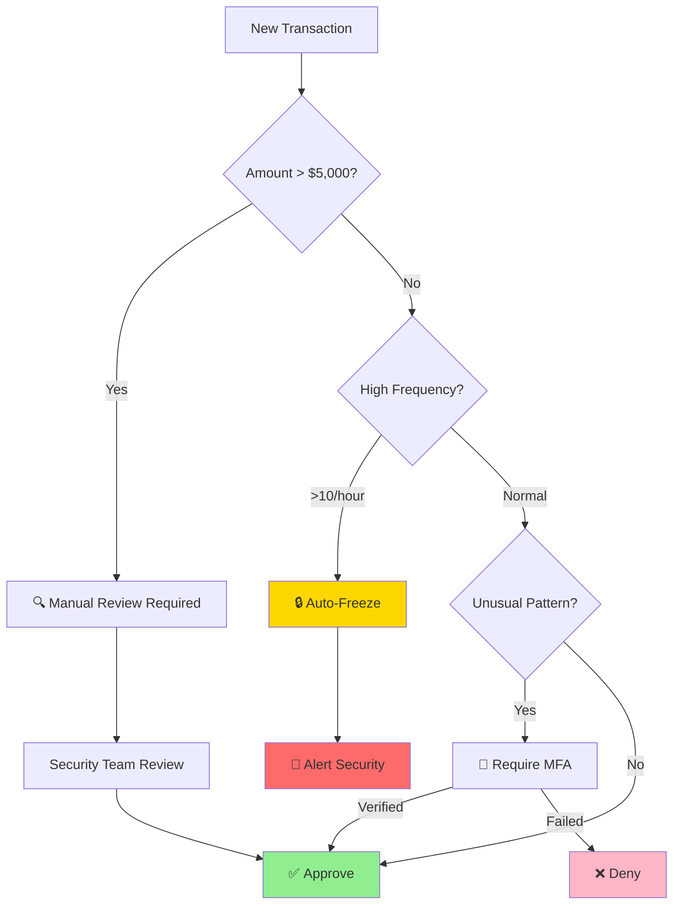
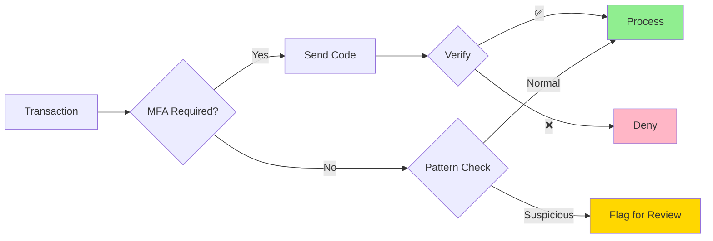
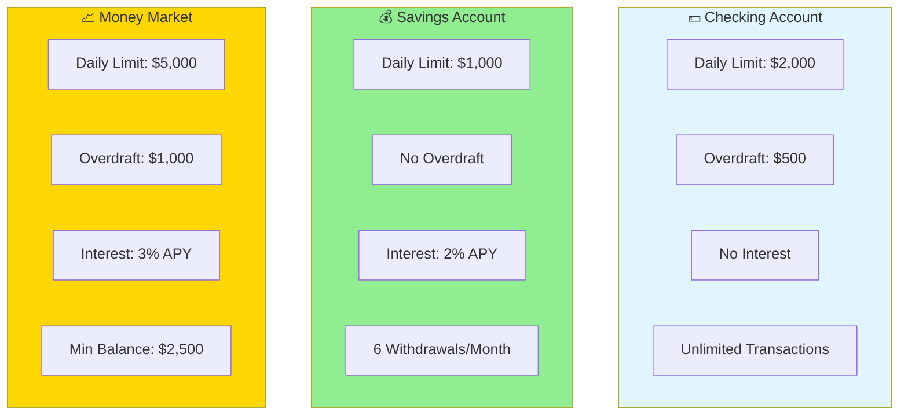
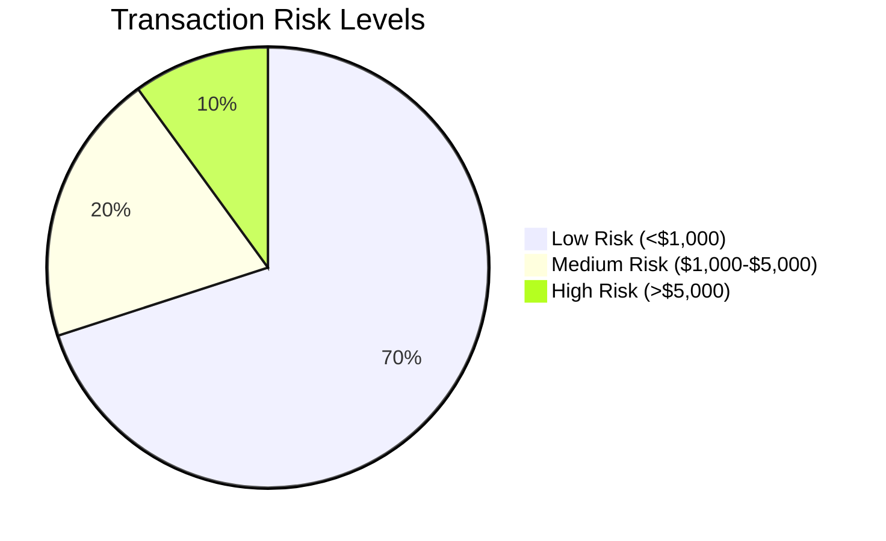
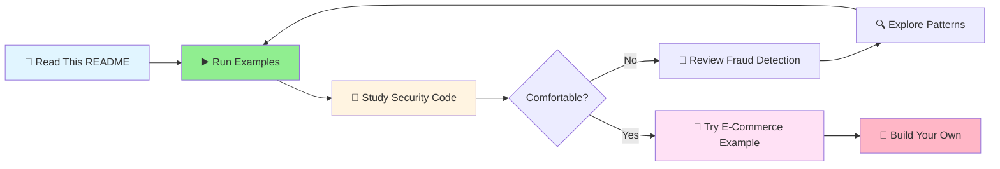

# 🏦 Banking Transaction Example

**Complexity:** ⭐⭐⭐⭐⭐ (Expert) | **Time to Learn:** 3-4 hours

A comprehensive banking system demonstrating **Railway Oriented Programming** (ROP), **Domain-Driven Design** (DDD), and advanced security patterns including fraud detection, multi-factor authentication, and audit trails.



## 🎯 What You'll Learn

This advanced example demonstrates enterprise-grade banking features:
- 🔐 **Security First** - Multi-layered fraud detection and prevention
- 🚨 **Real-time Monitoring** - Pattern detection and anomaly alerts
- ⚖️ **Compliance** - Daily limits, overdraft rules, audit trails
- 🔄 **Error Recovery** - Automatic freeze on suspicious activity
- 📊 **Parallel Processing** - Concurrent fraud checks for transfers

---

## 🏗️ Architecture Overview

### Domain Model



### Account Status State Machine



### Fraud Detection Flow



---

## 📦 Key Components

### Value Objects
- **AccountId**: Unique identifier for bank accounts
- **TransactionId**: Unique identifier for transactions
- **CustomerId**: Unique identifier for customers
- **Money**: Represents monetary amounts with precision

### Entities
- **Transaction**: Represents individual account transactions (deposit, withdrawal, transfer, fee, interest)

### Aggregates
- **BankAccount**: Aggregate root managing account state, balance, and transaction history

### Domain Services
- **FraudDetectionService**: Analyzes transactions for suspicious patterns and validates customer identity

### Workflows
- **BankingWorkflow**: Orchestrates complex banking operations with fraud detection and validation

---

## 🎨 Features Demonstrated

### 1. 🚂 Account Operations with Railway Pattern

Clean transaction processing with automatic validation:

```csharp
return await account.Deposit(amount, "Salary")
    .Ensure(acc => acc.Status == AccountStatus.Active, 
           Error.Validation("Account not active"))
    .Bind(acc => acc.Withdraw(withdrawAmount, "Rent"))
    .Match(
        onSuccess: acc => $"Balance: {acc.Balance} ✅",
        onFailure: err => $"Failed: {err.Detail} ❌"
    );
```

**What's happening:**
1. Deposit salary (validates amount, updates balance)
2. Ensure account is active (business rule check)
3. Withdraw rent (checks limits, validates funds)
4. Match result (handle success or failure)

**If any check fails, subsequent operations are skipped!** 🎯

### 2. 🔐 Multi-Layered Fraud Detection

Real-time security analysis integrated into the transaction flow:

```csharp
return await account.ToResult()
    .EnsureAsync(
        async acc => await _fraudDetection.AnalyzeTransactionAsync(
            acc, amount, "withdrawal", cancellationToken),
        Error.Forbidden("Fraud check failed - transaction blocked")
    )
    .Bind(acc => acc.Withdraw(amount, description))
    .RecoverOnFailureAsync(
        predicate: error => error.Code == "fraud.detected",
        func: async () => {
            await account.Freeze("Suspicious activity detected");
            await _notificationService.AlertSecurityTeam(account.Id);
            return account;
        }
    );
```

**Fraud Detection Rules:**

| Rule | Threshold | Action |
|------|-----------|--------|
| **💰 Large Amount** | > $5,000 | Manual review required |
| **⚡ High Frequency** | > 10 transactions/hour | Auto-freeze account |
| **🎯 Pattern Detection** | 3+ round amounts in 24h | Trigger MFA |
| **📱 MFA Required** | Withdrawal > $1,000 | Require verification code |

### 3. 🔄 Parallel Fraud Checks for Transfers

Concurrent validation for performance and security:

```csharp
var result = await ValidateFromAccountAsync(fromAccount, amount, ct)
    .ParallelAsync(ValidateToAccountAsync(toAccount, amount, ct))
    .WhenAllAsync()
    .BindAsync((fromValid, toValid) => 
        ProcessTransferAsync(fromAccount, toAccount, amount, ct), ct);
```

**Benefits:**
- ⚡ **Faster** - Both accounts checked simultaneously
- 🔒 **Secure** - All checks must pass before transfer
- 🎯 **Atomic** - Transfer fails if any check fails

### 4. 📊 Daily Withdrawal Limits

Automatic tracking and enforcement:

```csharp
account.Withdraw(amount, "ATM")
    .Ensure(acc => acc.GetDailyWithdrawalTotal() + amount <= acc.DailyWithdrawalLimit,
           Error.Validation($"Daily limit ${acc.DailyWithdrawalLimit} exceeded"))
```

**How it works:**
- Tracks all withdrawals for current day
- Resets at midnight
- Configurable per account type
- Different limits for Checking vs Savings

### 5. 💳 Overdraft Protection

Controlled negative balance with limits:

```csharp
account.Withdraw(amount, "Emergency")
    .Ensure(acc => acc.Balance - amount >= -acc.OverdraftLimit,
           Error.Validation($"Overdraft limit ${acc.OverdraftLimit} exceeded"))
```

**Rules:**
- ✅ Checking: $500 overdraft allowed
- ✅ Savings: No overdraft (must maintain positive balance)
- ✅ Money Market: $1,000 overdraft with fee

### 6. 🔐 Security Features

Enterprise-grade security patterns:



**Security Layers:**
1. **Multi-Factor Authentication** - For large transactions
2. **Behavioral Analysis** - Pattern detection
3. **Real-time Monitoring** - High-frequency alerts
4. **Automatic Freeze** - Suspicious activity response
5. **Audit Trail** - Complete transaction history

---

## 💼 Business Rules Implemented

### Account Types & Characteristics



### Transaction Validation Rules

| Validation | Rule | Error Type |
|------------|------|------------|
| **Amount** | Must be > $0 | `ValidationError` |
| **Account Status** | Must be Active | `DomainError` |
| **Daily Limit** | Total ≤ daily limit | `ValidationError` |
| **Balance** | Balance - amount ≥ -overdraft | `ValidationError` |
| **Fraud Check** | Must pass all fraud rules | `ForbiddenError` |
| **MFA** | Required if amount > $1,000 | `UnauthorizedError` |

### Fraud Detection Thresholds



**Risk Actions:**
- 🟢 **Low Risk**: Automatic approval
- 🟡 **Medium Risk**: MFA required
- 🔴 **High Risk**: Manual review + MFA

---

## 🚀 Running the Examples

### 📋 Available Examples

| # | Example | What It Demonstrates | Security Features |
|---|---------|---------------------|-------------------|
| 1️⃣ | **Basic Operations** | Deposits, withdrawals, domain events | ✅ Balance validation |
| 2️⃣ | **Account Transfer** | Transfer between accounts | ✅ Parallel fraud checks |
| 3️⃣ | **Fraud Detection** | Blocking suspicious transactions | ✅ Pattern detection, auto-freeze |
| 4️⃣ | **Daily Limits** | Enforcement of withdrawal limits | ✅ Limit tracking, denial |
| 5️⃣ | **Interest Payment** | Calculating and applying interest | ✅ Rate validation |
| 6️⃣ | **Domain Events** | Event sourcing and change tracking | ✅ Audit trail |

### 🎮 Run All Examples

```csharp
await BankingExamples.RunExamplesAsync();
```

**Expected Output:**
```
═══════════════════════════════════════════════
Example 1: Basic Account Operations ✅
═══════════════════════════════════════════════
Account created: CHK-12345
Deposited: $1,500.00
Withdrawn: $200.00
Balance: $1,300.00
Domain Events: 3

═══════════════════════════════════════════════
Example 2: Account Transfer ✅
═══════════════════════════════════════════════
Transfer from CHK-12345 to SAV-67890
Amount: $500.00
Fraud Check (From): ✅ Passed
Fraud Check (To): ✅ Passed
Transfer Complete!

═══════════════════════════════════════════════
Example 3: Fraud Detection 🚨
═══════════════════════════════════════════════
Large withdrawal attempted: $7,500.00
⚠️ FRAUD DETECTED: Amount exceeds threshold
Account Status: FROZEN
Security Team Notified: ✅

... (continues for all 6 examples)
```

---

## 🎓 Key Learnings

### 💡 What This Example Teaches

| Concept | What You Learn | Real-World Application |
|---------|---------------|------------------------|
| **🔐 Security-First** | Build fraud detection into domain logic | Banking, finance, payments |
| **⚖️ Business Rules** | Enforce complex rules with types | Regulatory compliance |
| **🔄 Error Recovery** | Automatic rollback on security issues | Fraud prevention systems |
| **📊 Parallel Operations** | Concurrent validation for performance | High-volume transactions |
| **📡 Event Sourcing** | Complete audit trail via events | Regulatory reporting |
| **🎯 Pattern Detection** | Identify suspicious behavior | Anti-money laundering |
| **💰 Precision** | Money type prevents rounding errors | Financial calculations |

---

## 🛠️ How to Run

### Option 1: Command Line (Recommended)

```bash
# Navigate to example directory
cd Examples/BankingExample

# Run all 6 examples
dotnet run
```

### Option 2: Visual Studio

1. **Set Startup Project**
   - Right-click `BankingExample` in Solution Explorer
   - Select **"Set as Startup Project"**

2. **Run**
   - Press `F5` (Debug) or `Ctrl+F5` (Run without debugging)
   - Watch console output with security alerts

### Option 3: Run Specific Examples

Edit `Program.cs`:

```csharp
using BankingExample;

// Run all examples
await BankingExamples.RunExamplesAsync();

// OR run individual examples
await BankingExamples.Example1_BasicAccountOperations();
await BankingExamples.Example2_TransferBetweenAccounts();
await BankingExamples.Example3_FraudDetection();
await BankingExamples.Example4_DailyWithdrawalLimit();
await BankingExamples.Example5_InterestPayment();
await BankingExamples.Example6_DomainEventsAndChangeTracking();
```

---

## 📚 Learning Path



### Recommended Study Order

1. **Start Here** → Read this README thoroughly
2. **Run Examples** → Execute `dotnet run` and observe security features
3. **Study Code** → Open files in this order:
   - `ValueObjects/Money.cs` - Precision arithmetic
   - `Aggregates/BankAccount.cs` - Account logic & rules
   - `Services/FraudDetectionService.cs` - Security patterns
   - `Workflows/BankingWorkflow.cs` - Orchestration
   - `BankingExamples.cs` - See it all working

4. **Compare** → Check [E-Commerce Example](../EcommerceExample/README.md) for different domain
5. **Extend** → Add features (see Extensions below)

---

## 🔧 Possible Extensions

Consider implementing these features to practice:

| Feature | Complexity | What You'd Learn |
|---------|-----------|------------------|
| **Account Statements** | ⭐⭐ | Reporting, date ranges |
| **Standing Orders** | ⭐⭐⭐ | Recurring transactions, scheduling |
| **Multiple Currencies** | ⭐⭐⭐⭐ | Foreign exchange, conversion rates |
| **Joint Accounts** | ⭐⭐⭐ | Multiple owners, authorization |
| **Transaction Categories** | ⭐⭐ | Categorization, budgeting |
| **Credit Cards** | ⭐⭐⭐⭐⭐ | Credit limits, interest, payments |
| **Loan Accounts** | ⭐⭐⭐⭐ | Amortization, payment schedules |

---

## 🔗 Related Examples & Resources

### Other Examples
- **[🛒 E-Commerce](../EcommerceExample/README.md)** - Payment processing, order workflows
- **[🚀 QUICKSTART.md](../QUICKSTART.md)** - Choose your learning path
- **[📚 Examples Overview](../README.md)** - All examples with complexity ratings

### Documentation
- **[Error Handling](../../docs/docfx_project/articles/error-handling.md)** - Security errors, forbidden, unauthorized
- **[Advanced Features](../../docs/docfx_project/articles/advanced-features.md)** - Parallel operations
- **[Performance](../../docs/docfx_project/articles/performance.md)** - Benchmarks and optimization

---

## 🎯 Next Steps

**After completing this example:**

✅ You understand **advanced security patterns**  
✅ You can **implement fraud detection**  
✅ You know **parallel validation** techniques  
✅ You've built a **domain-rich aggregate**  
✅ You understand **event sourcing** for audit trails  

**Now try:**
- 🛒 [E-Commerce Example](../EcommerceExample/README.md) for payment workflows
- 🌐 [Web API Examples](../SampleWebApplication/) for HTTP integration
- 📖 [Clean Architecture](../../docs/docfx_project/articles/clean-architecture.md) for app structure

---

**Questions?** Check the [main documentation](../../README.md) or open an issue on GitHub.
