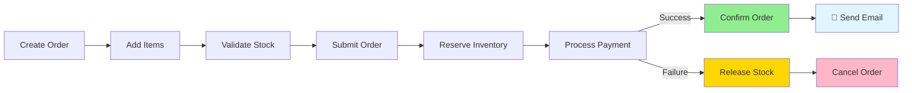
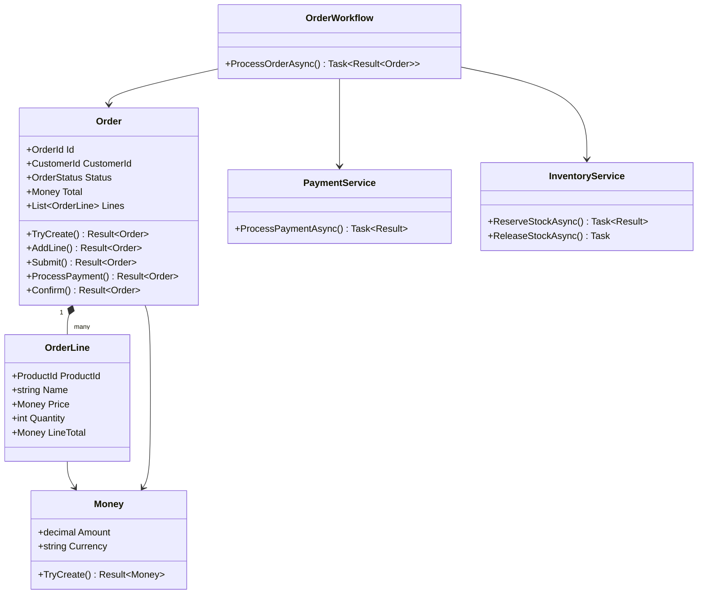
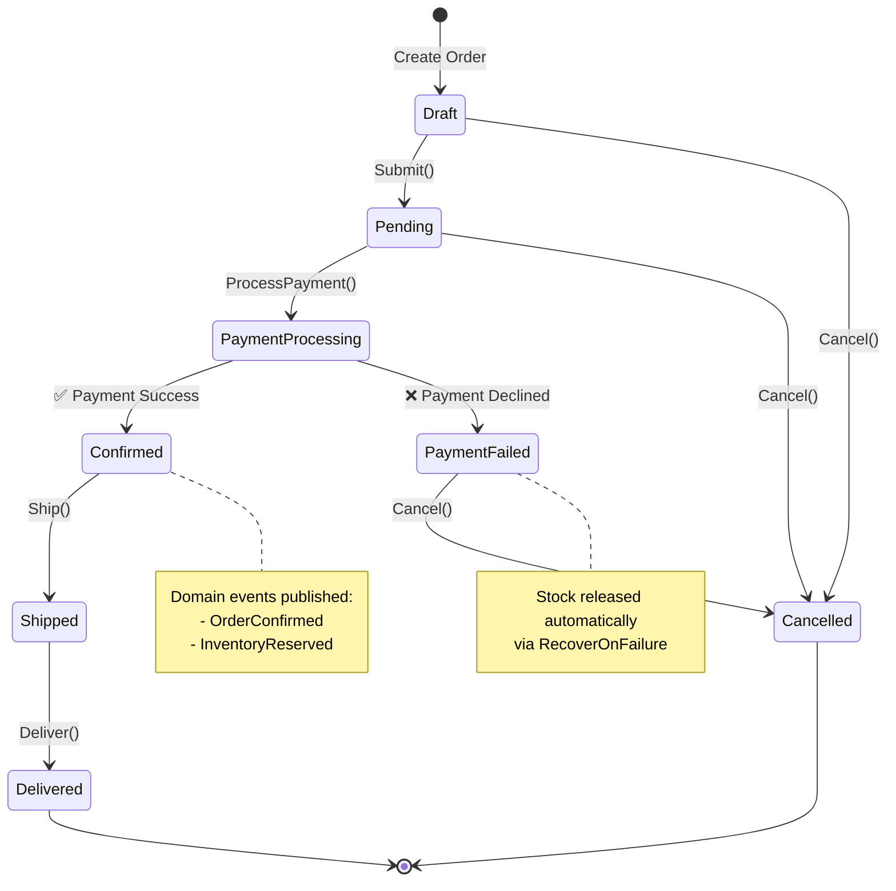
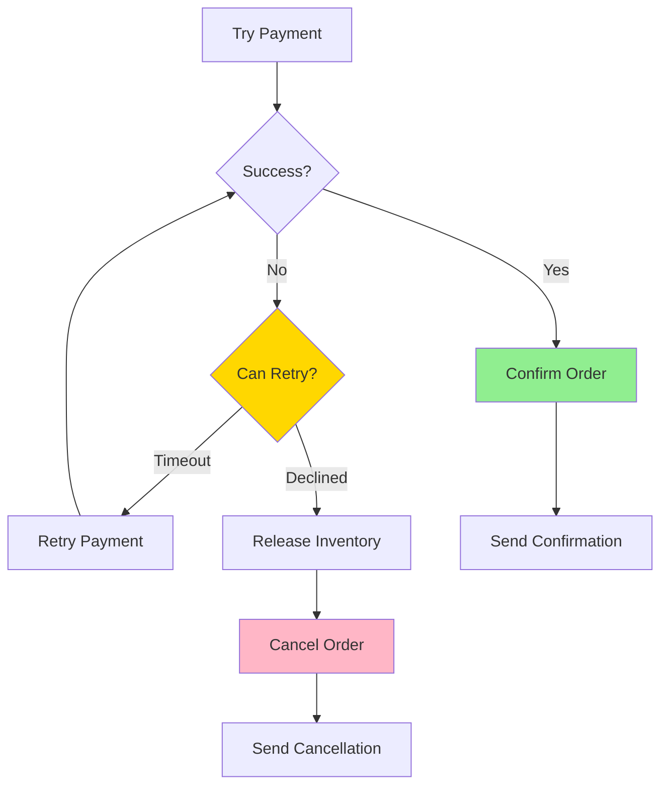
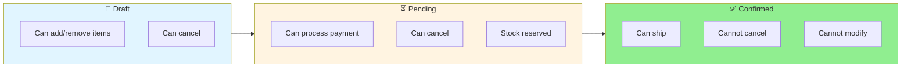
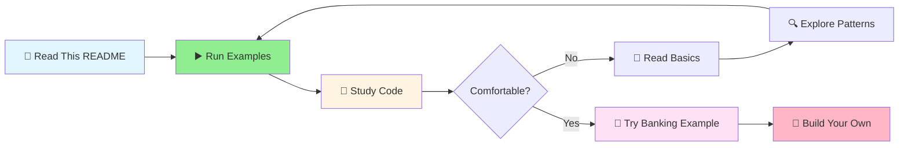

# 🛒 E-Commerce Order Processing Example

**Complexity:** ⭐⭐⭐⭐ (Advanced) | **Time to Learn:** 2-3 hours

A complete e-commerce order processing example demonstrating **Railway Oriented Programming** (ROP) and **Domain-Driven Design** (DDD) in action.



## 🎯 What You'll Learn

This example showcases a robust order processing system with:
- ✅ **Complete order workflow** - From cart to confirmation
- ✅ **Error recovery** - Automatic rollback and retry logic
- ✅ **Domain events** - Event-driven architecture patterns
- ✅ **Parallel operations** - Performance-optimized validation
- ✅ **Type safety** - No primitive obsession

---

## 🏗️ Architecture Overview

### Domain Model



### Order Lifecycle State Machine



---

## 📦 Key Components

### Value Objects
- **OrderId**: Unique identifier for orders
- **ProductId**: Unique identifier for products
- **CustomerId**: Unique identifier for customers
- **Money**: Represents monetary amounts with currency validation

### Entities
- **OrderLine**: Represents a line item in an order with product, quantity, and price

### Aggregates
- **Order**: The aggregate root managing the complete order lifecycle with status transitions

### Domain Services
- **PaymentService**: Handles payment processing with card validation
- **InventoryService**: Manages product inventory and stock reservations
- **NotificationService**: Sends email notifications to customers

### Workflows
- **OrderWorkflow**: Orchestrates the complete order processing flow with error handling and recoverys

---

## 🎨 Features Demonstrated

### 1. 🚂 Railway Oriented Programming Patterns

Clean, composable operations that read like English:

```csharp
return await Order.TryCreate(customerId)
    .Bind(order => order.AddLine(productId, productName, price, quantity))
    .Bind(order => order.Submit())
    .BindAsync(order => ProcessPaymentAsync(order, paymentInfo))
    .TapAsync(order => SendConfirmationEmailAsync(order))
    .MatchAsync(
        onSuccess: ok => "Order processed successfully ✅",
        onFailure: err => $"Order failed: {err.Detail} ❌"
    );
```

**What's happening here:**
1. Create order (returns `Result<Order>`)
2. Add line item (chains onto previous result)
3. Submit order (validates and changes status)
4. Process payment (async operation)
5. Send email (side effect on success only)
6. Match result (handle both success and failure)

**If any step fails, the rest are automatically skipped!** 🎯

### 2. 🔄 Error Handling with RecoverOnFailure

Automatic recovery patterns for resilient workflows:



**Recovery patterns demonstrated:**
- **Payment failures**: Automatic retry on gateway timeouts
- **Inventory shortages**: Suggesting alternative products
- **Transaction rollback**: Releasing reserved inventory on failures

```csharp
.RecoverOnFailureAsync(
    predicate: error => error is ServiceUnavailableError,
    func: async () => await RetryPaymentAsync(order, paymentInfo)
)
```

### 3. ✅ Domain Validation

**Money Validation:**
```csharp
Money.TryCreate(29.99m, "USD")
    .Ensure(m => m.Amount > 0, Error.Validation("Amount must be positive"))
```

**Order Status Transitions:**
```csharp
order.Ship()
    .Ensure(o => o.Status == OrderStatus.Confirmed, 
           Error.Domain("Can only ship confirmed orders"))
```

**Payment Card Validation:**
```csharp
PaymentService.ValidateCard(cardNumber)
    .Ensure(c => c.Length == 16, Error.Validation("Invalid card number"))
```

### 4. ⚡ Async Operations with CancellationToken

All operations support proper cancellation for timeouts and graceful shutdown:

```csharp
await _paymentService.ProcessPaymentAsync(
    order, 
    cardNumber, 
    cvv, 
    cancellationToken)
```

### 5. 🚀 Parallel Validation

Multiple order lines validated concurrently for performance:

```csharp
var result = await GetStudentInfoAsync(customerId, ct)
    .ParallelAsync(GetOrderHistoryAsync(customerId, ct))
    .ParallelAsync(GetPaymentMethodsAsync(customerId, ct))
    .AwaitAsync()
    .BindAsync((info, orders, methods) => 
        CreateCustomerProfile(info, orders, methods));
```

---

## 🚀 Running the Examples

### 📋 Available Examples

| # | Example | What It Demonstrates | Key Concepts |
|---|---------|---------------------|--------------|
| 1️⃣ | **Simple Order Creation** | Basic order creation with domain events | `TryCreate`, domain events, `AddLine` |
| 2️⃣ | **Complete Order Workflow** | Full order processing with event publishing | Async workflow, event publishing, `BindAsync` |
| 3️⃣ | **Payment Failure Handling** | Recovery when payment fails | `RecoverOnFailure`, rollback, notifications |
| 4️⃣ | **Insufficient Inventory** | Handling out-of-stock scenarios | Error handling, alternative suggestions |
| 5️⃣ | **Domain Events Deep Dive** | Event tracking and change detection | `UncommittedEvents()`, `AcceptChanges()`, `IsChanged` |

### 🎮 Run All Examples

```csharp
await EcommerceExamples.RunExamplesAsync();
```

**Expected Output:**
```
═══════════════════════════════════════════════
Example 1: Simple Order Creation ✅
═══════════════════════════════════════════════
Order created successfully!
Domain Events: 2
  - OrderCreated
  - OrderLineAdded

═══════════════════════════════════════════════
Example 2: Complete Order Workflow ✅
═══════════════════════════════════════════════
Order confirmed! Total: $159.99
Payment ID: TXN-12345
Email sent to customer@example.com

... (continues for all 5 examples)
```

---

## 💼 Business Rules Implemented

### Order Lifecycle Rules



**Rules enforced:**
- ✅ **Draft** → **Pending** → **PaymentProcessing** → **Confirmed** → **Shipped** → **Delivered**
- ✅ Orders can be cancelled only in Draft, Pending, or PaymentFailed status
- ✅ Items can only be added/removed in Draft status
- ✅ Payment can only be processed for Pending orders
- ✅ Only Confirmed orders can be shipped

### Inventory Management Rules
- 📦 Stock is **reserved** when order is submitted
- 🔄 Stock is **released** if payment fails or order is cancelled
- ✅ Availability is **checked** before order submission
- ⚠️ Insufficient stock triggers **alternative product suggestions**

### Payment Processing Rules
- 💳 Card validation (format, CVV length)
- 💰 Minimum payment amount validation
- 🔄 Automatic retry on transient failures (timeouts, gateway errors)
- 🆔 Transaction ID tracking for audit trail

---

## 🎓 Key Learnings

### 💡 What This Example Teaches

| Concept | What You Learn | Code Pattern |
|---------|---------------|--------------|
| **🧩 Composability** | Build complex workflows from simple operations | `Bind`, `Map`, `Tap` chaining |
| **📝 Explicit Errors** | All error cases are typed and visible | `Result<T>`, `Error` types |
| **🔄 Recovery** | Automatic rollback and retry logic | `RecoverOnFailure` predicate matching |
| **🔒 Type Safety** | Compiler prevents mistakes | Value objects vs primitives |
| **✅ Testability** | Each component tests independently | Pure functions, no hidden state |
| **📡 Domain Events** | Event-driven architecture | `UncommittedEvents()`, `AcceptChanges()` |
| **⚡ Performance** | Parallel operations where safe | `ParallelAsync`, `AwaitAsync` |

---

## 🛠️ How to Run

### Option 1: Command Line (Recommended)

```bash
# Navigate to example directory
cd Examples/EcommerceExample

# Run all 5 examples
dotnet run
```

### Option 2: Visual Studio

1. **Set Startup Project**
   - Right-click `EcommerceExample` in Solution Explorer
   - Select **"Set as Startup Project"**

2. **Run**
   - Press `F5` (Debug) or `Ctrl+F5` (Run without debugging)
   - Watch console output

### Option 3: Run Specific Examples

Edit `Program.cs`:

```csharp
using EcommerceExample;

// Run all examples
await EcommerceExamples.RunExamplesAsync();

// OR run individual examples
await EcommerceExamples.Example1_SimpleOrderCreation();
await EcommerceExamples.Example2_CompleteOrderWorkflow();
await EcommerceExamples.Example3_PaymentFailureWithRecovery();
await EcommerceExamples.Example4_InsufficientInventory();
await EcommerceExamples.Example5_DomainEventsAndChangeTracking();
```

---

## 📚 Learning Path



### Recommended Steps

1. **Start Here** → Read this README top to bottom
2. **Run Examples** → Execute `dotnet run` and observe output
3. **Study Code** → Open files in this order:
   - `ValueObjects/Money.cs` - See value object pattern
   - `Aggregates/Order.cs` - Understand aggregate root
   - `Workflows/OrderWorkflow.cs` - Learn workflow orchestration
   - `EcommerceExamples.cs` - See it all in action

4. **Compare** → Check out the [Banking Example](../BankingExample/README.md) for different patterns
5. **Practice** → Build your own order processing features

---

## 🔗 Related Examples & Resources

### Other Examples
- **[🏦 Banking Transactions](../BankingExample/README.md)** - Fraud detection, account transfers, security patterns
- **[🚀 QUICKSTART.md](../QUICKSTART.md)** - Choose your learning path
- **[📚 Examples Overview](../README.md)** - All examples with complexity ratings

### Documentation
- **[Railway Oriented Programming](../../docs/docfx_project/articles/basics.md)** - ROP fundamentals
- **[Error Handling](../../docs/docfx_project/articles/error-handling.md)** - All error types
- **[Advanced Features](../../docs/docfx_project/articles/advanced-features.md)** - Parallel operations, LINQ

---

## 🎯 Next Steps

**After completing this example:**

✅ You understand **Railway Oriented Programming**  
✅ You can **compose complex workflows**  
✅ You know how to **handle errors functionally**  
✅ You've seen **domain events** in action  

**Now try:**
- 🏦 [Banking Example](../BankingExample/README.md) for fraud detection patterns
- 🌐 [Web API Examples](../SampleWebApplication/) for HTTP integration
- 📖 [Clean Architecture Guide](../../docs/docfx_project/articles/clean-architecture.md) for application structure

---

**Questions?** Check the [main documentation](../../README.md) or open an issue on GitHub.
