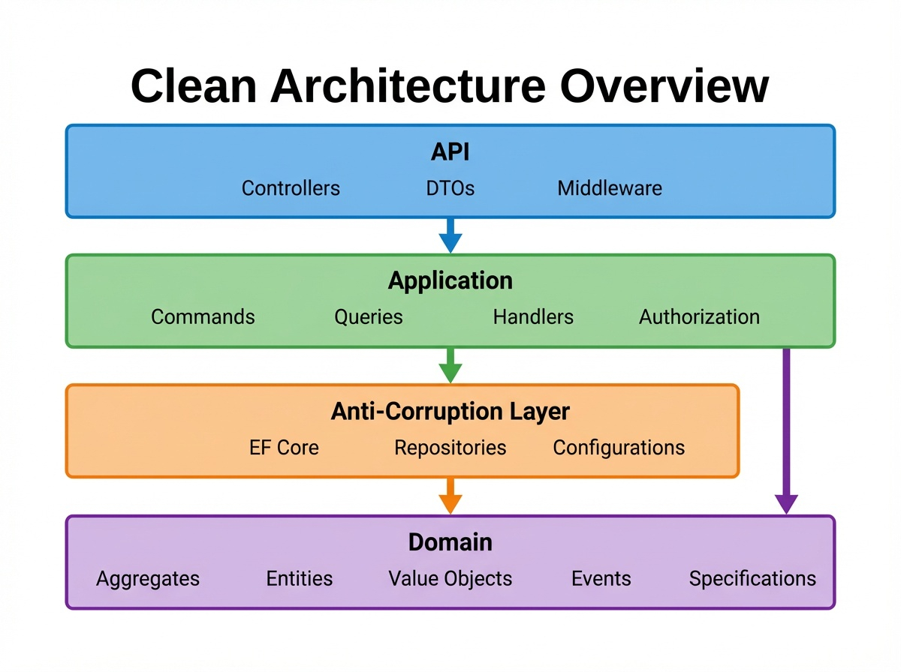

# Trellis

[](https://github.com/xavierjohn/Trellis/actions/workflows/build.yml)
[](https://codecov.io/gh/xavierjohn/Trellis)
[](https://www.nuget.org/packages/Trellis.Results)
[](https://www.nuget.org/packages/Trellis.Results)
[](LICENSE)
[](https://dotnet.microsoft.com/download)
[](https://docs.microsoft.com/en-us/dotnet/csharp/)
[](https://github.com/xavierjohn/Trellis/stargazers)
[](https://xavierjohn.github.io/Trellis/)

<p align="center">
  
</p>

> Typed errors, validated objects, composable pipelines — so .NET enterprise code reads like the business spec that inspired it.

---

## The Problem

You've seen this — 15 lines of defensive code obscuring 3 lines of business logic:

```csharp
public User CreateUser(string firstName, string lastName, string email)
{
    if (string.IsNullOrWhiteSpace(firstName))
        throw new ArgumentException("First name is required");
    if (firstName.Length > 100)
        throw new ArgumentException("First name too long");
    if (string.IsNullOrWhiteSpace(lastName))
        throw new ArgumentException("Last name is required");
    if (!IsValidEmail(email))
        throw new ArgumentException("Invalid email");
    if (_repository.EmailExists(email))
        throw new ConflictException("Email already exists");

    var user = new User(firstName, lastName, email);
    _repository.Save(user);
    _emailService.SendWelcome(email);
    return user;
}
```

Exceptions for control flow. Stringly-typed parameters. Validation scattered across the method. And the caller? It has to `try/catch` every call and guess what went wrong.

## The Fix

```csharp
public Result<User> CreateUser(
    string firstName, string lastName, string email)
    => FirstName.TryCreate(firstName)
        .Combine(LastName.TryCreate(lastName))
        .Combine(EmailAddress.TryCreate(email))
        .Bind((first, last, email) => User.TryCreate(first, last, email))
        .Ensure(user => !_repository.EmailExists(user.Email), Error.Conflict("Email exists"))
        .Tap(user => _repository.Save(user))
        .Tap(user => _emailService.SendWelcome(user.Email));
```

This reads as: *Create a first name, last name, and email. Combine them to create a user. Ensure the email doesn't already exist. Save the user. Send a welcome email.* Any step that fails short-circuits the rest — no nested if-statements, no try-catch, no null checks.

- **`FirstName`**, **`LastName`**, **`EmailAddress`** are strongly-typed value objects. If they exist, they're valid. The compiler catches parameter mix-ups that `string` silently allows.
- **`Result<T>`** is the return type. Success carries a value. Failure carries a typed error (`ValidationError`, `NotFoundError`, `ConflictError`, etc.) that maps directly to HTTP status codes.
- **19 Roslyn analyzers** catch mistakes at compile time: ignored `Result` return values, unsafe `.Value` access, `throw` inside Result chains, blocking on async Results.

<p align="center">
  
</p>

## Key Properties

- **Open source** (MIT) — no vendor lock-in
- **Zero runtime overhead** — 11–16 ns per operation (0.002% of a typical database call)
- **Incremental adoption** — install one package into an existing project, no rewrite required
- **AI-ready** — ships with copilot instructions and a complete API reference that AI coding assistants consume automatically
- **.NET 10 / C# 14**

---

## Quick Start

```bash
dotnet add package Trellis.Results
```

```csharp
using Trellis;

// Validate and compose
var result = EmailAddress.TryCreate("user@example.com")
    .Ensure(email => !email.Value.EndsWith("@spam.com"),
            Error.Validation("Email domain not allowed"))
    .Tap(email => Console.WriteLine($"Valid: {email}"));

// Handle success or failure
var message = result.Match(
    onSuccess: email => $"Welcome {email}!",
    onFailure: error => $"Error: {error.Detail}");
```

For ASP.NET Core, add `Trellis.Asp` to map `Result<T>` directly to HTTP responses:

```bash
dotnet add package Trellis.Asp
```

```csharp
[HttpPost]
public ActionResult<User> Register([FromBody] RegisterUserRequest request) =>
    FirstName.TryCreate(request.FirstName)
        .Combine(LastName.TryCreate(request.LastName))
        .Combine(EmailAddress.TryCreate(request.Email))
        .Bind((first, last, email) => User.TryCreate(first, last, email))
        .Tap(user => _repository.Save(user))
        .ToActionResult(this);
// ValidationError → 400, NotFoundError → 404, ConflictError → 409, success → 200
```

For a complete service built with Trellis, see the **[Training Lab](https://github.com/xavierjohn/trellis-training)** — scaffold, implement, and test an Order Management service in 45 minutes.

---

## Packages

<p align="center">
  
</p>

### Core

| Package | Description |
|---------|-------------|
| [Trellis.Results](https://www.nuget.org/packages/Trellis.Results) | `Result<T>`, `Maybe<T>`, error types, pipeline operators, async extensions |
| [Trellis.Primitives](https://www.nuget.org/packages/Trellis.Primitives) | Base types (`RequiredString`, `RequiredGuid`, `RequiredInt`, `RequiredDecimal`, `RequiredEnum`) + 12 ready-to-use value objects |
| [Trellis.Primitives.Generator](https://www.nuget.org/packages/Trellis.Primitives.Generator) | Source generator — eliminates value object boilerplate |
| [Trellis.DomainDrivenDesign](https://www.nuget.org/packages/Trellis.DomainDrivenDesign) | `Aggregate`, `Entity`, `ValueObject`, `Specification`, domain events |
| [Trellis.Analyzers](https://www.nuget.org/packages/Trellis.Analyzers) | 19 Roslyn analyzers for compile-time safety |

### Integration

| Package | Description |
|---------|-------------|
| [Trellis.Asp](https://www.nuget.org/packages/Trellis.Asp) | `Result<T>` → HTTP responses, `Maybe<T>` JSON/model binding, Problem Details |
| [Trellis.EntityFrameworkCore](https://www.nuget.org/packages/Trellis.EntityFrameworkCore) | Conventions, value converters, `Maybe<T>` queries, `SaveChangesResultAsync` |
| [Trellis.Mediator](https://www.nuget.org/packages/Trellis.Mediator) | CQRS pipeline behaviors for [Mediator](https://github.com/martinothamar/Mediator) |
| [Trellis.Authorization](https://www.nuget.org/packages/Trellis.Authorization) | `Actor`, permissions, resource-based auth returning `Result<T>` |
| [Trellis.Asp.Authorization](https://www.nuget.org/packages/Trellis.Asp.Authorization) | Azure Entra ID v2.0 `IActorProvider` |
| [Trellis.Stateless](https://www.nuget.org/packages/Trellis.Stateless) | State machine transitions returning `Result<T>` |
| [Trellis.Http](https://www.nuget.org/packages/Trellis.Http) | `HttpClient` extensions returning `Result<T>` |
| [Trellis.FluentValidation](https://www.nuget.org/packages/Trellis.FluentValidation) | FluentValidation bridge into the Result pipeline |
| [Trellis.Testing](https://www.nuget.org/packages/Trellis.Testing) | FluentAssertions for `Result<T>` and `Maybe<T>`, test builders |

---

## Performance

ROP adds **11–16 nanoseconds** per operation. Zero extra allocations on Combine.

| Operation | Time | Overhead | Memory |
|-----------|------|----------|--------|
| Happy Path | 147 ns | 16 ns (12%) | 144 B |
| Error Path | 99 ns | 11 ns (13%) | 184 B |
| Combine (5 results) | 58 ns | — | 0 B |
| Bind chain (5) | 63 ns | — | 0 B |

For context: a single database query is ~1,000,000 ns. ROP overhead is 0.0016% of that.

[Detailed benchmarks](BENCHMARKS.md)

---

## AI-Ready Development

Trellis ships with two files that make AI coding assistants effective immediately:

- **`.github/copilot-instructions.md`** — conventions, patterns, and implementation rules. AI assistants (GitHub Copilot, Cursor, etc.) consume this automatically when they open a Trellis project.
- **`trellis-api-reference.md`** — complete API surface covering every public type, method, and extension method.

The **[Trellis ASP Template](https://www.nuget.org/packages/Trellis.AspTemplate)** scaffolds a full clean-architecture solution with both files included:

```bash
dotnet new install Trellis.AspTemplate
dotnet new trellis-asp -n MyService
```

Give an AI a business spec and the scaffolded project — it produces a working enterprise service with correct architecture, error handling, and tests. The **[Training Lab](https://github.com/xavierjohn/trellis-training)** demonstrates this with a 57-criteria evaluation showing 93–96% consistency across independent AI runs.

---

## Adoption Path

Trellis does not require a rewrite. Adopt it one endpoint, one method, one service at a time.

1. **Install `Trellis.Results`** — start returning `Result<T>` from new methods
2. **Add `Trellis.Primitives`** — introduce value objects for new domain concepts
3. **Add `Trellis.Asp`** — map Results to HTTP responses on new endpoints
4. **Migrate gradually** — convert existing endpoints one at a time

No runtime services, no hosted processes, no network dependencies. Old and new patterns coexist in the same project.

---

## Documentation

| Resource | Description |
|----------|-------------|
| **[Documentation Site](https://xavierjohn.github.io/Trellis/)** | Tutorials, integration guides, analyzer rules, API reference |
| **[Training Lab](https://github.com/xavierjohn/trellis-training)** | Build an Order Management service with AI — doubles as a consistency benchmark |
| **[Quick Start Guide](Examples/QUICKSTART.md)** | From zero to working code in 5 minutes |
| **[Changelog](CHANGELOG.md)** | Version history and migration notes |

---

## Contributing

Contributions welcome. Fork, branch, PR. All tests must pass (`dotnet test`). New features require tests and documentation. For major changes, [open an issue](https://github.com/xavierjohn/Trellis/issues) first.

## License

MIT — see [LICENSE](LICENSE).
