# Mermaid Diagrams for Documentation

This document contains reusable Mermaid diagram scripts for the FunctionalDDD documentation. All diagrams use the ````mermaid` code fence and are compatible with DocFX, GitHub, and mermaid.live.

## Table of Contents

1. [Architecture Diagrams](#architecture-diagrams)
2. [Railway-Oriented Programming](#railway-oriented-programming)
3. [Entity Framework Integration](#entity-framework-integration)
4. [Error Handling](#error-handling)
5. [Value Objects](#value-objects)
6. [Domain-Driven Design](#domain-driven-design)
7. [Sequence Diagrams](#sequence-diagrams)

---

## Diagrams Added to Documentation

### ? clean-architecture.md (6 diagrams added)

1. **Simple Pattern Architecture** - Shows 3-layer architecture (API, Domain, Infrastructure)
2. **CQRS Architecture** - Shows 4-layer architecture with Application layer
3. **User Registration Sequence** - Complete flow from HTTP request to response
4. **Railway-Oriented Flow** - Simple Pattern ROP chain visualization
5. **CQRS Command Flow** - Sequence diagram with Mediator and Event Bus
6. **Dependency Flow** - Clean architecture dependency rules
7. **Validation Layers** - Three layers of validation (API, Application, Domain)

### ? integration-ef.md (4 diagrams added)

1. **Repository Pattern Architecture** - Shows Maybe<T> and Result<T> usage
2. **Maybe vs Result Decision** - Flowchart showing when to use each
3. **Database Command Result** - Exception handling in SaveAsync
4. **Exception Handling Strategy** - Expected vs unexpected failures

---

## Architecture Diagrams

### Simple Pattern Architecture (clean-architecture.md)

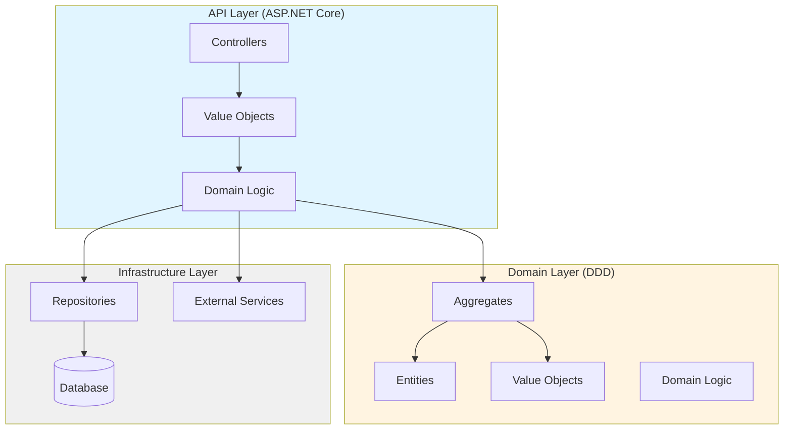

### CQRS Pattern Architecture (clean-architecture.md)

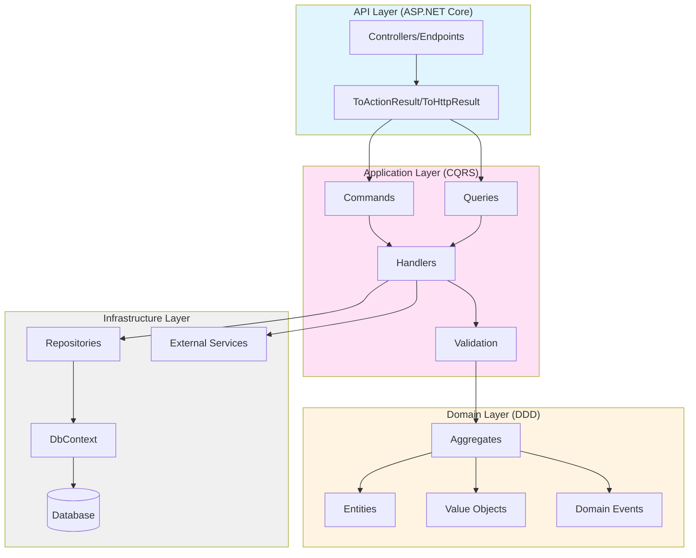

---

## Railway-Oriented Programming

### Happy Path Flow (basics.md, intro.md)

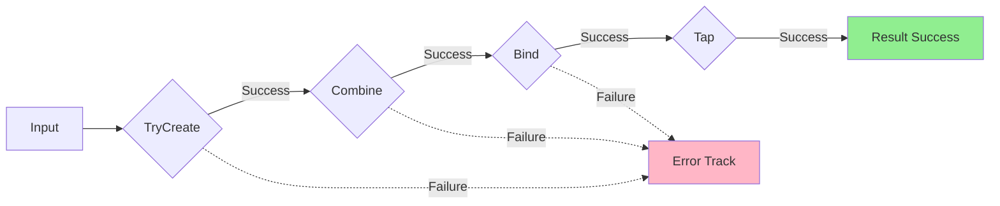

### Complete ROP Chain (basics.md)

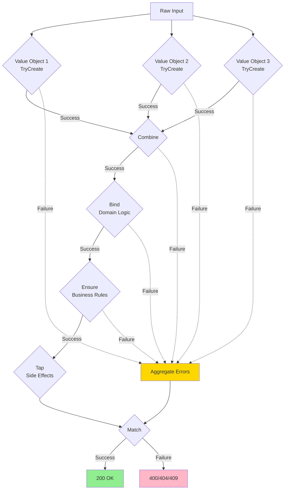

### Railway Track Metaphor (intro.md)

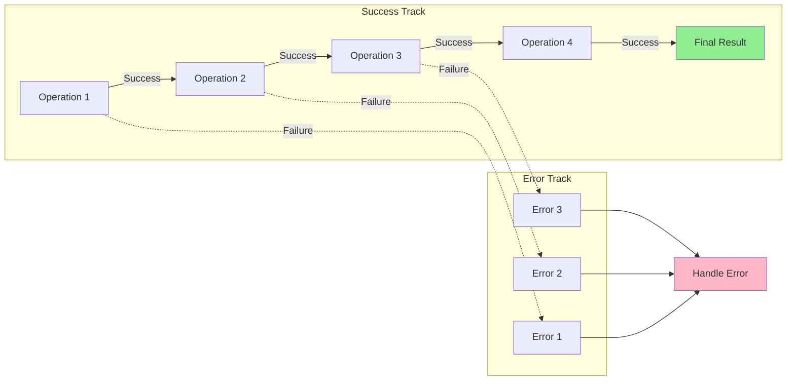

---

## Entity Framework Integration

### Repository Pattern Architecture (integration-ef.md) ? ADDED

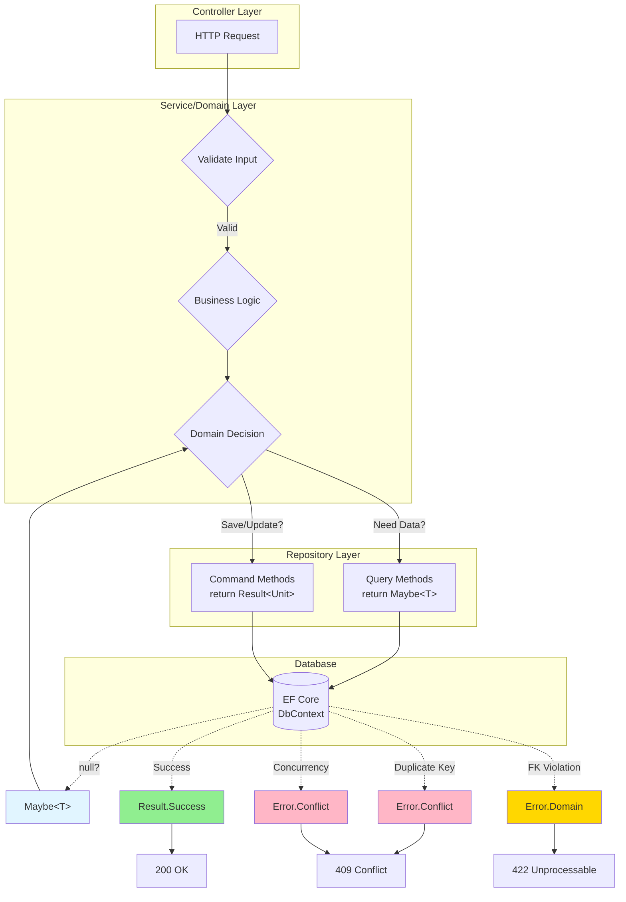

### Maybe vs Result Decision (integration-ef.md) ? ADDED

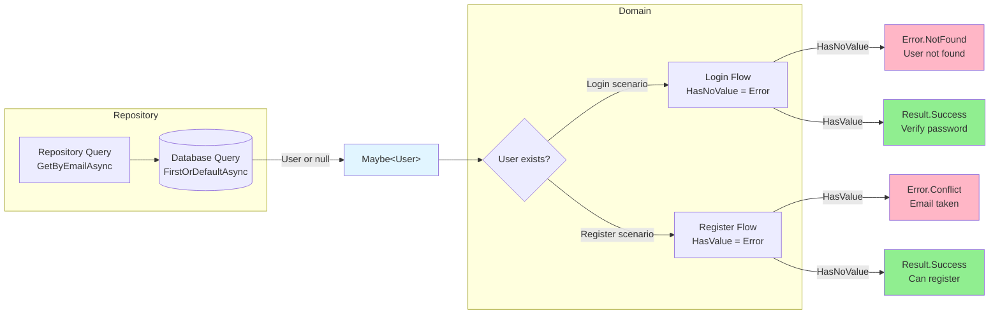

### Database Command Result Pattern (integration-ef.md) ? ADDED

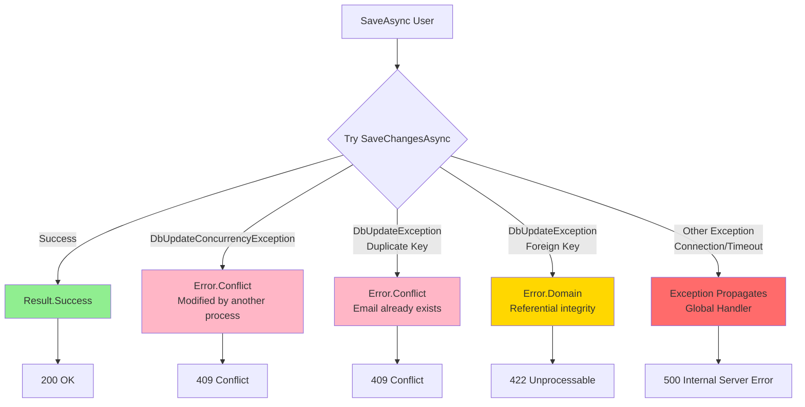

### Exception Handling Strategy (integration-ef.md) ? ADDED

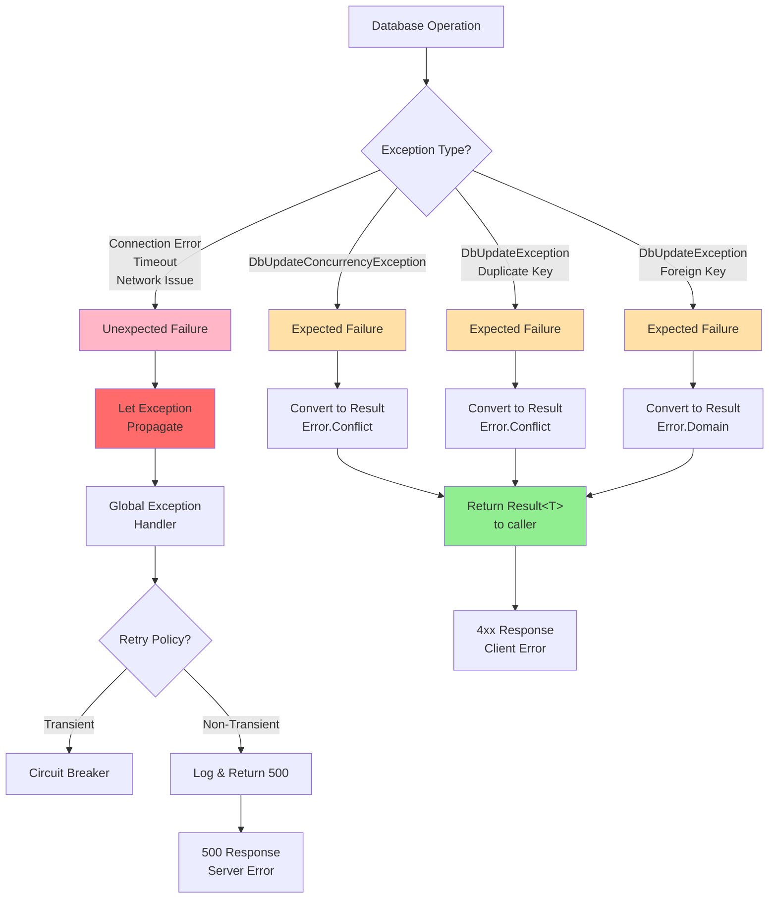

---

## Error Handling

### Error Type to HTTP Status Mapping (error-handling.md, integration-aspnet.md)

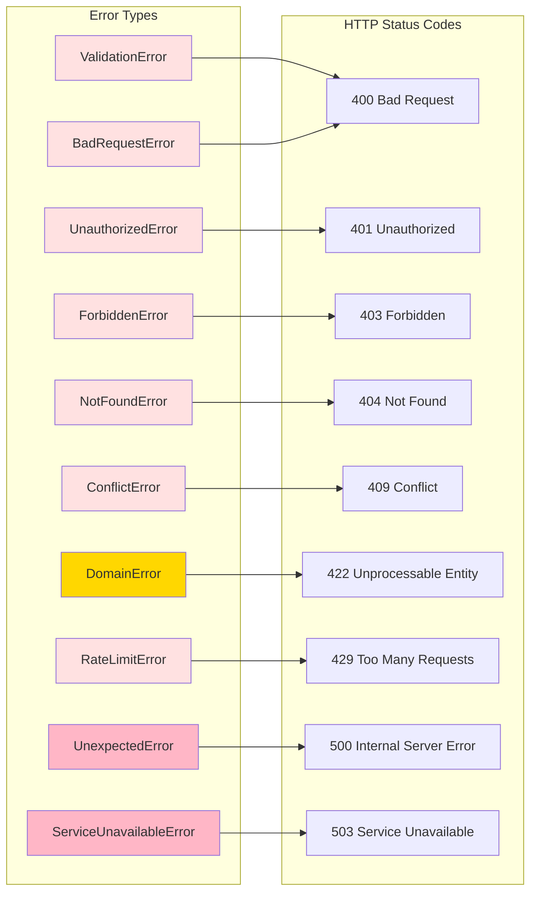

### Error Aggregation (error-handling.md)

```mermaid
flowchart TB
    START[Multiple Operations] --> OP1[Operation 1]
    START --> OP2[Operation 2]
    START --> OP3[Operation 3]
    
    OP1 --> RES1{Result 1}
    OP2 --> RES2{Result 2}
    OP3 --> RES3{Result 3}
    
    RES1 -->|ValidationError| VAL1[Email invalid]
    RES2 -->|ValidationError| VAL2[Password weak]
    RES3 -->|Success| OK
    
    VAL1 --> COMBINE[Combine Errors]
    VAL2 --> COMBINE
    
    COMBINE --> AGG[AggregateError<br/>Multiple validation errors]
    
    AGG --> RESPONSE[400 Bad Request<br/>errors: {<br/>&nbsp;&nbsp;email: [...],<br/>&nbsp;&nbsp;password: [...]<br/>}]
    
    style VAL1 fill:#FFB6C6
    style VAL2 fill:#FFB6C6
    style OK fill:#90EE90
    style AGG fill:#FFD700
```

---

## Value Objects

### Value Object Class Diagram (PrimitiveValueObjects README)

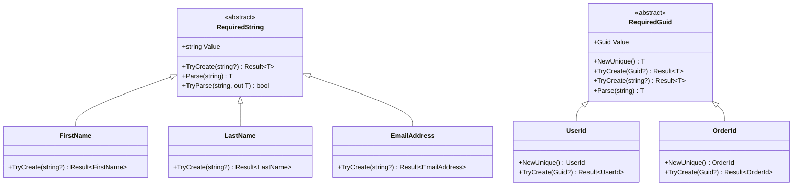

### Value Object Validation Flow (PrimitiveValueObjects SAMPLES)

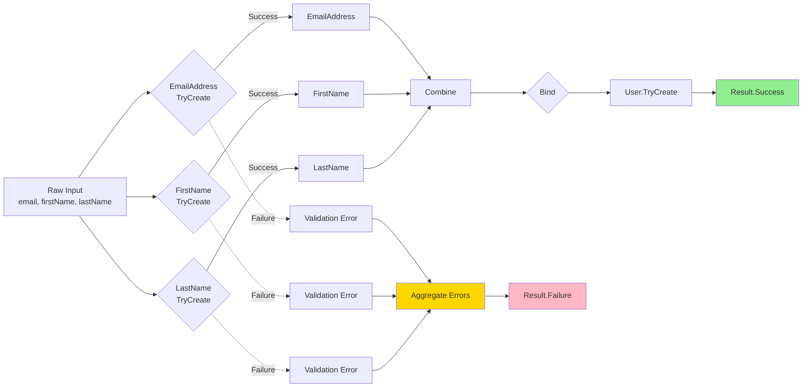

---

## Domain-Driven Design

### Aggregate Pattern (DomainDrivenDesign README)

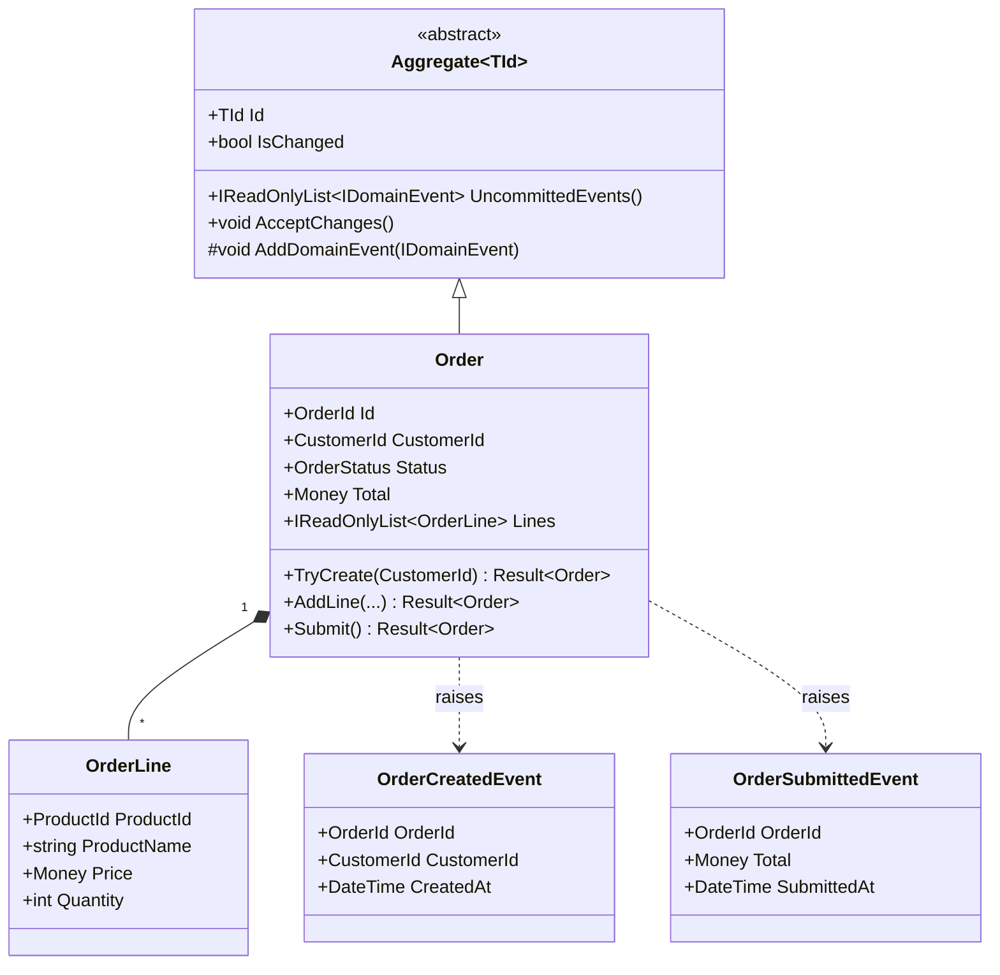

### Entity vs Value Object vs Aggregate (DomainDrivenDesign README)

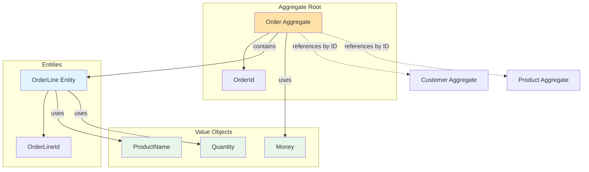

---

## Sequence Diagrams

### User Registration Flow (clean-architecture.md)

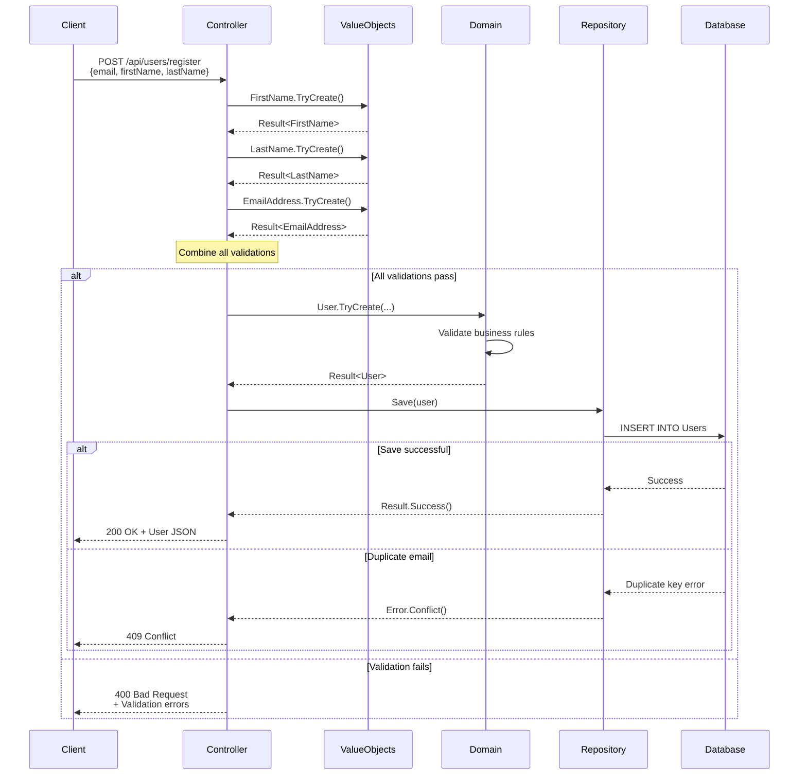

### CQRS Command Flow (clean-architecture.md)

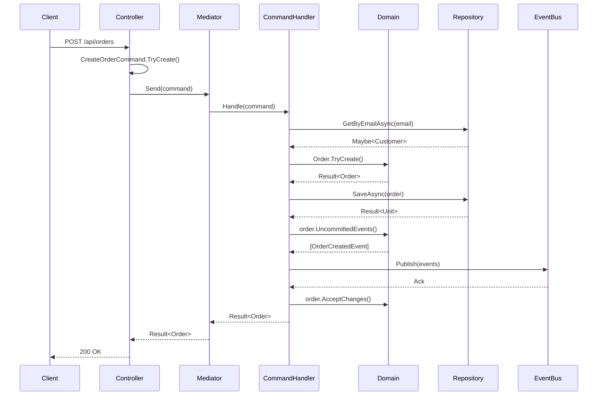

### OpenTelemetry Tracing Flow (integration-observability.md)

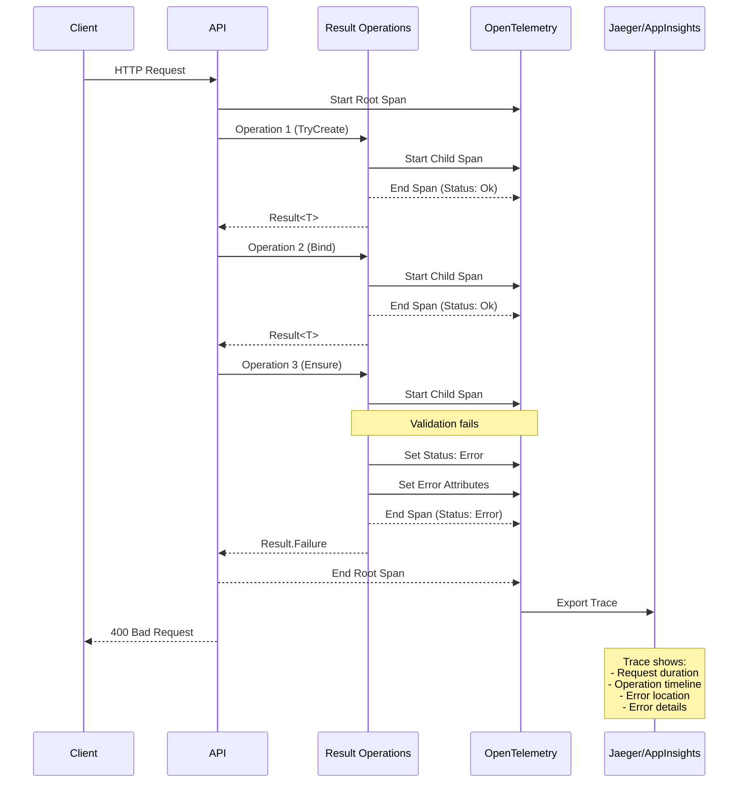

---

## Usage Instructions

### In DocFX Markdown Files

Simply paste the diagram code with triple backticks and `mermaid` language identifier:

````markdown
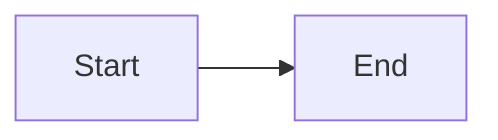
````

### Testing Diagrams

1. **Mermaid Live Editor**: https://mermaid.live/
2. **GitHub Preview**: Commit and view on GitHub (supports Mermaid natively)
3. **VS Code Extension**: Install "Markdown Preview Mermaid Support"

### Color Palette Used

- Success: `#90EE90` (Light Green)
- Error: `#FFB6C6` (Light Pink)
- Warning: `#FFD700` (Gold)
- Info: `#E1F5FF` (Light Blue)
- Neutral: `#F0F0F0` (Light Gray)
- Critical: `#FF6B6B` (Red)
- Highlight: `#FFE1A8` (Light Orange)

### Best Practices

1. **Keep diagrams simple** - Focus on one concept per diagram
2. **Use consistent colors** - Follow the palette above for consistency
3. **Add descriptions** - Include a paragraph explaining what the diagram shows
4. **Test before commit** - Verify diagrams render correctly in mermaid.live
5. **Mobile-friendly** - Avoid overly complex diagrams that don't render well on mobile

---

## Contributing

To add a new diagram:

1. Create the diagram in [mermaid.live](https://mermaid.live/)
2. Test it renders correctly
3. Add it to this document with proper categorization
4. Include usage notes and which doc files it's suitable for
5. Use the established color palette for consistency

---

**Last Updated:** December 2024
**Mermaid Version:** Compatible with DocFX, GitHub, and Mermaid Live v10+
