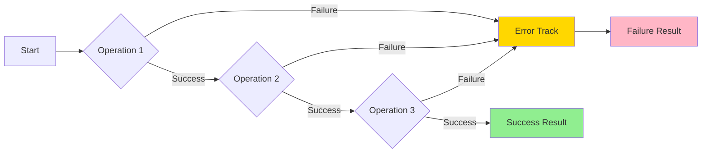
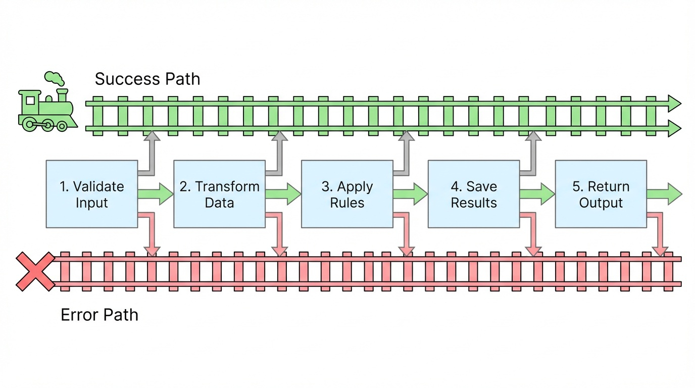
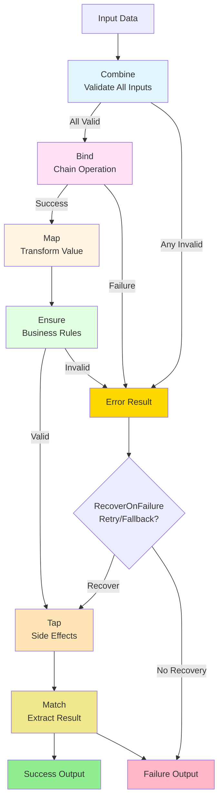
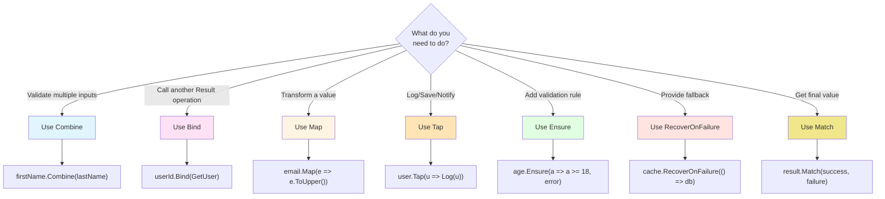

# Basics

Learn the fundamentals of Railway-Oriented Programming (ROP) and type-safe domain modeling in just a few minutes.

## Table of Contents

- [What is Railway-Oriented Programming?](#what-is-railway-oriented-programming)
- [Why Avoid Primitive Obsession?](#why-avoid-primitive-obsession)
- [Result Type](#resulttvalue-type)
- [Core Extension Methods](#core-extension-methods-building-blocks)
- [Putting It All Together](#putting-it-all-together)
- [Working with Async Operations](#working-with-async-operations)
- [Common Beginner Questions](#common-beginner-questions)
- [Quick Reference](#quick-reference)
- [Next Steps](#next-steps)

## What is Railway-Oriented Programming?

Railway-Oriented Programming is a functional programming pattern that treats your code like a railway track with **two paths**:

- 🟢 **Success Track** - Operations continue when everything works
- 🔴 **Failure Track** - Errors are captured and propagated automatically

Instead of checking for errors after every operation, ROP lets you chain operations together. If any step fails, the rest are automatically skipped—like a train switching to an error track.



**Benefits:**
- ✅ Explicit error handling (no hidden exceptions)
- ✅ Clean, readable code without nested if-statements
- ✅ Type-safe operations that prevent runtime errors
- ✅ Compiler-enforced error handling

### Visual Comparison: Traditional vs Railway-Oriented

**Traditional Approach:**
```csharp
// ❌ Nested error checking - hard to read
var firstName = ValidateFirstName(input.FirstName);
if (firstName == null) return BadRequest("Invalid first name");

var lastName = ValidateLastName(input.LastName);
if (lastName == null) return BadRequest("Invalid last name");

var email = ValidateEmail(input.Email);
if (email == null) return BadRequest("Invalid email");

var user = CreateUser(firstName, lastName, email);
if (user == null) return BadRequest("Cannot create user");

return Ok(user);
```

**Railway-Oriented Approach:**
```csharp
// ✅ Clean railway - automatic error handling
return FirstName.TryCreate(input.FirstName)
    .Combine(LastName.TryCreate(input.LastName))
    .Combine(EmailAddress.TryCreate(input.Email))
    .Bind((first, last, email) => User.TryCreate(first, last, email))
    .Match(
        onSuccess: user => Ok(user),
        onFailure: error => BadRequest(error.Detail)
    );
```



## Why Avoid Primitive Obsession?

Passing strings as parameters can cause errors. Consider this example where first and last names could be swapped:

```csharp
Person CreatePerson(string firstName, string lastName)
{
    return new Person(firstName, lastName);
}

var firstName = "John";
var lastName = "Smith";
var person = CreatePerson(lastName, firstName);  // ❌ Oops! Swapped parameters
```

This compiles successfully but creates a person with first name "Smith" and last name "John"—a **runtime logic bug** the compiler can't catch.

### Creating Type-Safe Parameters

Create dedicated classes for each domain type (FirstName, LastName). In Domain-Driven Design, objects must maintain valid state, requiring parameter validation before instantiation.

For simple null/empty checks, use the `RequiredString` base class provided by the library:

```csharp
// These classes inherit from RequiredString which ensures non-empty values
public partial class FirstName : RequiredString
{
}

public partial class LastName : RequiredString
{
}

Person CreatePerson(FirstName firstName, LastName lastName)
{
    return new Person(firstName, lastName);
}
```

**Why `partial`?** The class must be partial to allow source code generation of the `TryCreate` method by the library.

The generated `TryCreate` method returns a `Result` type that is either `Success` or `Failure`:

```csharp
Result<FirstName> firstNameResult = FirstName.TryCreate("John");
// Returns Success with value "John"

Result<FirstName> emptyResult = FirstName.TryCreate("");
// Returns Failure with error "First Name cannot be empty"
```

### The Old Way: Manual Error Checking (Verbose) ❌

```csharp
Result<FirstName> firstNameResult = FirstName.TryCreate("John");
if (firstNameResult.IsFailure)
{
    Console.WriteLine(firstNameResult.Error.Detail);
    return;
}

Result<LastName> lastNameResult = LastName.TryCreate("Smith");
if (lastNameResult.IsFailure)
{
    Console.WriteLine(lastNameResult.Error.Detail);
    return;
}

var person = CreatePerson(firstNameResult.Value, lastNameResult.Value);
```

**Problems with this approach:**
- Lots of repetitive if-statements
- Easy to forget error checks
- Verbose and hard to read

**The compiler will catch parameter order mistakes** because `FirstName` and `LastName` are different types!

## Result&lt;TValue&gt; Type

`Result<T>` is a generic type that holds **either** a value **or** an error—never both. It's the foundation of Railway-Oriented Programming.

### Result Structure

```csharp
// Simplified structure (actual implementation in the library)
public readonly struct Result<TValue>
{
    public bool IsSuccess { get; }
    public bool IsFailure { get; }
    public TValue Value { get; }      // ⚠️ Throws if IsFailure
    public Error Error { get; }       // ⚠️ Throws if IsSuccess
    
    // Safe access methods (recommended)
    public bool TryGetValue(out TValue value);
    public bool TryGetError(out Error error);
}
```

**⚠️ Important:** Accessing `Value` on failure or `Error` on success throws an `InvalidOperationException`. 

### Safe Ways to Access Result Values

**Option 1: Check state first**
```csharp
var result = FirstName.TryCreate("John");

if (result.IsSuccess)
{
    var name = result.Value;  // ✅ Safe
    Console.WriteLine($"Name: {name}");
}
else
{
    var error = result.Error;  // ✅ Safe
    Console.WriteLine($"Error: {error.Detail}");
}
```

**Option 2: Use TryGetValue (recommended)**
```csharp
var result = FirstName.TryCreate("John");

if (result.TryGetValue(out var name))
{
    Console.WriteLine($"Name: {name}");
}
else if (result.TryGetError(out var error))
{
    Console.WriteLine($"Error: {error.Detail}");
}
```

**Option 3: Use Match (most functional)**
```csharp
var result = FirstName.TryCreate("John");

var message = result.Match(
    onSuccess: name => $"Hello, {name}!",
    onFailure: error => $"Error: {error.Detail}"
);
Console.WriteLine(message);
```

## Core Extension Methods (Building Blocks)

Extension methods eliminate tedious failure handling after each call, enabling Railway-Oriented Programming.

### Railway Operations Flow



### Combine - Validate Multiple Inputs

**Use when:** You need to validate multiple inputs and collect all errors together.

```csharp
var result = FirstName.TryCreate("John")
    .Combine(LastName.TryCreate("Smith"));

// ✅ Success: result contains tuple (FirstName("John"), LastName("Smith"))
// ❌ Failure: result contains all validation errors from both
```

**What you get:**
- **Success**: A tuple `(FirstName, LastName)` with both values
- **Failure**: All validation errors collected together

**Real-world example:**
```csharp
var result = EmailAddress.TryCreate("user@example.com")
    .Combine(FirstName.TryCreate("John"))
    .Combine(LastName.TryCreate("Smith"))
    .Combine(Password.TryCreate("SecurePass123!"));

// If email AND password are invalid, you get BOTH errors
// Perfect for form validation where you want to show all problems at once
```

### Bind - Chain Operations

**Use when:** You want to call another operation that returns a `Result`.

```csharp
var result = FirstName.TryCreate("John")
    .Combine(LastName.TryCreate("Smith"))
    .Bind((firstName, lastName) => CreatePerson(firstName, lastName));

// Calls CreatePerson only if both names are valid
// Returns the Person on success, or any validation/creation error
```

**Key point:** `Bind` is for chaining operations that return `Result<T>`.

**Real-world example:**
```csharp
var result = UserId.TryCreate("12345")
    .Bind(userId => GetUserFromDatabase(userId))
    .Bind(user => UpdateUserEmail(user, newEmail))
    .Bind(user => SaveUserToDatabase(user));

// Each step only runs if the previous succeeded
// If GetUserFromDatabase fails (user not found), the rest are skipped
```

### Map - Transform Values

**Use when:** You want to transform a successful value without returning a `Result`.

```csharp
var result = EmailAddress.TryCreate("user@example.com")
    .Map(email => email.ToString().ToUpper());
// Result<string> containing "USER@EXAMPLE.COM" or an error
```

**Key difference:**
- **Map**: Transforms the value (function returns `T`)
- **Bind**: Chains operations (function returns `Result<T>`)

**When to use Map:**
```csharp
// ✅ Use Map for simple transformations
.Map(email => email.Domain)
.Map(price => price * 1.10m)  // Add 10% tax
.Map(user => new UserDto(user))

// ❌ Don't use Map if your function returns Result<T>
// Use Bind instead!
```

**Map with Combine (Tuple Destructuring):**

Just like `Bind`, `Map` supports tuple destructuring after `Combine`:

```csharp
// ✅ Use Map when constructor cannot fail
var result = FirstName.TryCreate("John")
    .Combine(LastName.TryCreate("Doe"))
    .Map((firstName, lastName) => new PersonDto(firstName, lastName));

// ✅ Use Bind when constructor returns Result<T>
var result = FirstName.TryCreate("John")
    .Combine(LastName.TryCreate("Doe"))
    .Bind((firstName, lastName) => Person.TryCreate(firstName, lastName));
```

**Rule of thumb:**
- Use `.Map((a, b) => ...)` when creating objects that **cannot fail**
- Use `.Bind((a, b) => ...)` when calling methods that return `Result<T>`

### Tap - Execute Side Effects

**Use when:** You want to do something with the value (like logging) without changing it.

```csharp
var result = FirstName.TryCreate("John")
    .Tap(name => Console.WriteLine($"Created name: {name}"))
    .Tap(name => _logger.LogInformation("Name validated: {Name}", name));
// Result<FirstName> - unchanged, but side effects executed on success
```

**Common uses:**
- 📝 Logging
- 📊 Auditing
- 🔔 Sending notifications
- 💾 Caching
- 🖥️ Updating UI

**Important:** `Tap` only runs on **success**. Use `TapOnFailure` for failures:
```csharp
var result = FirstName.TryCreate("")
    .Tap(name => Console.WriteLine("Success!"))          // Skipped (failure path)
    .TapOnFailure(error => Console.WriteLine($"Error: {error.Detail}"));  // Runs!
// Output: "Error: First Name cannot be empty"
```

### Ensure - Add Validation

**Use when:** You need additional validation beyond what `TryCreate` does.

```csharp
var result = EmailAddress.TryCreate("user@spam.com")
    .Ensure(email => !email.Domain.Contains("spam"),
           Error.Validation("Spam domains not allowed"));
// Fails if email is from spam domain
```

**Chaining multiple validations:**
```csharp
var result = Age.TryCreate(25)
    .Ensure(age => age >= 18, Error.Validation("Must be 18 or older"))
    .Ensure(age => age <= 120, Error.Validation("Invalid age"));
// Each validation only runs if the previous succeeded
```

**When to use `Ensure` vs validation in `TryCreate`:**
- **TryCreate validation**: Format and structure rules (email format, non-empty)
- **Ensure validation**: Business rules and context-specific rules (age limits, domain restrictions)

### RecoverOnFailure - Recover from Errors

**Use when:** You want to try a fallback when an error occurs.

```csharp
var result = GetUserFromCache(id)
    .RecoverOnFailure(error => GetUserFromDatabase(id));
// Try cache first, fallback to database on ANY error
```

**With predicate for selective recovery:**
```csharp
var result = CallExternalApi()
    .RecoverOnFailure(
        predicate: error => error is ServiceUnavailableError,
        func: () => GetCachedData()
    );
// Only use cache if service is unavailable (not on other errors)
```

**Real-world example:**
```csharp
var result = GetUserFromCache(userId)
    .RecoverOnFailure(error => GetUserFromDatabase(userId))
    .RecoverOnFailure(error => GetDefaultUser());
// Try cache → database → default user
// Stops at first success
```

### Match - Unwrap the Result

**Use when:** You're at the end of your chain and need to extract the final value.

```csharp
string message = FirstName.TryCreate("John")
    .Combine(LastName.TryCreate("Smith"))
    .Bind((firstName, lastName) => CreatePerson(firstName, lastName))
    .Match(
        onSuccess: person => $"Created: {person.FullName}",
        onFailure: error => $"Error: {error.Detail}"
    );
// message is a plain string, not wrapped in Result
```

**Match accepts two functions:**
- `onSuccess`: Called when `IsSuccess == true`
- `onFailure`: Called when `IsFailure == true`

## Putting It All Together

### Example: User Registration (The ROP Way) ✅

```csharp
public Result<User> RegisterUser(string firstName, string lastName, string email, string password)
{
    return FirstName.TryCreate(firstName)
        .Combine(LastName.TryCreate(lastName))
        .Combine(EmailAddress.TryCreate(email))
        .Combine(Password.TryCreate(password))
        .Tap(tuple => _logger.LogInformation("All inputs validated"))
        .Bind((first, last, emailAddr, pwd) => User.TryCreate(first, last, emailAddr, pwd))
        .Ensure(user => !_repository.EmailExists(user.Email), 
                Error.Conflict("Email already registered"))
        .Tap(user => _repository.Save(user))
        .Tap(user => _emailService.SendWelcomeEmail(user.Email));
}

// Usage in a controller
var result = RegisterUser("John", "Smith", "john@example.com", "SecurePass123!");

return result.Match(
    onSuccess: user => Ok(new { userId = user.Id, message = "Registration successful" }),
    onFailure: error => error switch
    {
        ValidationError validationErr => BadRequest(validationErr.FieldErrors),
        ConflictError conflictErr => Conflict(conflictErr.Detail),
        _ => StatusCode(500, "Unexpected error")
    }
);
```

**What's happening:**
1. ✅ Validate all 4 inputs (collects all errors if multiple fail)
2. ✅ Log successful validation
3. ✅ Create user (business validation)
4. ✅ Check email doesn't exist (database validation)
5. ✅ Save to database
6. ✅ Send welcome email
7. ✅ Return appropriate HTTP response based on error type

**If ANY step fails, the rest are automatically skipped!**

## Working with Async Operations

All operations have async variants with `Async` suffix and support `CancellationToken` for graceful cancellation:

### Simple Async Example

```csharp
var result = await GetUserAsync(userId, cancellationToken)
    .BindAsync(user => GetOrdersAsync(user.Id, cancellationToken), cancellationToken)
    .MapAsync(orders => orders.Count);
// Returns Result<int> with order count
```

### Parallel Async Operations

Execute multiple independent async operations in parallel using `Result.ParallelAsync`:

```csharp
var result = await Result.ParallelAsync(
    () => GetStudentInfoAsync(studentId, cancellationToken),
    () => GetStudentGradesAsync(studentId, cancellationToken),
    () => GetLibraryBooksAsync(studentId, cancellationToken)
)
.AwaitAsync()
.BindAsync((info, grades, books, ct) => 
    PrepareReportAsync(info, grades, books, ct),
    cancellationToken
);
```

**Key Points:**
- `Result.ParallelAsync` takes factory functions (`Func<Task<Result<T>>>`)
- All operations start **immediately** and run in **parallel**
- `.AwaitAsync()` waits for all to complete and returns tuple result
- If any operation fails, the result contains the combined errors
- Results are automatically destructured for the next operation

### Complete Async Example

```csharp
public async Task<IActionResult> ProcessOrderAsync(int orderId, CancellationToken ct)
{
    return await GetOrderAsync(orderId, ct)
        .EnsureAsync(order => order.Status == OrderStatus.Pending,
                     Error.Validation("Order already processed"))
        .TapAsync(order => _logger.LogInformation("Processing order {OrderId}", order.Id), ct)
        .BindAsync(order => ChargePaymentAsync(order, ct), ct)
        .TapAsync(order => _repository.SaveAsync(order, ct), ct)
        .TapAsync(order => SendConfirmationEmailAsync(order.CustomerEmail, ct), ct)
        .MatchAsync(
            onSuccess: order => Results.Ok(new { orderId = order.Id }),
            onFailure: error => Results.BadRequest(error.Detail),
            cancellationToken: ct
        );
}
```

**Async + CancellationToken benefits:**
- ⏱️ Timeout support
- 🛑 Graceful shutdown
- 🔄 Request cancellation when client disconnects

## Summary of Core Operations

| Operation | When to Use | Input Function Returns | Example |
|-----------|-------------|------------------------|---------|
| **Combine** | Validate multiple inputs together | N/A | Form validation with multiple fields |
| **Bind** | Chain operations that return Result | `Result<T>` | Database lookups, business operations |
| **Map** | Transform successful values | `T` | Type conversion, formatting |
| **Tap** | Execute side effects (logging, etc.) | `void` | Logging, notifications, caching |
| **Ensure** | Add business rule validation | `bool` | Age limits, domain restrictions |
| **RecoverOnFailure** | Provide fallback on errors | `Result<T>` | Retry logic, default values |
| **Match** | Extract final value | `TResult` | Convert to HTTP response, display message |

**All operations have `Async` variants** that accept `CancellationToken` for async/await support.

## Common Beginner Questions

### Q: When should I use `Bind` vs `Map`?

**Use `Bind`** when your function returns `Result<T>`:
```csharp
Result<User> GetUser(UserId id);  // Returns Result
.Bind(userId => GetUser(userId))  // ✅ Use Bind
```

**Use `Map`** when your function returns a plain value:
```csharp
string FormatName(string name);   // Returns plain string
.Map(name => FormatName(name))    // ✅ Use Map
```

### Q: How do I handle errors?

Three ways:

**1. Pattern matching (recommended for complex scenarios):**
```csharp
var response = result.Match(
    onSuccess: user => Ok(user),
    onFailure: error => error switch
    {
        ValidationError => BadRequest(error),
        NotFoundError => NotFound(error),
        _ => StatusCode(500, error)
    }
);
```

**2. MatchError (discriminated union):**
```csharp
var response = result.MatchError(
    onValidation: err => BadRequest(err.FieldErrors),
    onNotFound: err => NotFound(err.Detail),
    onError: err => StatusCode(500, err.Detail),
    onSuccess: user => Ok(user)
);
```

**3. Safe access:**
```csharp
if (result.TryGetError(out var error))
{
    _logger.LogError("Operation failed: {Error}", error.Detail);
    return;
}
```

### Q: What if I need the error in the middle of a chain?

Use `TapOnFailure`:
```csharp
var result = GetUser(userId)
    .TapOnFailure(error => _logger.LogWarning("User not found: {Error}", error.Detail))
    .RecoverOnFailure(error => GetDefaultUser());
```

## Next Steps

Now that you understand the basics:

1. ✅ **Practice** - Try refactoring some of your existing validation code to use ROP
2. 📚 **Learn more** - Read [Advanced Features](advanced-features.md) for LINQ syntax, parallel operations
3. 🔍 **See examples** - Check out [Examples](examples.md) for real-world patterns
4. 🏗️ **Architecture** - Learn how to structure apps with [Clean Architecture](clean-architecture.md)
5. 🔌 **Integration** - See [ASP.NET Core Integration](integration-aspnet.md) for web APIs

## Quick Reference

### Creating Value Objects

```csharp
// Define your value object (must be partial)
public partial class EmailAddress : RequiredString { }

// Use the generated TryCreate method
var result = EmailAddress.TryCreate("user@example.com");
```

### Cheat Sheet: Operation Selection



### Common Patterns

**Form Validation:**
```csharp
FirstName.TryCreate(input.FirstName)
    .Combine(LastName.TryCreate(input.LastName))
    .Combine(EmailAddress.TryCreate(input.Email))
    .Bind((first, last, email) => User.TryCreate(first, last, email))
    .ToActionResult(this);
```

**Database Operations:**
```csharp
await GetUserAsync(userId, ct)
    .BindAsync(user => UpdateUserAsync(user, ct), ct)
    .TapAsync(user => SaveAsync(user, ct), ct)
    .TapAsync(user => PublishEventAsync(user, ct), ct);
```

**Retry Pattern:**
```csharp
CallServiceA()
    .RecoverOnFailure(error => CallServiceB())
    .RecoverOnFailure(error => GetCachedData())
    .Ensure(data => data.IsValid, Error.Validation("Invalid data"));
```

### Error Handling Patterns

**Simple Match:**
```csharp
result.Match(
    onSuccess: value => Ok(value),
    onFailure: error => BadRequest(error.Detail)
);
```

**Discriminated Union:**
```csharp
result.MatchError(
    onValidation: err => BadRequest(err.FieldErrors),
    onNotFound: err => NotFound(err.Detail),
    onConflict: err => Conflict(err.Detail),
    onError: err => StatusCode(500, err.Detail),
    onSuccess: value => Ok(value)
);
```

**Pattern Matching:**
```csharp
return result.Match(
    onSuccess: user => Ok(user),
    onFailure: error => error switch
    {
        ValidationError e => BadRequest(e.FieldErrors),
        NotFoundError e => NotFound(e.Detail),
        ConflictError e => Conflict(e.Detail),
        _ => StatusCode(500, error.Detail)
    }
);
```

### Async + CancellationToken

```csharp
public async Task<IActionResult> ProcessAsync(int id, CancellationToken ct)
{
    return await GetItemAsync(id, ct)
        .BindAsync(item => ValidateAsync(item, ct), ct)
        .TapAsync(item => SaveAsync(item, ct), ct)
        .MatchAsync(
            onSuccess: item => Results.Ok(item),
            onFailure: error => Results.BadRequest(error.Detail),
            cancellationToken: ct
        );
}
```

### Key Reminders

| ✅ Do | ❌ Don't |
|-------|----------|
| Use `Bind` when function returns `Result<T>` | Use `Map` when function returns `Result<T>` |
| Use `Map` when function returns plain `T` | Access `.Value` without checking `IsSuccess` |
| Chain operations for readability | Nest if-statements for error checking |
| Use `Combine` to collect all validation errors | Check each validation separately |
| Use `TryCreate` for value object construction | Use constructors directly |
| Handle errors with `Match` or `MatchError` | Throw exceptions for business logic errors |
