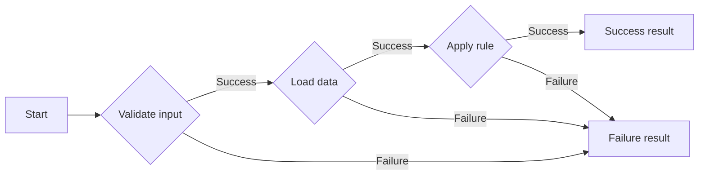
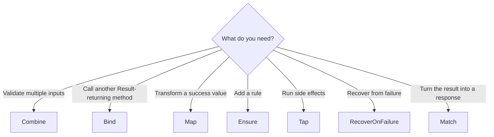

---
title: Basics
package: Trellis (multiple)
topics: [result, railway-oriented-programming, value-objects, ddd, error-handling, async, beginner]
related_api_reference: [trellis-api-core.md, trellis-api-primitives.md]
last_verified: 2026-05-01
audience: [developer]
---
# Basics

This article teaches the handful of Trellis concepts you will use most often: **value objects**, **`Result<T>`**, and the core operators that turn a multi-step workflow into readable code.

## Patterns Index

| Goal | Use | See |
|---|---|---|
| Replace primitive parameters with typed value objects | `RequiredString<T>` / `RequiredGuid<T>` partial classes | [Why avoid primitive obsession?](#why-avoid-primitive-obsession) |
| Validate several independent fields and keep all failures | `Combine` | [`Combine`](#combine-validate-independent-inputs-together) |
| Call the next result-producing step | `Bind` | [`Bind`](#bind-call-the-next-result-producing-step) |
| Transform a success value with a non-failing function | `Map` | [`Map`](#map-transform-a-successful-value) |
| Add a single business rule | `Ensure` | [`Ensure`](#ensure-add-a-business-rule) |
| Collect several rule violations together | `EnsureAll` | [`EnsureAll`](#ensureall-collect-several-business-rule-failures-at-once) |
| Run a side effect on the success path | `Tap` | [`Tap`](#tap-run-a-side-effect-without-changing-the-result) |
| Provide a fallback when an error matches a predicate | `RecoverOnFailure` | [`RecoverOnFailure`](#recoveronfailure-provide-a-fallback-path) |
| Finish the pipeline and produce a plain value | `Match` | [`Match`](#match-finish-the-pipeline) |
| Chain over async I/O without losing readability | `BindAsync` / `TapAsync` / `MatchAsync` | [Working with async operations](#working-with-async-operations) |
| Run independent async work in parallel and combine | `Result.ParallelAsync(...).WhenAllAsync()` | [Parallel async work](#parallel-async-work) |

Full operator signatures and overloads: [`trellis-api-core.md`](../api_reference/trellis-api-core.md). Built-in value-object base classes: [`trellis-api-primitives.md`](../api_reference/trellis-api-primitives.md).

## Table of Contents

- [What problem does Railway-Oriented Programming solve?](#what-problem-does-railway-oriented-programming-solve)
- [Why avoid primitive obsession?](#why-avoid-primitive-obsession)
- [Meet `Result<T>`](#meet-resultt)
- [Core operations](#core-operations)
- [Putting it together](#putting-it-together)
- [Working with async operations](#working-with-async-operations)
- [Common beginner questions](#common-beginner-questions)
- [Quick reference](#quick-reference)
- [Next steps](#next-steps)

## What problem does Railway-Oriented Programming solve?

The answer is: **it keeps the happy path readable even when every step can fail.**

Without ROP, each validation or database check forces another `if`, another `return`, or another exception path. With Trellis, a failure automatically moves the workflow onto the failure track and the remaining success steps are skipped.


```mermaid
graph LR
    A[Start] --> B{Validate input}
    B -->|Success| C{Load data}
    B -->|Failure| F[Failure result]
    C -->|Success| D{Apply rule}
    C -->|Failure| F
    D -->|Success| E[Success result]
    D -->|Failure| F
```

### Before and after

```csharp
var firstName = ValidateFirstName(input.FirstName);
if (firstName is null)
    return BadRequest("Invalid first name.");

var lastName = ValidateLastName(input.LastName);
if (lastName is null)
    return BadRequest("Invalid last name.");

var email = ValidateEmail(input.Email);
if (email is null)
    return BadRequest("Invalid email.");

if (_repository.EmailExists(email))
    return Conflict("Email already registered.");

var user = new User(firstName, lastName, email);
_repository.Save(user);

return Ok(user);
```

```csharp
using Trellis;

public partial class FirstName : RequiredString<FirstName> { }
public partial class LastName : RequiredString<LastName> { }
public partial class CustomerEmail : RequiredString<CustomerEmail> { }

public sealed record RegisterUserInput(string FirstName, string LastName, string Email);

public sealed record User(FirstName FirstName, LastName LastName, CustomerEmail Email)
{
    public static Result<User> TryCreate(FirstName firstName, LastName lastName, CustomerEmail email) =>
        Result.Ok(new User(firstName, lastName, email));
}

public static Result<User> RegisterUser(RegisterUserInput input, Func<CustomerEmail, bool> emailExists)
{
    return FirstName.TryCreate(input.FirstName)
        .Combine(LastName.TryCreate(input.LastName))
        .Combine(CustomerEmail.TryCreate(input.Email, fieldName: "email"))
        .Bind((firstName, lastName, email) => User.TryCreate(firstName, lastName, email))
        .Ensure(user => !emailExists(user.Email), new Error.Conflict(null, "conflict") { Detail = "Email already registered." });
}
```

The second version reads like the business process instead of the defensive scaffolding around it.

## Why avoid primitive obsession?

The problem with primitives is not that they are simple. The problem is that **they erase intent**.

```csharp
public sealed record Person(string FirstName, string LastName);

Person CreatePerson(string firstName, string lastName) => new(firstName, lastName);

var person = CreatePerson("Smith", "Jane");
```

That compiles even if the arguments are in the wrong order.

### Replace raw primitives with value objects

```csharp
using Trellis;

[StringLength(100)]
public partial class FirstName : RequiredString<FirstName> { }

[StringLength(100)]
public partial class LastName : RequiredString<LastName> { }

public sealed record Person(FirstName FirstName, LastName LastName);

Person CreatePerson(FirstName firstName, LastName lastName) => new(firstName, lastName);
```

Now invalid strings are rejected when you create the value object, and parameter mix-ups become compiler errors.

```csharp
Result<FirstName> firstName = FirstName.TryCreate("Jane");
Result<LastName> lastName = LastName.TryCreate("Smith");
```

> [!TIP]
> If you need domain-specific rules beyond required text, implement the optional `ValidateAdditional(...)` partial method described in the primitives API reference.

## Meet `Result<T>`

The answer to "how do I represent success or failure explicitly?" is **`Result<T>`**.

A `Result<T>` contains either:

- a successful **value**, or
- a failed **error**

It never contains both.

```csharp
Result<FirstName> result = FirstName.TryCreate("Jane");
```

### Safe ways to consume a result

#### Option 1: `Match`

```csharp
string message = result.Match(
    onSuccess: name => $"Hello, {name}.",
    onFailure: error => $"Validation failed: {error.Detail}"
);
```

#### Option 2: `TryGetValue`

```csharp
if (result.TryGetValue(out var name))
    Console.WriteLine(name);
else if (result.TryGetError(out var error))
    Console.WriteLine(error.Detail);
```

#### Option 3: deconstruct

```csharp
var (isSuccess, name, error) = result;
if (isSuccess)
    Console.WriteLine(name);
else
    Console.WriteLine(error?.Detail);
```

> [!WARNING]
> `Result<T>.Value` no longer exists. Use `Match`, `TryGetValue`, or deconstruction to extract the success value. `result.Error` is `null` on success and never throws.

## Core operations

Each operator solves a different problem. Once you learn these, most Trellis pipelines become easy to read.

### `Combine`: validate independent inputs together

Use `Combine` when the inputs do not depend on each other and you want to keep all validation failures.

```csharp
var result = FirstName.TryCreate("Jane")
    .Combine(LastName.TryCreate("Smith"))
    .Combine(CustomerEmail.TryCreate("jane@example.com", fieldName: "email"));
```

**Why it matters:** form-style input usually has multiple invalid fields at once. `Combine` lets you surface them together instead of stopping at the first problem.

### `Bind`: call the next result-producing step

Use `Bind` when the next step already returns `Result<T>`.

```csharp
public static Result<Person> CreatePerson(FirstName firstName, LastName lastName) =>
    Result.Ok(new Person(firstName, lastName));

var result = FirstName.TryCreate("Jane")
    .Combine(LastName.TryCreate("Smith"))
    .Bind((firstName, lastName) => CreatePerson(firstName, lastName));
```

**Rule of thumb:** if your lambda returns a `Result`, you almost always want `Bind`.

### `Map`: transform a successful value

Use `Map` when the transformation itself cannot fail.

```csharp
var result = FirstName.TryCreate("Jane")
    .Map(name => name.Value.ToUpperInvariant());
```

`Map` changes the success value but leaves failures alone.

### `Ensure`: add a business rule

Use `Ensure` when the value is structurally valid, but you still need a domain rule.

```csharp
var result = CustomerEmail.TryCreate("jane@example.com", fieldName: "email")
    .Ensure(email => !email.Value.EndsWith("@blocked.example", StringComparison.OrdinalIgnoreCase),
        new Error.InvalidInput(EquatableArray.Create(new FieldViolation(InputPointer.ForProperty("email"), "validation.error") { Detail = "Blocked email domains are not allowed." })));
```

A good mental model is:

- **`TryCreate`** checks shape and basic validity
- **`Ensure`** checks context-specific business rules

### `Tap`: run a side effect without changing the result

Use `Tap` when you want to log, save, publish, or notify on the success path.

```csharp
var saved = false;

var result = FirstName.TryCreate("Jane")
    .Tap(_ => saved = true);
```

The result still contains the original `FirstName`. `Tap` is for side effects, not transformations.

### `EnsureAll`: collect several business-rule failures at once

Use `EnsureAll` when showing all rule violations is better than stopping at the first one.

```csharp
public sealed record CheckoutRequest(string CouponCode, decimal Subtotal, string Currency);

var result = Result.Ok(new CheckoutRequest("SPRING25", 125m, "USD"))
    .EnsureAll(
        (request => request.Subtotal > 0m, new Error.InvalidInput(EquatableArray.Create(new FieldViolation(InputPointer.ForProperty("subtotal"), "validation.error") { Detail = "Subtotal must be greater than zero." }))),
        (request => request.Currency.Length == 3, new Error.InvalidInput(EquatableArray.Create(new FieldViolation(InputPointer.ForProperty("currency"), "validation.error") { Detail = "Currency must be a 3-letter code." }))),
        (request => request.CouponCode.Length <= 20, new Error.InvalidInput(EquatableArray.Create(new FieldViolation(InputPointer.ForProperty("couponCode"), "validation.error") { Detail = "Coupon code is too long." }))));
```

### `RecoverOnFailure`: provide a fallback path

Use `RecoverOnFailure` when a failure should trigger another attempt.

```csharp
public sealed record CustomerProfile(string Source);

Result<CustomerProfile> fromCache = new Error.NotFound(ResourceRef.For("CustomerProfile")) { Detail = "Customer not found in cache." };
Result<CustomerProfile> fromDatabase = Result.Ok(new CustomerProfile("database"));

Result<CustomerProfile> result = fromCache.RecoverOnFailure(
    predicate: error => error is Error.NotFound,
    func: _ => fromDatabase);
```

### `Match`: finish the pipeline

Use `Match` at the edge of your workflow when you need a plain value.

```csharp
string response = RegisterUser(new RegisterUserInput("Jane", "Smith", "jane@example.com"), _ => false)
    .Match(
        onSuccess: user => $"Registered {user.Email}.",
        onFailure: error => $"Registration failed: {error.Detail}"
    );
```

## Putting it together

Here is a complete example using the core operators in one flow.

```csharp
using Trellis;

public partial class FirstName : RequiredString<FirstName> { }
public partial class LastName : RequiredString<LastName> { }
public partial class CustomerEmail : RequiredString<CustomerEmail> { }

public sealed record RegisterUserInput(string FirstName, string LastName, string Email);

public sealed record User(FirstName FirstName, LastName LastName, CustomerEmail Email)
{
    public static Result<User> TryCreate(FirstName firstName, LastName lastName, CustomerEmail email) =>
        Result.Ok(new User(firstName, lastName, email));
}

public static Result<User> RegisterUser(
    RegisterUserInput input,
    Func<CustomerEmail, bool> emailExists,
    Action<User> saveUser,
    Action<CustomerEmail> sendWelcomeEmail)
{
    return FirstName.TryCreate(input.FirstName)
        .Combine(LastName.TryCreate(input.LastName))
        .Combine(CustomerEmail.TryCreate(input.Email, fieldName: "email"))
        .Bind((firstName, lastName, email) => User.TryCreate(firstName, lastName, email))
        .Ensure(user => !emailExists(user.Email), new Error.Conflict(null, "conflict") { Detail = "Email already registered." })
        .Tap(saveUser)
        .Tap(user => sendWelcomeEmail(user.Email));
}
```

Read that pipeline left to right:

1. validate the incoming fields
2. create the domain object
3. enforce the duplicate-email rule
4. save the user
5. send the welcome email

That is the everyday Trellis experience.

## Working with async operations

The async story is the same mental model: **keep the workflow readable while I/O happens in the background**.

### Simple async chain

```csharp
using Trellis;

public sealed class Customer
{
    public Customer(string email, bool canBePromoted)
    {
        Email = email;
        CanBePromoted = canBePromoted;
    }

    public string Email { get; }
    public bool CanBePromoted { get; }
    public Task PromoteAsync() => Task.CompletedTask;
}

public static Task<Customer?> GetCustomerByIdAsync(long id) =>
    Task.FromResult(id == 1 ? new Customer("customer@example.com", true) : null);

public static Task<Result<Unit>> SendPromotionNotificationAsync(string email) =>
    Task.FromResult(Result.Ok());

string message = await GetCustomerByIdAsync(1)
    .ToResultAsync(new Error.NotFound(ResourceRef.For("Customer", 1)) { Detail = "Customer not found." })
    .EnsureAsync(customer => customer.CanBePromoted, new Error.InvalidInput(EquatableArray<FieldViolation>.Empty) { Detail = "Customer cannot be promoted." })
    .TapAsync(customer => customer.PromoteAsync())
    .BindAsync(customer => SendPromotionNotificationAsync(customer.Email))
    .MatchAsync(
        onSuccess: _ => "Promotion completed.",
        onFailure: error => error.Detail);
```

> [!NOTE]
> Use `Result.Ok()` for successful operations that do not produce a payload.

### Parallel async work

When several calls are independent, run them in parallel and combine the results afterward.

```csharp
using Trellis;

public sealed record Dashboard(string Profile, string Orders, string Preferences);

static Task<Result<string>> FetchUserProfileAsync(string userId) =>
    Task.FromResult(Result.Ok($"Profile for {userId}"));

static Task<Result<string>> FetchUserOrdersAsync(string userId) =>
    Task.FromResult(Result.Ok($"Orders for {userId}"));

static Task<Result<string>> FetchUserPreferencesAsync(string userId) =>
    Task.FromResult(Result.Ok($"Preferences for {userId}"));

Result<Dashboard> dashboard = await Result.ParallelAsync(
        () => FetchUserProfileAsync("user-123"),
        () => FetchUserOrdersAsync("user-123"),
        () => FetchUserPreferencesAsync("user-123"))
    .WhenAllAsync()
    .MapAsync((profile, orders, preferences) =>
        new Dashboard(profile, orders, preferences));
```

Use this when the operations do not depend on each other and latency matters.

## Common beginner questions

### When should I use `Bind` instead of `Map`?

Use **`Bind`** when your function returns `Result<T>`.

```csharp
using Trellis;

public sealed record Person(long Id, string Name);

Result<Person> LoadPerson(long id) => Result.Ok(new Person(id, "Jane"));
```

Use **`Map`** when your function returns a plain value.

```csharp
string FormatName(Person person) => person.Name.ToUpperInvariant();
```

### How do I handle different error types?

Use a `switch` expression on the closed `Error` ADT when the response should depend on the concrete case.

```csharp
using Microsoft.AspNetCore.Http;
using Trellis;

Result<string> result = new Error.NotFound(ResourceRef.For("Order")) { Detail = "Order not found." };

IResult httpResult = result.Match(
    onSuccess: value => Results.Ok(value),
    onFailure: error => error switch
    {
        Error.InvalidInput uc => Results.UnprocessableEntity(uc.Fields.Items),
        Error.NotFound nf             => Results.NotFound(nf.Detail),
        Error.Conflict c              => Results.Conflict(c.Detail),
        _                              => Results.StatusCode(StatusCodes.Status500InternalServerError)
    });
```

### What if I need to inspect failures in the middle of a chain?

Use `TapOnFailure`.

```csharp
Result<string> result = new Error.Unexpected("unexpected_fault", "fault-id") { Detail = "Email service offline." }
    .TapOnFailure(error => Console.WriteLine($"Failure: {error.Code}"));
```

## Quick reference

### Choosing an operator

| If you need to... | Use... |
| --- | --- |
| validate several independent inputs | `Combine` |
| call the next result-producing operation | `Bind` |
| transform a success value | `Map` |
| add a business rule | `Ensure` |
| collect several rule failures | `EnsureAll` |
| run a side effect on success | `Tap` |
| run a side effect on failure | `TapOnFailure` |
| recover from a failure | `RecoverOnFailure` |
| finish the chain | `Match` (with a `switch` expression on the closed `Error` ADT) |

### Cheat sheet


```mermaid
flowchart TD
    START{What do you need?}
    START -->|Validate multiple inputs| COMBINE[Combine]
    START -->|Call another Result-returning method| BIND[Bind]
    START -->|Transform a success value| MAP[Map]
    START -->|Add a rule| ENSURE[Ensure]
    START -->|Run side effects| TAP[Tap]
    START -->|Recover from failure| RECOVER[RecoverOnFailure]
    START -->|Turn the result into a response| MATCH[Match]
```

### Creating value objects

```csharp
using Trellis;

public partial class OrderNumber : RequiredString<OrderNumber> { }
public partial class OrderId : RequiredGuid<OrderId> { }

Result<OrderNumber> orderNumber = OrderNumber.TryCreate("SO-2025-0001");
OrderId newId = OrderId.NewUniqueV7();
```

## Next steps

- Read [Examples](examples.md) for end-to-end scenarios
- Read [Introduction](intro.md) if you want the bigger picture again
- Read [ASP.NET Core Integration](integration-aspnet.md) when you are ready to map results to HTTP
- Keep the [API reference](../api/index.md) nearby for exact signatures
