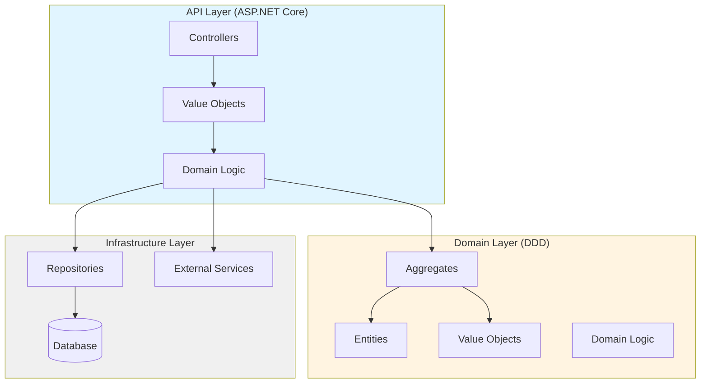
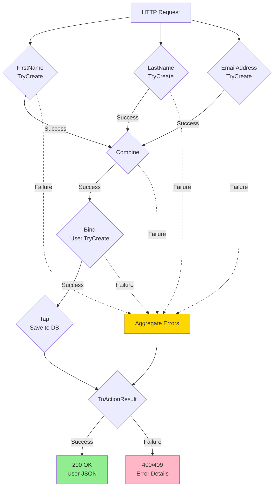
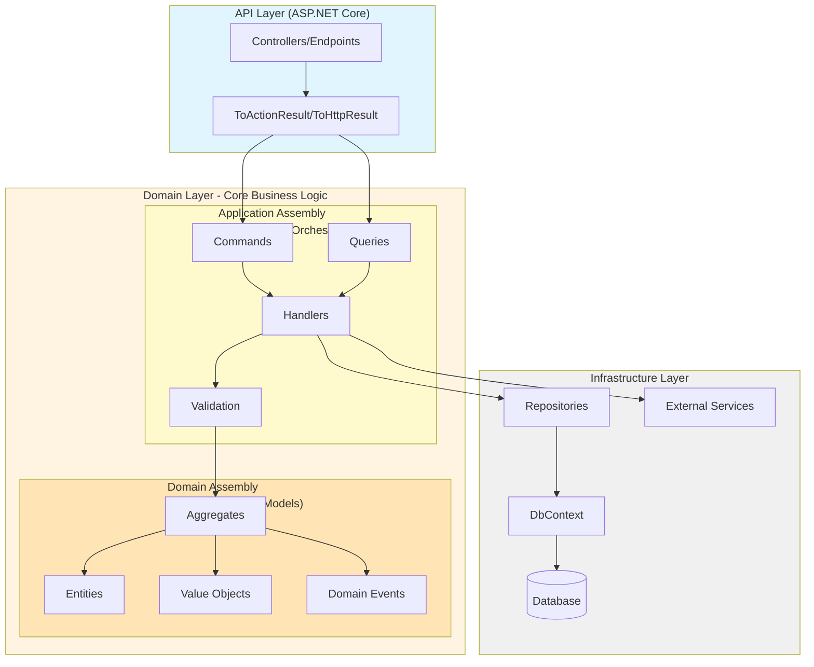
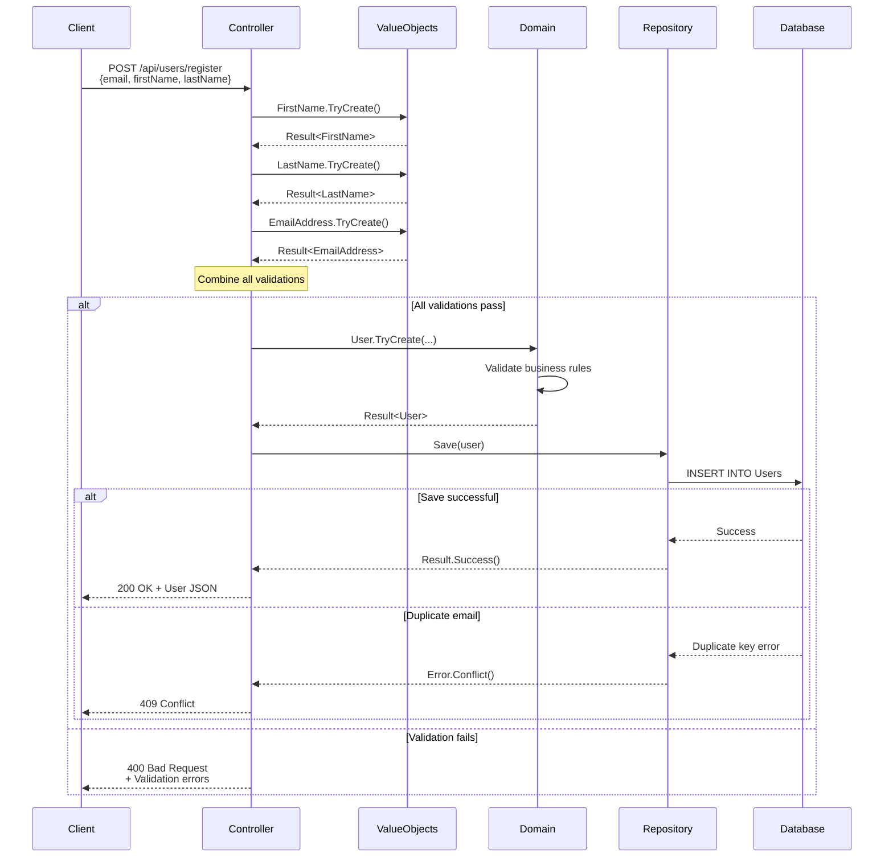
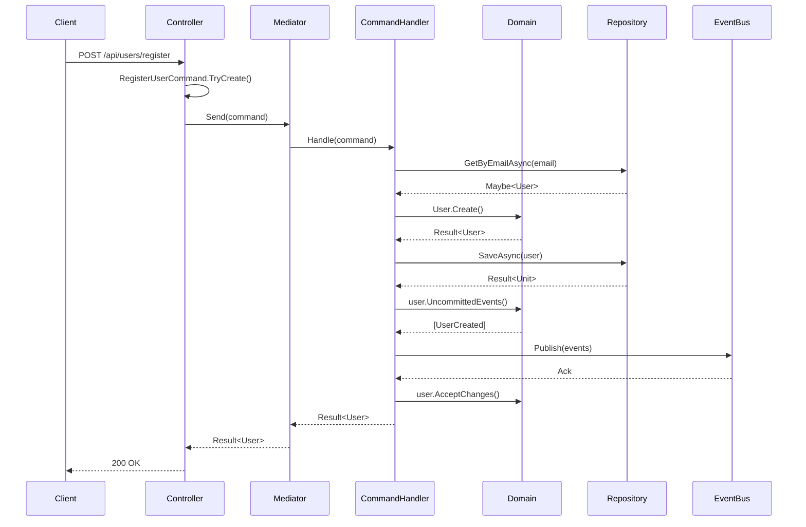

# Architecture Patterns with Functional DDD

**Level:** Intermediate to Advanced 📚→🚀 | **Time:** 30-60 min | **Prerequisites:** [Basics](basics.md), [Error Handling](error-handling.md)

Learn how to architect applications with **Railway-Oriented Programming** and **Domain-Driven Design**, from simple controller-based patterns to advanced CQRS architectures. Choose the pattern that fits your needs.

## Table of Contents

- [Overview](#overview)
- [Choosing Your Architecture](#choosing-your-architecture)
- [Simple Pattern: Controller → Domain → Repository](#simple-pattern-controller--domain--repository)
  - [Architecture Diagram](#simple-architecture-diagram)
  - [Complete Example: User Registration](#simple-example-user-registration)
  - [When to Use Simple Pattern](#when-to-use-simple-pattern)
- [Advanced Pattern: CQRS with Application Layer](#advanced-pattern-cqrs-with-application-layer)
  - [Architecture Diagram](#cqrs-architecture-diagram)
  - [Architecture Layers](#architecture-layers)
  - [Complete Example: User Registration](#complete-example-user-registration)
  - [When to Use CQRS Pattern](#when-to-use-cqrs-pattern)
- [Testing](#testing)
- [Benefits](#benefits)
- [Best Practices](#best-practices)

## Overview

This guide demonstrates **two production-ready architectural patterns** that combine:

- **Railway-Oriented Programming (ROP)** - Explicit error handling with `Result<T>`
- **Domain-Driven Design (DDD)** - Rich domain models with business logic
- **Functional Programming** - Immutability, pure functions, composition
- **Clean Architecture Principles** - Dependencies point inward, testable layers

Both patterns are **valid for production** - choose based on your application's complexity and team size.

## Choosing Your Architecture

| Factor | Simple Pattern | CQRS Pattern |
|--------|----------------|--------------|
| **Complexity** | Low to Medium | Medium to High |
| **Team Size** | 1-10 developers | 10+ developers |
| **Domain Complexity** | Straightforward business rules | Complex, evolving business logic |
| **Read vs Write** | Similar concerns | Need separate optimization |
| **Layers** | 3 (API, Domain, Infrastructure) | 3 (API, Domain*, Infrastructure) |
| **Assemblies** | 3 assemblies | 4 assemblies (2 in Domain Layer) |
| **Learning Curve** | Gentle - Start here ✅ | Steep - Graduate to this |
| **Example Code** | SampleWebApplication (Examples folder) | Enterprise applications |
| **Time to Market** | Fast 🚀 | Slower (more structure) |

*Domain Layer contains 2 assemblies: Application (use cases) + Domain (business rules)

**Recommendation:** Start with the **Simple Pattern** and evolve to CQRS **only when you need it**.

## Simple Pattern: Controller → Domain → Repository

The **Simple Pattern** goes directly from Controllers to Domain logic, with minimal layers. This is perfect for most applications and matches the **SampleWebApplication** example in the Examples folder.

### Simple Architecture Diagram



### Simple Example: User Registration

**1. Controller (API Layer)**

The controller validates inputs, calls domain logic, and converts to HTTP:

```csharp
[ApiController]
[Route("api/[controller]")]
public class UsersController : ControllerBase
{
    private readonly IUserRepository _repository;

    public UsersController(IUserRepository repository)
        => _repository = repository;

    [HttpPost]
    public ActionResult<User> Register([FromBody] RegisterUserRequest request) =>
        FirstName.TryCreate(request.FirstName)
            .Combine(LastName.TryCreate(request.LastName))
            .Combine(EmailAddress.TryCreate(request.Email))
            .Bind((firstName, lastName, email) => 
                User.TryCreate(firstName, lastName, email, request.Password))
            .Tap(user => _repository.Save(user))
            .ToActionResult(this);
}
```

**What happens:**
1. **Validate** - `TryCreate` validates each value object
2. **Combine** - Collects all validations (returns all errors if multiple fail)
3. **Bind** - Creates domain aggregate (User)
4. **Tap** - Saves to database (side effect)
5. **ToActionResult** - Converts `Result<User>` → `ActionResult<User>`

### Railway-Oriented Flow



**2. Domain Layer**

```csharp
// Value Object
public record EmailAddress
{
    public string Value { get; }

    private EmailAddress(string value) => Value = value;

    public static Result<EmailAddress> TryCreate(string? email)
    {
        if (string.IsNullOrWhiteSpace(email))
            return Error.Validation("Email is required", nameof(email));

        if (!email.Contains('@'))
            return Error.Validation("Invalid email format", nameof(email));

        return new EmailAddress(email.ToLowerInvariant());
    }

    public override string ToString() => Value;
}

// Aggregate Root
public class User : Aggregate<UserId>
{
    public FirstName FirstName { get; }
    public LastName LastName { get; }
    public EmailAddress Email { get; }
    public string Password { get; }

    public static Result<User> TryCreate(
        FirstName firstName,
        LastName lastName,
        EmailAddress email,
        string password)
    {
        var user = new User(firstName, lastName, email, password);
        return Validator.ValidateToResult(user);
    }

    private User(FirstName firstName, LastName lastName, EmailAddress email, string password)
        : base(UserId.NewUnique())
    {
        FirstName = firstName;
        LastName = lastName;
        Email = email;
        Password = password; // Should use Password value object in production
    }

    private static readonly InlineValidator<User> Validator = new()
    {
        v => v.RuleFor(x => x.FirstName).NotNull(),
        v => v.RuleFor(x => x.LastName).NotNull(),
        v => v.RuleFor(x => x.Email).NotNull(),
        v => v.RuleFor(x => x.Password)
            .NotEmpty().WithMessage("Password must not be empty.")
            .MinimumLength(8).WithMessage("Password must be at least 8 characters long.")
            .Matches("[A-Z]").WithMessage("Password must contain at least one uppercase letter.")
    };
}
```

**3. Infrastructure Layer (Repository)**

```csharp
public interface IUserRepository
{
    Maybe<User> GetById(UserId id);
    Maybe<User> GetByEmail(EmailAddress email);
    Result<Unit> Save(User user);
}

public class UserRepository : IUserRepository
{
    private readonly ApplicationDbContext _context;

    public Maybe<User> GetById(UserId id)
    {
        var user = _context.Users.Find(id);
        return Maybe.From(user);
    }

    public Result<Unit> Save(User user)
    {
        try
        {
            _context.Users.Add(user);
            _context.SaveChanges();
            return Result.Success();
        }
        catch (DbUpdateException ex) when (IsDuplicateKey(ex))
        {
            return Error.Conflict("Email already in use");
        }
    }

    private static bool IsDuplicateKey(DbUpdateException ex)
        => ex.InnerException?.Message.Contains("duplicate key") ?? false;
}
```

### When to Use Simple Pattern

**Use the Simple Pattern when:**

- ✅ **Small to medium applications** - Most web APIs, microservices
- ✅ **Straightforward business logic** - CRUD + validation + some rules
- ✅ **Small teams** - 1-10 developers
- ✅ **Fast iteration** - Need to ship features quickly
- ✅ **Learning ROP/DDD** - Best place to start
- ✅ **Microservices** - Each service is focused and simple

**Benefits:**
- **Less code** - Fewer layers, less boilerplate
- **Easier to understand** - Direct flow from controller → domain → database
- **Faster development** - No command/query objects, no handlers
- **Still testable** - Domain logic pure, easy to test
- **Production-ready** - Fully capable for most applications

**Limitations:**
- Controllers become complex if orchestrating multiple services
- Read/write concerns not separated (acceptable for most apps)
- No built-in cross-cutting concerns (add as needed)

## Advanced Pattern: CQRS with Application Layer

The **CQRS Pattern** adds a dedicated Application Layer between API and Domain for complex orchestration, separate read/write models, and cross-cutting concerns.

**⚠️ Only graduate to this pattern when you experience pain with the Simple Pattern.**

### CQRS Architecture Diagram



## Architecture Layers

**Note:** In this architecture, both the **Application** and **Domain** assemblies are part of the **Domain Layer**. They represent different concerns within the core business logic but share the same architectural layer.

### Assembly Organization

The Domain Layer is split into two assemblies for better organization:

- **Domain Assembly** - Pure business logic with zero dependencies
  - Aggregates, Entities, Value Objects
  - Domain Events
  - Repository interfaces
  - Domain services

- **Application Assembly** - Use case orchestration (depends only on Domain)
  - Commands and Queries (CQRS)
  - Command/Query Handlers
  - Application services
  - DTOs and mapping logic

This separation allows you to:
- Keep domain logic pure and framework-agnostic
- Organize complex use cases separately from core business rules
- Test business logic in complete isolation
- Share the domain assembly across multiple applications

### 1. API Layer (Presentation)

**Responsibility:** HTTP concerns only  
**Dependencies:** Application Layer  
**Returns:** `ActionResult<T>` or `IResult`

```csharp
[ApiController]
[Route("api/[controller]")]
public class UsersController : ControllerBase
{
    private readonly IMediator _mediator;

    public UsersController(IMediator mediator) => _mediator = mediator;
    
    [HttpPost]
    public async Task<ActionResult<UserDto>> Register(
        [FromBody] RegisterUserRequest request,
        CancellationToken ct)
        => await RegisterUserCommand.TryCreate( request.Email, request.FirstName, request.LastName)
            .BindAsync(_mediator.Send, ct)
            .Map(user => new UserDto(user))
            .ToActionResult(this);
}
```

**What it does:**
- Receives HTTP requests
- **Validates raw inputs using `TryCreate`**
- Sends **validated command** to application layer via mediator
- Converts `Result<T>` to HTTP responses
- **No business logic**

### 2. Application Layer (Use Cases)

**Responsibility:** Application workflows, orchestration  
**Dependencies:** Domain Layer  
**Returns:** `Result<T>`

```csharp
public record RegisterUserCommand(
    EmailAddress Email,
    FirstName FirstName,
    LastName LastName
) : IRequest<Result<User>>
{
    // Factory method for validation
    public static Result<RegisterUserCommand> TryCreate(
        string email,
        string firstName,
        string lastName)
    {
        return EmailAddress.TryCreate(email)
            .Combine(FirstName.TryCreate(firstName))
            .Combine(LastName.TryCreate(lastName))
            .Map((e, f, l) => new RegisterUserCommand(e, f, l));
    }
}

public class RegisterUserCommandHandler 
    : IRequestHandler<RegisterUserCommand, Result<User>>
{
    private readonly IUserRepository _repository;
    private readonly IEmailService _emailService;

    public async ValueTask<Result<User>> Handle(
        RegisterUserCommand command,
        CancellationToken ct)
    {
        // Command is already validated, no need to re-validate
        // Check uniqueness (application-level concern)
        var maybeExistingUser = await _repository.GetByEmailAsync(command.Email, ct);
        if (maybeExistingUser.HasValue)
            return Error.Conflict($"Email {command.Email} already registered");

        // Create aggregate (domain operation)
        return User.Create(command.Email, command.FirstName, command.LastName)
            // Save to database (transaction boundary)
            .TapAsync(async (user, cancellationToken) =>
                await _repository.SaveAsync(user, cancellationToken), ct)
            // Send welcome email (side effect)
            .TapAsync(async (user, cancellationToken) =>
                await _emailService.SendWelcomeEmailAsync(user, cancellationToken), ct);
    }
}
```

**What it does:**
- **Command validates inputs via `TryCreate`** (value objects)
- Handler receives **pre-validated command**
- Orchestrates domain operations
- Manages transaction boundaries
- **No HTTP knowledge**
- **No database knowledge** (uses repositories)

### 3. Domain Layer (Business Logic)

**Responsibility:** Business rules, invariants  
**Dependencies:** None (pure domain)  
**Returns:** `Result<T>` for operations that can fail

```csharp
// Aggregate Root
public class User : Aggregate<UserId>
{
    public EmailAddress Email { get; private set; }
    public FirstName FirstName { get; private set; }
    public LastName LastName { get; private set; }
    public bool IsActive { get; private set; }
    public DateTime CreatedAt { get; private set; }

    // Factory method with validation
    public static Result<User> Create(
        EmailAddress email,
        FirstName firstName,
        LastName lastName)
    {
        var user = new User(email, firstName, lastName);
        return Validator.ValidateToResult(user);
    }

    private User(
        EmailAddress email,
        FirstName firstName,
        LastName lastName)
        : base(UserId.NewUnique())
    {
        Email = email;
        FirstName = firstName;
        LastName = lastName;
        IsActive = true;
        CreatedAt = DateTime.UtcNow;

        // Domain event
        AddDomainEvent(new UserCreated(Id, Email));
    }

    // Business operation
    public Result<User> Deactivate(string reason)
    {
        if (!IsActive)
            return Error.Domain("User is already deactivated");

        if (string.IsNullOrWhiteSpace(reason))
            return Error.Validation("Deactivation reason is required", nameof(reason));

        IsActive = false;
        AddDomainEvent(new UserDeactivated(Id, reason));
        return Result.Success(this);
    }

    // Domain validator
    private static readonly InlineValidator<User> Validator = new()
    {
        v => v.RuleFor(x => x.Email).NotNull(),
        v => v.RuleFor(x => x.FirstName).NotNull(),
        v => v.RuleFor(x => x.LastName).NotNull()
    };
}

// Value Objects
public record EmailAddress
{
    public string Value { get; }

    private EmailAddress(string value) => Value = value;

    public static Result<EmailAddress> TryCreate(string? email)
    {
        if (string.IsNullOrWhiteSpace(email))
            return Error.Validation("Email is required", nameof(email));

        if (!email.Contains('@'))
            return Error.Validation("Invalid email format", nameof(email));

        return new EmailAddress(email.ToLowerInvariant());
    }

    public override string ToString() => Value;
}

// Domain Events
public record UserCreated(UserId UserId, EmailAddress Email) : DomainEvent;
public record UserDeactivated(UserId UserId, string Reason) : DomainEvent;
```

**What it does:**
- Enforces business rules (invariants)
- Validates domain operations
- Raises domain events
- **No infrastructure dependencies**
- **No knowledge of HTTP, database, etc.**
- Fully testable in isolation

### 4. Infrastructure Layer (Data Access)

**Responsibility:** External concerns  
**Dependencies:** Domain Layer (interfaces)  
**Returns:** `Result<T>` (no exceptions)

```csharp
public class UserRepository : IUserRepository
{
    private readonly ApplicationDbContext _context;
    private readonly ILogger<UserRepository> _logger;

    public async Task<Result<User>> GetByIdAsync(
        UserId id,
        CancellationToken ct)
    {
        var user = await _context.Users
            .FirstOrDefaultAsync(u => u.Id == id, ct);

        return user.ToResult(Error.NotFound($"User {id} not found"));
    }

    public async Task<bool> ExistsByEmailAsync(
        EmailAddress email,
        CancellationToken ct)
    {
        return await _context.Users
            .AnyAsync(u => u.Email == email, ct);
    }

    public async Task<Result<Unit>> SaveAsync(
        User user,
        CancellationToken ct)
    {
        try
        {
            _context.Users.Update(user);
            await _context.SaveChangesAsync(ct);
            return Result.Success();
        }
        catch (DbUpdateConcurrencyException)
        {
            return Error.Conflict("User was modified by another process");
        }
        catch (DbUpdateException ex) when (IsDuplicateKey(ex))
        {
            return Error.Conflict("Email already in use");
        }
        catch (Exception ex)
        {
            _logger.LogError(ex, "Error saving user");
            return Error.Unexpected("Failed to save user");
        }
    }

    private static bool IsDuplicateKey(DbUpdateException ex)
        => ex.InnerException?.Message.Contains("duplicate key") ?? false;
}

// EF Core Configuration
public class UserConfiguration : IEntityTypeConfiguration<User>
{
    public void Configure(EntityTypeBuilder<User> builder)
    {
        builder.ToTable("Users");
        builder.HasKey(u => u.Id);

        builder.Property(u => u.Id)
            .HasConversion(id => id.Value, value => new UserId(value));

        builder.Property(u => u.Email)
            .HasConversion(
                email => email.Value,
                value => EmailAddress.TryCreate(value).Value)
            .HasMaxLength(256)
            .IsRequired();

        builder.HasIndex(u => u.Email).IsUnique();
    }
}
```

**What it does:**
- Implements repository interfaces from domain
- Handles database exceptions → `Result<T>` errors
- Configures EF Core mappings for value objects
- **No business logic**

## Complete Example: User Registration

Let's see how all layers work together for a complete user registration flow:

### User Registration Sequence Diagram



### CQRS Command Flow Diagram



### HTTP Response Examples

**Success Response (200 OK):**

```http
HTTP/1.1 200 OK
Content-Type: application/json

{
  "id": "550e8400-e29b-41d4-a716-446655440000",
  "email": "john@example.com",
  "firstName": "John",
  "lastName": "Doe",
  "isActive": true,
  "createdAt": "2024-01-15T10:30:00Z"
}
```

**Validation Failure (400 Bad Request):**

```http
HTTP/1.1 400 Bad Request
Content-Type: application/problem+json

{
  "type": "https://tools.ietf.org/html/rfc7231#section-6.5.1",
  "title": "One or more validation errors occurred.",
  "status": 400,
  "errors": {
    "email": ["'Email' must not be empty."],
    "firstName": ["'First Name' must not be empty."]
  }
}
```

**Conflict Response (409 Conflict):**

```http
HTTP/1.1 409 Conflict
Content-Type: application/problem+json

{
  "type": "https://tools.ietf.org/html/rfc7231#section-6.5.8",
  "title": "Conflict",
  "status": 409,
  "detail": "Email john@example.com already registered"
}
```

## When to Use CQRS Pattern

**Use the CQRS Pattern when you experience these pain points:**

- ✅ **Complex orchestration** - Controllers juggling multiple services/repositories
- ✅ **Cross-cutting concerns** - Need logging, caching, authorization across many operations
- ✅ **Different read/write needs** - Queries need denormalized views, commands need rich validation
- ✅ **Large teams** - Need clear boundaries between teams working on different features
- ✅ **Event-driven architecture** - Publishing domain events to message buses
- ✅ **Complex transactions** - Multi-aggregate transactions with compensation logic

**Benefits of CQRS:**
- **Dedicated orchestration layer** - Commands/Queries handle complex workflows
- **Separation of concerns** - Read models optimized separately from write models
- **Testability** - Handlers easy to test in isolation
- **Scalability** - Read/write can scale independently
- **Clear contracts** - Commands/Queries define explicit contracts

**Trade-offs:**
- **More code** - Additional layer, command/query objects, handlers
- **Learning curve** - Team needs to understand mediator pattern, CQRS
- **Overkill for simple apps** - Unnecessary complexity for CRUD operations

**Migration path from Simple Pattern:**
1. Start with Simple Pattern
2. When controllers get complex, introduce handlers for those specific controllers
3. Gradually migrate complex operations to CQRS
4. Keep simple CRUD in Simple Pattern if it works

You **don't need to choose** one pattern for the entire application - **mix both** based on complexity per feature!

## Testing

### Unit Tests (Domain Layer)

```csharp
public class UserTests
{
    [Fact]
    public void Create_ValidData_ReturnsSuccess()
    {
        // Arrange
        var email = EmailAddress.TryCreate("john@example.com").Value;
        var firstName = FirstName.TryCreate("John").Value;
        var lastName = LastName.TryCreate("Doe").Value;

        // Act
        var result = User.Create(email, firstName, lastName);

        // Assert
        result.IsSuccess.Should().BeTrue();
        result.Value.Email.Should().Be(email);
        result.Value.IsActive.Should().BeTrue();
    }

    [Fact]
    public void Deactivate_WhenActive_ReturnsSuccess()
    {
        // Arrange
        var user = CreateValidUser();

        // Act
        var result = user.Deactivate("No longer needed");

        // Assert
        result.IsSuccess.Should().BeTrue();
        user.IsActive.Should().BeFalse();
    }

    [Fact]
    public void Deactivate_WhenAlreadyInactive_ReturnsFailure()
    {
        // Arrange
        var user = CreateValidUser();
        user.Deactivate("First time");

        // Act
        var result = user.Deactivate("Second time");

        // Assert
        result.IsFailure.Should().BeTrue();
        result.Error.Should().BeOfType<DomainError>();
    }
}
```

### Integration Tests (Application Layer)

```csharp
public class RegisterUserCommandHandlerTests
{
    [Fact]
    public async Task Handle_ValidCommand_CreatesUser()
    {
        // Arrange
        var repository = new InMemoryUserRepository();
        var handler = new RegisterUserCommandHandler(repository, new EmailServiceFake());
        var command = new RegisterUserCommand(
            EmailAddress.TryCreate("john@example.com").Value,
            FirstName.TryCreate("John").Value,
            LastName.TryCreate("Doe").Value);

        // Act
        var result = await handler.Handle(command, CancellationToken.None);

        // Assert
        result.IsSuccess.Should().BeTrue();
        result.Value.Email.Value.Should().Be("john@example.com");
        
        var saved = await repository.GetByIdAsync(result.Value.Id, CancellationToken.None);
        saved.IsSuccess.Should().BeTrue();
    }

    [Fact]
    public async Task Handle_DuplicateEmail_ReturnsConflict()
    {
        // Arrange
        var repository = new InMemoryUserRepository();
        var existingEmail = EmailAddress.TryCreate("john@example.com").Value;
        await repository.SaveAsync(CreateExistingUser(existingEmail));
        
        var handler = new RegisterUserCommandHandler(repository, new EmailServiceFake());
        var command = new RegisterUserCommand(
            existingEmail,
            FirstName.TryCreate("Jane").Value,
            LastName.TryCreate("Smith").Value);

        // Act
        var result = await handler.Handle(command, CancellationToken.None);

        // Assert
        result.IsFailure.Should().BeTrue();
        result.Error.Should().BeOfType<ConflictError>();
    }
}
```

### API Tests (End-to-End)

```csharp
public class UsersControllerTests : IClassFixture<WebApplicationFactory<Program>>
{
    private readonly HttpClient _client;

    public UsersControllerTests(WebApplicationFactory<Program> factory)
    {
        _client = factory.CreateClient();
    }

    [Fact]
    public async Task Register_ValidRequest_Returns200WithUser()
    {
        // Arrange
        var request = new RegisterUserRequest
        {
            Email = "john@example.com",
            FirstName = "John",
            LastName = "Doe"
        };

        // Act
        var response = await _client.PostAsJsonAsync("/api/users/register", request);

        // Assert
        response.StatusCode.Should().Be(HttpStatusCode.OK);
        var user = await response.Content.ReadFromJsonAsync<UserDto>();
        user.Should().NotBeNull();
        user!.Email.Should().Be("john@example.com");
    }

    [Fact]
    public async Task Register_InvalidEmail_Returns400WithValidationErrors()
    {
        // Arrange
        var request = new RegisterUserRequest
        {
            Email = "",
            FirstName = "John",
            LastName = "Doe"
        };

        // Act
        var response = await _client.PostAsJsonAsync("/api/users/register", request);

        // Assert
        response.StatusCode.Should().Be(HttpStatusCode.BadRequest);
        var problemDetails = await response.Content.ReadFromJsonAsync<ValidationProblemDetails>();
        problemDetails.Should().NotBeNull();
        problemDetails!.Errors.Should().ContainKey("email");
    }
}
```

## Benefits

### 1. **Testability**
- Domain logic testable without infrastructure
- Application logic testable with in-memory repositories
- API testable end-to-end with WebApplicationFactory

### 2. **Maintainability**
- Clear separation of concerns
- Changes isolated to specific layers
- Easy to understand and modify

### 3. **Explicit Error Handling**
- No hidden exceptions
- All failures represented as `Result<T>`
- HTTP status codes automatically mapped

### 4. **Type Safety**
- Value objects prevent primitive obsession
- Compiler catches errors early
- Impossible states impossible

### 5. **Business Logic Clarity**
- Domain rules explicit in code
- No business logic leaked to infrastructure
- Easy to communicate with domain experts

## Best Practices

### 1. Dependencies Always Point Inward

```
API → Application → Domain ← Infrastructure
     (Both in Domain Layer)
```

- **Domain Assembly** has **zero** external dependencies
- **Application Assembly** depends only on Domain Assembly  
- Infrastructure implements domain interfaces
- Application orchestrates domain + infrastructure
- API depends on Application (or Domain for simple scenarios)

**Layer vs Assembly:**
- **3 Layers**: API, Domain, Infrastructure
- **4 Assemblies**: API, Application (in Domain Layer), Domain (in Domain Layer), Infrastructure
