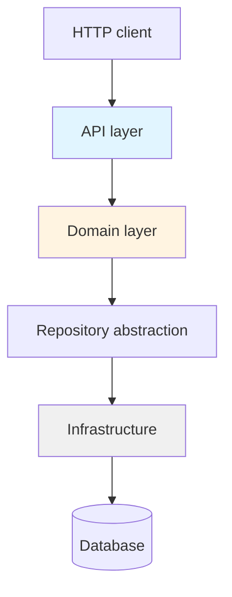
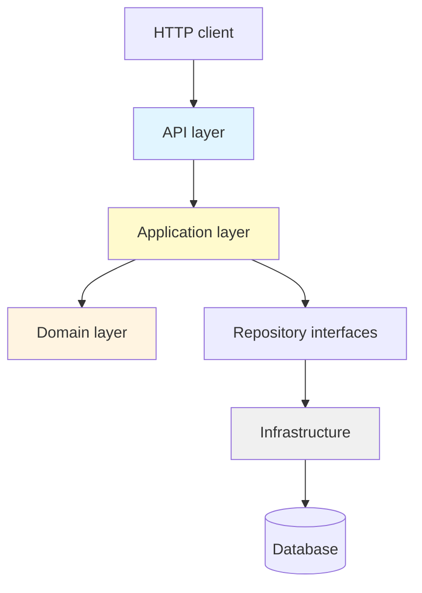
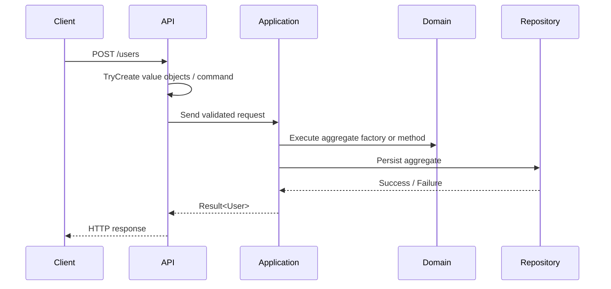

---
title: Clean Architecture with Trellis
package: Trellis (multiple)
topics: [clean-architecture, ddd, aggregates, application-layer, value-objects, result]
related_api_reference: [trellis-api-core.md, trellis-api-primitives.md]
last_verified: 2026-05-01
audience: [developer]
---
# Clean Architecture with Trellis

If your API starts as “just a few endpoints,” it is easy for validation, orchestration, persistence, and business rules to end up tangled together.

This article shows how Trellis helps you separate those concerns without losing momentum:

- start with a simple, direct architecture
- add an application layer only when the workflow becomes genuinely complex
- keep domain rules in aggregates and specifications
- keep failures explicit with `Result<T>`

> [!TIP]
> In Trellis, start simple first. Add CQRS or a dedicated application layer when you feel real pain, not because a template told you to.

## The short version

| Situation | Recommended shape |
| --- | --- |
| Small API, focused service, straightforward rules | **API -> Domain -> Infrastructure** |
| Complex workflows, multiple integrations, rich orchestration | **API -> Application -> Domain <- Infrastructure** |
| Unsure | Start simple and evolve later |

## Why this structure works well with Trellis

Trellis already gives you building blocks for clean boundaries:

- **Value objects** validate input at the edge
- **Aggregates** protect invariants in the domain
- **`Result<T>`** keeps failures explicit
- **Specifications** keep query logic reusable
- **`IAggregate`** carries real behavior, not just identity

`IAggregate` is especially important here. It is **not** a marker interface. It:

- inherits `IChangeTracking`
- exposes `ETag` for optimistic concurrency
- exposes `UncommittedEvents()`
- relies on `AcceptChanges()` after persistence/event publication

That means your architecture can treat aggregates as first-class consistency boundaries all the way from the API to persistence.

## Start simple: API -> Domain -> Infrastructure

The simplest useful architecture is:

```text
API -> Domain -> Infrastructure
```

Use it when one request maps cleanly to one aggregate operation.


```mermaid
graph TB
    Client[HTTP client] --> Api[API layer]
    Api --> Domain[Domain layer]
    Domain --> Repo[Repository abstraction]
    Repo --> Infra[Infrastructure]
    Infra --> Db[(Database)]

    style Api fill:#e1f5ff
    style Domain fill:#fff4e1
    style Infra fill:#f0f0f0
```

### A working example

The example below keeps each responsibility small:

- the request stays primitive
- the service converts primitives into value objects
- the aggregate enforces domain rules
- the repository hides persistence details

```csharp
using Trellis;
using Trellis.Primitives;

namespace SimpleArchitecture;

public partial class UserId : RequiredGuid<UserId> { }
public partial class FirstName : RequiredString<FirstName> { }
public partial class LastName : RequiredString<LastName> { }

public sealed record RegisterUserRequest(string Email, string FirstName, string LastName);

public sealed record UserRegistered(UserId UserId, DateTimeOffset OccurredAt) : IDomainEvent;

public sealed class User : Aggregate<UserId>
{
    private User(UserId id, EmailAddress email, FirstName firstName, LastName lastName)
        : base(id)
    {
        Email = email;
        FirstName = firstName;
        LastName = lastName;
    }

    private User() : base(null!)
    {
        Email = null!;
        FirstName = null!;
        LastName = null!;
    }

    public EmailAddress Email { get; private set; }
    public FirstName FirstName { get; private set; }
    public LastName LastName { get; private set; }

    public static Result<User> TryCreate(
        EmailAddress email,
        FirstName firstName,
        LastName lastName)
    {
        var user = new User(UserId.NewUniqueV7(), email, firstName, lastName);
        user.DomainEvents.Add(new UserRegistered(user.Id, DateTimeOffset.UtcNow));
        return Result.Ok(user);
    }
}

public interface IUserRepository
{
    Task<bool> EmailExistsAsync(EmailAddress email, CancellationToken ct);
    Task<Result<Unit>> AddAsync(User user, CancellationToken ct);
}

public sealed class RegisterUserService
{
    private readonly IUserRepository _repository;

    public RegisterUserService(IUserRepository repository) => _repository = repository;

    public async Task<Result<User>> HandleAsync(RegisterUserRequest request, CancellationToken ct)
    {
        var userResult = EmailAddress.TryCreate(request.Email, nameof(request.Email))
            .Combine(FirstName.TryCreate(request.FirstName, nameof(request.FirstName)))
            .Combine(LastName.TryCreate(request.LastName, nameof(request.LastName)))
            .Bind(User.TryCreate);

        if (!userResult.TryGetValue(out var user))
            return userResult;

        if (await _repository.EmailExistsAsync(user.Email, ct))
            return Result.Fail<User>(new Error.Conflict(null, "conflict") { Detail = $"Email {user.Email} is already registered." });

        var saveResult = await _repository.AddAsync(user, ct);
        if (saveResult.TryGetError(out var saveError))
            return Result.Fail<User>(saveError);

        return Result.Ok(user);
    }
}
```

### Why this version stays maintainable

- **API layer** deals with transport shapes
- **Domain layer** decides what a valid `User` is
- **Infrastructure** decides how a `User` is stored
- **Errors stay explicit** from edge to persistence

> [!NOTE]
> In the simple version, orchestration can live in a controller, endpoint, or small service. The real goal is not “fewest classes.” The goal is “business rules stay out of infrastructure.”

## When the simple version starts to hurt

Move beyond the simple pattern when you notice things like:

- one request touches several repositories or external services
- you need retry logic, authorization, caching, or audit behavior around many use cases
- write-side workflows are much richer than read-side queries
- controllers or endpoints are becoming orchestration classes

That is the moment to introduce an **application layer**.

## Add an application layer for complex use cases

Now the shape becomes:

```text
API -> Application -> Domain <- Infrastructure
```


```mermaid
graph TB
    Client[HTTP client] --> Api[API layer]
    Api --> App[Application layer]
    App --> Domain[Domain layer]
    App --> Repo[Repository interfaces]
    Repo --> Infra[Infrastructure]
    Infra --> Db[(Database)]

    style Api fill:#e1f5ff
    style App fill:#fffacd
    style Domain fill:#fff4e1
    style Infra fill:#f0f0f0
```

### What changes?

The **application layer** owns orchestration:

- uniqueness checks
- repository calls
- integration with email, queues, or billing
- transaction boundaries
- event publication policies

The **domain layer** still owns:

- invariants
- aggregate state transitions
- domain events
- specifications and value objects

### A working application-layer example

This version keeps validation at the edge, then hands a validated command to a handler.

```csharp
using Trellis;
using Trellis.Primitives;

namespace ApplicationLayerExample;

public partial class UserId : RequiredGuid<UserId> { }
public partial class FirstName : RequiredString<FirstName> { }
public partial class LastName : RequiredString<LastName> { }

public sealed record RegisterUserCommand(
    EmailAddress Email,
    FirstName FirstName,
    LastName LastName)
{
    public static Result<RegisterUserCommand> TryCreate(string email, string firstName, string lastName) =>
        EmailAddress.TryCreate(email, nameof(email))
            .Combine(FirstName.TryCreate(firstName, nameof(firstName)))
            .Combine(LastName.TryCreate(lastName, nameof(lastName)))
            .Map((validEmail, validFirstName, validLastName) =>
                new RegisterUserCommand(validEmail, validFirstName, validLastName));
}

public sealed record UserRegistered(UserId UserId, DateTimeOffset OccurredAt) : IDomainEvent;

public sealed class User : Aggregate<UserId>
{
    private User(UserId id, EmailAddress email, FirstName firstName, LastName lastName)
        : base(id)
    {
        Email = email;
        FirstName = firstName;
        LastName = lastName;
        IsActive = true;
    }

    private User() : base(null!)
    {
        Email = null!;
        FirstName = null!;
        LastName = null!;
    }

    public EmailAddress Email { get; private set; }
    public FirstName FirstName { get; private set; }
    public LastName LastName { get; private set; }
    public bool IsActive { get; private set; }

    public static Result<User> TryCreate(
        EmailAddress email,
        FirstName firstName,
        LastName lastName)
    {
        var user = new User(UserId.NewUniqueV7(), email, firstName, lastName);
        user.DomainEvents.Add(new UserRegistered(user.Id, DateTimeOffset.UtcNow));
        return Result.Ok(user);
    }

    public Result<User> Deactivate()
    {
        if (!IsActive)
            return Result.Fail<User>(new Error.Conflict(null, "domain.violation") { Detail = "User is already inactive." });

        IsActive = false;
        return Result.Ok(this);
    }
}

public interface IUserRepository
{
    Task<bool> EmailExistsAsync(EmailAddress email, CancellationToken ct);
    Task<Result<Unit>> AddAsync(User user, CancellationToken ct);
}

public interface IWelcomeEmailSender
{
    Task<Result<Unit>> SendAsync(EmailAddress email, CancellationToken ct);
}

public sealed class RegisterUserHandler
{
    private readonly IUserRepository _repository;
    private readonly IWelcomeEmailSender _welcomeEmailSender;

    public RegisterUserHandler(IUserRepository repository, IWelcomeEmailSender welcomeEmailSender)
    {
        _repository = repository;
        _welcomeEmailSender = welcomeEmailSender;
    }

    public async Task<Result<User>> HandleAsync(RegisterUserCommand command, CancellationToken ct)
    {
        if (await _repository.EmailExistsAsync(command.Email, ct))
            return Result.Fail<User>(new Error.Conflict(null, "conflict") { Detail = $"Email {command.Email} is already registered." });

        var userResult = User.TryCreate(command.Email, command.FirstName, command.LastName);
        if (!userResult.TryGetValue(out var user))
            return userResult;

        var saveResult = await _repository.AddAsync(user, ct);
        if (saveResult.TryGetError(out var saveError))
            return Result.Fail<User>(saveError);

        var emailResult = await _welcomeEmailSender.SendAsync(command.Email, ct);
        if (emailResult.TryGetError(out var emailError))
            return Result.Fail<User>(emailError);

        return Result.Ok(user);
    }
}
```

## Request flow at a glance


```mermaid
sequenceDiagram
    participant Client
    participant API
    participant App as Application
    participant Domain
    participant Repo as Repository

    Client->>API: POST /users
    API->>API: TryCreate value objects / command
    API->>App: Send validated request
    App->>Domain: Execute aggregate factory or method
    App->>Repo: Persist aggregate
    Repo-->>App: Success / Failure
    App-->>API: Result<User>
    API-->>Client: HTTP response
```

## Layer responsibilities

| Layer | Owns | Does not own |
| --- | --- | --- |
| API | HTTP, JSON, route/query/body binding, response mapping | Domain rules, persistence logic |
| Application | Use-case orchestration, policies, transaction flow | Core invariants, storage details |
| Domain | Aggregates, entities, value objects, specifications, domain events | HTTP, EF Core, message-bus wiring |
| Infrastructure | EF Core, repositories, external services | Business decisions |

## How aggregates fit into the architecture

An aggregate root is your write-side consistency boundary.

In Trellis:

- `Aggregate<TId>` inherits `Entity<TId>`
- it implements `IAggregate`
- it tracks domain events internally
- `UncommittedEvents()` returns the current event buffer
- `AcceptChanges()` clears that buffer
- `ETag` supports optimistic concurrency

That is why write workflows usually look like this:

1. create or load aggregate
2. call aggregate method(s)
3. persist aggregate
4. publish `UncommittedEvents()`
5. call `AcceptChanges()`

> [!WARNING]
> Do not treat `IAggregate` as a marker. If your repository loads an aggregate, it should respect its `ETag`, change tracking, and uncommitted domain events.

## Testing strategy

Clean architecture pays off fastest in tests.

### Domain tests

Test aggregates and value objects without any infrastructure:

- creation rules
- state transitions
- event emission
- specifications

### Application tests

Test handlers or services with fakes:

- orchestration order
- conflict handling
- retries or side effects

### API tests

Test transport concerns separately:

- model binding
- HTTP status codes
- problem details responses

## When to upgrade from simple to application-layer architecture

Use the simple pattern by default. Introduce an application layer when:

- one endpoint orchestrates many steps
- the same workflow appears in multiple entry points
- command handling needs decorators/pipelines
- read and write concerns evolve at different speeds

You do **not** need one pattern for the whole system. A codebase can keep simple flows simple and use handlers only where the complexity pays for them.

## Practical rules of thumb

1. **Validate primitives at the edge**
2. **Put invariants in aggregates**
3. **Return `Result<T>` for expected failure paths**
4. **Keep repositories boring**
5. **Add orchestration layers only when orchestration is the real problem**

## See also

- [Aggregate Factory Pattern](aggregate-factory-pattern.md)
- [Primitive Value Objects](primitives.md)
- [Specifications](specifications.md)
- [RequiredEnum](required-enum.md)
- API surface for `Result<T>`, `Aggregate<TId>`, `IDomainEvent`, `Error.InvalidInput`, `Error.Conflict`: [`trellis-api-core.md`](../api_reference/trellis-api-core.md)
- Value-object base classes (`RequiredString<TSelf>`, `RequiredGuid<TSelf>`, `EmailAddress`): [`trellis-api-primitives.md`](../api_reference/trellis-api-primitives.md)
