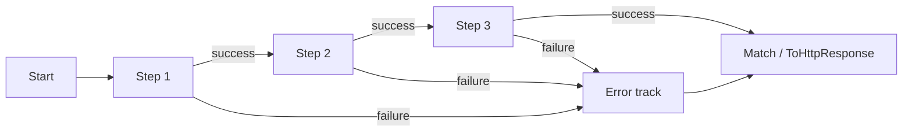

---
title: Debugging Trellis Pipelines
package: Trellis (multiple)
topics: [debugging, tap, tryget, opentelemetry, logging, result]
related_api_reference: [trellis-api-core.md, trellis-api-primitives.md]
last_verified: 2026-05-01
audience: [developer]
---
# Debugging Trellis Pipelines

Trellis pipelines are easy to read when they work — and sometimes harder to inspect when they do not.

The reason is simple: **failure short-circuits the rest of the chain**. That is a feature, but it changes how you debug.

## First, remember how the railway works



Once a result is failed:

- later success-path operations are skipped
- the **first failure** usually explains the outcome
- debugging becomes easier when you inspect the chain at the point it changes tracks

> [!TIP]
> Most Trellis debugging boils down to two questions: **Where did the pipeline fail?** and **What error was produced there?**

## The fastest way to find the failing step

Add `Tap` and `TapOnFailure` around suspicious boundaries.

```csharp
using Microsoft.Extensions.Logging;
using Trellis;
using Trellis.Primitives;

public sealed class RegistrationService(ILogger<RegistrationService> logger)
{
    public Result<EmailAddress> Validate(string email) =>
        EmailAddress.TryCreate(email)
            .Tap(value => logger.LogDebug("Validated email {Email}", value.Value))
            .TapOnFailure(error => logger.LogWarning(
                "Email validation failed: {Code} - {Detail}",
                error.Code,
                error.Detail));
}
```

This keeps the business logic intact while giving you visibility into the exact step that failed.

## Safely inspect a `Result<T>`

The most common debugging mistake is reaching straight for `.Value` or `.Error`.

### Safe options

```csharp
using Trellis;

static string Describe(Result<int> result)
{
    if (result.TryGetValue(out var value))
        return $"Value: {value}";

    if (result.TryGetError(out var error))
        return $"Error: {error.Code} - {error.Detail}";

    return "Unknown";
}
```

### Also safe: `Match` (with a `switch` expression on the closed `Error` ADT)

```csharp
using Trellis;

static string Describe(Result<int> result) =>
    result.Match(
        onSuccess: value => $"Value: {value}",
        onFailure: error => error switch
        {
            Error.InvalidInput uc => $"Validation: {uc.GetDisplayMessage()}",
            _                              => $"Error: {error.Code}"
        });
```

### Unsafe options

| Expression | Why it is risky |
| --- | --- |
| `Result<T>.Value` | Removed from the current API. Use `TryGetValue(out var value)` or `Match(...)` instead. |
| `result.Error!` without checking | Null on success; dereferencing it without checking can throw. |

> [!WARNING]
> In the Watch window, prefer `TryGetValue(out var value)` and `TryGetError(out var error)` over direct property access.

## Use the built-in debug helpers when you want instant visibility

Trellis includes debug helpers for ad-hoc tracing.

```csharp
using Trellis;
using Trellis.Primitives;

ResultDebugSettings.EnableDebugTracing = true;

var result = EmailAddress.TryCreate("ada@example.com")
    .Debug("after email")
    .Map(email => email.Value.ToUpperInvariant())
    .DebugDetailed("after map");
```

Useful helpers include:

- `Debug(...)`
- `DebugDetailed(...)`
- `DebugWithStack(...)`
- async variants such as `DebugAsync(...)`

> [!NOTE]
> These helpers are conditionally compiled for `DEBUG` builds, so they do not add runtime cost to release builds.

## Break long chains when you need a debugger-friendly view

A long fluent chain is great for production readability. It is not always the best shape for stepping through line by line.

```csharp
using Trellis;
using Trellis.Primitives;

static Result<string> Register(string first, string last, string email)
{
    var nameResult = FirstName.TryCreate(first)
        .Combine(LastName.TryCreate(last));

    var emailResult = EmailAddress.TryCreate(email);

    return nameResult
        .Combine(emailResult)
        .Bind((firstName, lastName, emailAddress) =>
            Result.Ok($"{firstName} {lastName} <{emailAddress}>"));
}
```

That gives you stable breakpoint locations and named intermediate values.

## Debugging aggregated validation errors

`Combine` is excellent for forms and DTO validation because it can return multiple failures at once. When something fails, inspect the aggregated error — not just the top-level message.

```csharp
using Trellis;
using Trellis.Primitives;

var result = FirstName.TryCreate("")
    .Combine(LastName.TryCreate(""))
    .Combine(EmailAddress.TryCreate("not-an-email"))
    .TapOnFailure(error => Console.WriteLine(error.Detail));
```

What to inspect:

- `error.Code` — usually ends with `.error` (for example `validation.error`)
- `error.Detail` — human-readable explanation
- concrete error type — for example `Error.InvalidInput`
- nested failures if the error is aggregated

## Common debugging patterns

### Pattern 1: log the boundary between layers

A lot of bugs are not inside Trellis at all — they happen when data crosses boundaries.

Good places to log:

- after parsing input
- after loading from a repository
- before converting to HTTP with `ToHttpResponse()` or `ToHttpResponse().AsActionResult<T>()`
- around external service calls

### Pattern 2: name the method instead of hiding it in a lambda

```csharp
using Trellis;

static Result<int> DoubleIfPositive(Result<int> result) =>
    result.Bind(ValidatePositive)
        .Map(value => value * 2);

static Result<int> ValidatePositive(int value) =>
    value > 0
        ? Result.Ok(value)
        : new Error.InvalidInput(EquatableArray<FieldViolation>.Empty) { Detail = "Value must be positive." };
```

Named methods give you cleaner stack traces and more searchable logs.

### Pattern 3: use `Result.Try` when the code you call still throws

```csharp
using Trellis;

static Result<int> ParsePort(string input) =>
    Result.Try(() => int.Parse(input));
```

That lets you keep exception-throwing code at the edge instead of letting it tear through the pipeline.

## OpenTelemetry: use it when you need full pipeline forensics

When a simple log line is not enough, enable tracing.

```csharp
using OpenTelemetry.Trace;
using Trellis;
using Trellis.Primitives;

builder.Services.AddOpenTelemetry()
    .WithTracing(tracerBuilder => tracerBuilder
        .AddResultsInstrumentation()
        .AddPrimitiveValueObjectInstrumentation()
        .AddAspNetCoreInstrumentation()
        .AddHttpClientInstrumentation());
```

### When to enable which instrumentation

| Instrumentation | Best for |
| --- | --- |
| `AddResultsInstrumentation()` | Deep, temporary pipeline forensics |
| `AddPrimitiveValueObjectInstrumentation()` | Lower-noise validation and parsing diagnostics |

> [!WARNING]
> `AddResultsInstrumentation()` can generate a lot of spans because it traces individual result operations. Treat it as a break-glass diagnostic tool, not a default production setting.

## Common errors and what they usually mean

### "Attempted to access the Value for a failed result"

You read `.Value` on a failure result.

**Fix:** use `TryGetValue`, `Match`, or check `IsSuccess` first.

### "Attempted to access the Error property for a successful result"

You read `.Error` on a success result.

**Fix:** use `TryGetError`, `Match`, or check `IsFailure` first.

### "No handler provided for error type ..."

You called `Match` with a `switch` expression that is not exhaustive over the closed `Error` ADT.

```csharp
using Trellis;

static string Render(Result<int> result) =>
    result.Match(
        onSuccess: value => $"Value: {value}",
        onFailure: error => error switch
        {
            Error.InvalidInput uc => $"Validation: {uc.GetDisplayMessage()}",
            _                              => $"Fallback: {error.Detail}"
        });
```

## Performance debugging: usually debug I/O, not the pipeline

If a Trellis-based request is slow, start with the expensive work around it:

- database calls
- HTTP calls
- serialization
- large object graphs
- logging

Trellis pipeline operations are measured in nanoseconds. Most real bottlenecks are not.

## A practical debugging checklist

When a pipeline fails, walk this list in order:

- Check the **first error**.
- Inspect `error.Code` and `error.Detail`.
- Add `Tap` / `TapOnFailure` around the suspicious step.
- Break long fluent chains into named locals temporarily.
- Use `TryGetValue` / `TryGetError` in the debugger.
- If validation is aggregated, inspect the nested failures.
- Enable debug helpers in `DEBUG` builds.
- Turn on OpenTelemetry only if logs are not enough.

## Bottom line

Debugging Trellis is different from debugging exception-heavy code, but it is usually simpler once you lean into the model:

- inspect the result safely
- find the step where the railway changed tracks
- let error values tell you what happened

When you do that, most pipeline bugs become straightforward to locate.

## Cross-references

- `Result<T>` accessors (`TryGetValue`, `TryGetError`, `Match`), `Tap` / `TapOnFailure`, `ResultDebugSettings`, `AddResultsInstrumentation`: [`trellis-api-core.md`](../api_reference/trellis-api-core.md)
- `AddPrimitiveValueObjectInstrumentation`: [`trellis-api-primitives.md`](../api_reference/trellis-api-primitives.md)
