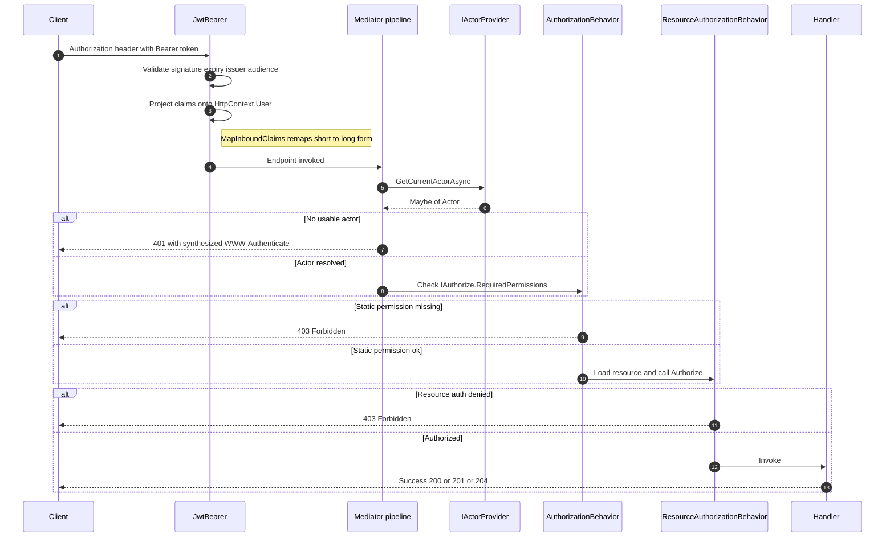
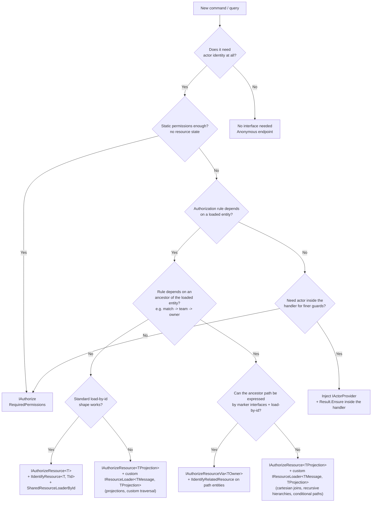
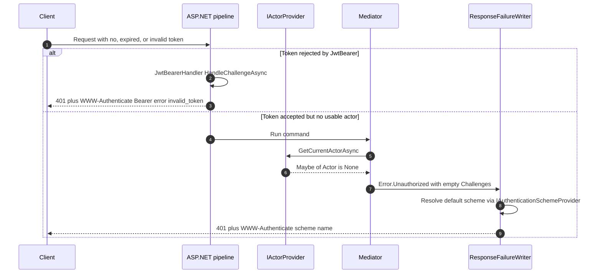
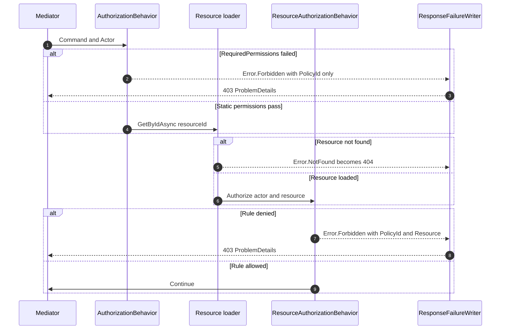
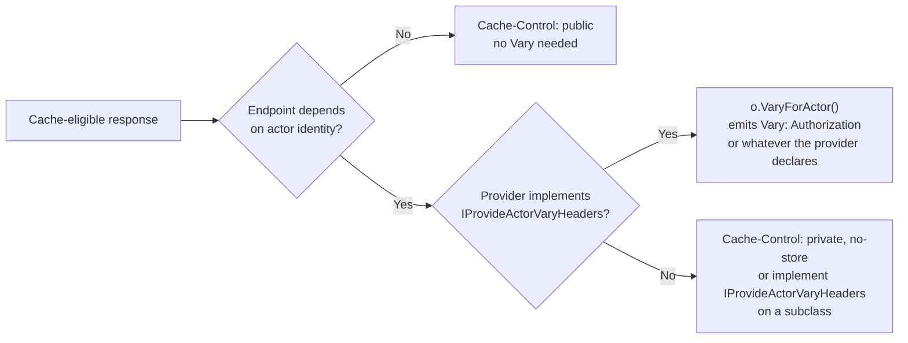
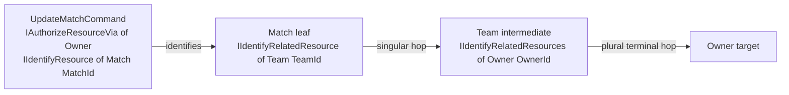
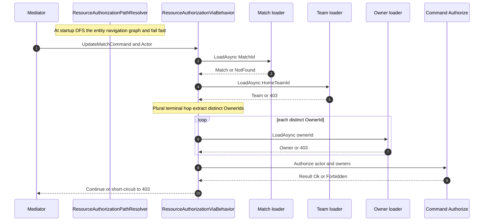

---
title: ASP.NET Core Authorization
package: Trellis.Asp
topics: [authorization, actor, entra, claims, abac, mediator, asp]
related_api_reference: [trellis-api-authorization.md, trellis-api-asp.md, trellis-api-core.md]
last_verified: 2026-05-14
audience: [developer]
---
# ASP.NET Core Authorization

`Trellis.Asp.Authorization` translates an authenticated `ClaimsPrincipal` into a frozen `Actor` (id + permissions + forbidden permissions + ABAC attributes) so handlers, mediator behaviors, and endpoints stop parsing JWT claims directly.

## Mental model

Authorization in a Trellis + ASP.NET Core service runs as a pipeline. Each layer has one job, and each layer is the only thing the next layer trusts. Understanding where each decision is made — and which layer turns the decision into an HTTP status — is the difference between a debuggable system and a "why is this 401?" mystery.

### End-to-end flow



Six layers, in order of execution:

1. **Authentication (`JwtBearer` or your scheme).** Validates the token's signature, issuer, audience, and expiry. Produces an authenticated `ClaimsPrincipal` on `HttpContext.User` — or a 401 challenge if the token is missing/invalid. Trellis does not run here; the auth handler owns this slice.

2. **Claim mapping.** `JwtBearerOptions.MapInboundClaims = true` (the ASP.NET Core default) silently remaps RFC 7519 short claim names (`sub`, `email`, `role`) onto WS-* long-form URNs (`ClaimTypes.NameIdentifier`, `ClaimTypes.Email`, `ClaimTypes.Role`) **before** the claims reach `HttpContext.User`. This is the most common Trellis-integration footgun and is covered explicitly in [`MapInboundClaims` and the short↔long fallback](#mapinboundclaims-and-the-shortlong-fallback) below.

3. **Actor resolution (`IActorProvider`).** A scoped service that reads `HttpContext.User`, applies your claim-mapping rules, and returns `Maybe<Actor>`. The bundled providers (`ClaimsActorProvider`, `EntraActorProvider`, `DevelopmentActorProvider`) cover the common cases; `CachingActorProvider` wraps any of them. Returning `Maybe<Actor>.None` is the framework's "no identifiable actor" signal — when the mediator authorization pipeline (layers 4–5 below) consumes it, the pipeline maps `None` to HTTP 401, not 500. Endpoints that resolve the actor directly (outside the mediator pipeline) are responsible for their own 401 — see the Quick start.

4. **Static permission authorization (`AuthorizationBehavior`).** Commands implementing `IAuthorize` declare `RequiredPermissions`. The behavior reads the actor, checks every required permission against `Actor.Permissions` (deny-aware via `Actor.ForbiddenPermissions`), and emits `Error.Forbidden` → HTTP 403 when any check fails. No resource is loaded.

5. **Resource-based authorization.** Two distinct behaviors handle this. `ResourceAuthorizationBehavior<TMessage, TResource, TResponse>` handles commands implementing `IAuthorizeResource<TResource>` (single-hop): loads ONE entity via the configured `IResourceLoader<TMessage, TResource>` (typically `SharedResourceLoaderById<TResource, TId>` bridged through `IIdentifyResource<TResource, TId>`, but may be a custom per-command loader) and calls `Authorize(actor, resource)`. `ResourceAuthorizationViaBehavior<TMessage, TLeaf, TOwner, TResponse>` handles commands implementing `IAuthorizeResourceVia<TOwner>` (multi-hop): loads the leaf, walks each navigation hop (each via its own `SharedResourceLoaderById<,>`), and calls `Authorize(actor, IReadOnlyList<TOwner>)` — multiple owners when the terminal hop is plural (e.g. cricket fan-out). Either denial emits `Error.Forbidden` → HTTP 403; both share one envelope shape.

6. **Handler.** Receives a validated, authorized command. Returns `Result<T>` / `Result<WriteOutcome<T>>` / `Result<Page<T>>`. `ToHttpResponse(...)` maps success to 200/201/204/206 with appropriate companion headers; failures continue through `ResponseFailureWriter` to ProblemDetails.

### Decision tree: which authorization shape?



Pick one **primary** authorization shape per command. The framework allows an `IAuthorize` static gate to coexist with `IAuthorizeResource<T>` or `IAuthorizeResourceVia<TOwner>` (both run, either denial produces 403) — that composition is common for a coarse "must have this permission" gate plus a fine "and must own the resource" check. The only combination rejected at startup is **dual-mode resource authorization** (a command carrying both `IAuthorizeResource<T>` and `IAuthorizeResourceVia<TOwner>` simultaneously) — pick one path-resolution shape, not both.

### Anatomy of a 401



Two 401 sources, one wire shape. The mediator-emitted 401 (right branch) is the path the framework controls; consumers populate `Error.Unauthorized.Challenges` explicitly when they need a parametrized challenge (with `realm`, `scope`, etc.).

### Anatomy of a 403



403 always carries a `PolicyId` (the policy identifier the consumer authored) and optionally a `ResourceRef` (which resource the policy was evaluated against). 404 is reserved for the leaf resource genuinely not existing in the single-resource path above; resource-authorization failure on a loaded entity is always 403, never 404. **In multi-hop authorization** the directly identified leaf load failure bubbles verbatim (so a missing leaf can still produce 404); only intermediate hop and terminal owner load failures collapse to 403 to avoid existence leaks across team / owner boundaries — see [Multi-hop resource authorization](#multi-hop-resource-authorization-via-iauthorizeresourceviatowner) for the full sequence.

### Cache partitioning across actors

Cacheable responses (200, 206, 304, paginated lists) must include `Vary: <actor-header>` so intermediate caches partition by actor — without it, actor A's response can be served to actor B.



The bundled `ClaimsActorProvider` / `EntraActorProvider` declare `VaryByHeaders = ["Authorization"]` (the JWT-bearer assumption); `DevelopmentActorProvider` declares `[X-Test-Actor]`; `CachingActorProvider` delegates to its inner. Services that use cookie or forwarded-header auth must subclass and override `VaryByHeaders` — leaving the default would emit a wrong `Vary` header. Services that derive actor identity from request data that cannot be cleanly named by a single HTTP header (mTLS client certificate, IP-based binding, etc.) must NOT call `VaryForActor()`; use `Cache-Control: private, no-store` on those endpoints instead. See [`VaryForActor()` on `HttpResponseOptionsBuilder<T>`](../api_reference/trellis-api-asp.md#httpresponseoptionsbuildertdomain) and [Cache partitioning across actors (`VaryForActor()`)](#cache-partitioning-across-actors-varyforactor) below for the configured shape.

## Patterns Index

| Goal | Use | See |
|---|---|---|
| Resolve actors from Azure Entra ID v2.0 tokens | `AddEntraActorProvider(options?)` | [Entra ID provider](#entra-id-provider) |
| Resolve actors from any flat-claim OIDC/JWT provider | `AddClaimsActorProvider(options?)` | [Generic claims provider](#generic-claims-provider) |
| Inject a fake actor in Development / integration tests | `AddDevelopmentActorProvider(options?)` | [Development provider](#development-provider) |
| Cache an async actor resolution per request | `AddCachingActorProvider<T>()` | [Caching wrapper](#caching-wrapper) |
| Flatten roles into permissions / add ABAC attributes | `EntraActorOptions.MapPermissions` / `MapAttributes` | [Customizing claim mapping](#customizing-claim-mapping) |
| Read well-known attributes safely | `Actor.GetAttribute(ActorAttributes.*)` | [ABAC attributes](#abac-attributes) |
| Enforce static permissions on a command | `IAuthorize.RequiredPermissions` | [Mediator integration](#mediator-integration) |
| Authorize against a loaded entity | `IAuthorizeResource<TResource>` | [Mediator integration](#mediator-integration) |
| Authorize against an ancestor of the loaded entity (multi-hop) | `IAuthorizeResourceVia<TOwner>` + `IIdentifyRelatedResource(s)` on path entities | [Multi-hop resource authorization](#multi-hop-resource-authorization-via-iauthorizeresourceviatowner) |
| Partition cache entries by actor | `o.VaryForActor()` on the response builder | [Cache partitioning across actors](#cache-partitioning-across-actors-varyforactor) |
| Configure JWT bearer to avoid the `MapInboundClaims` footgun | `o.MapInboundClaims = false` on `AddJwtBearer(...)` | [`MapInboundClaims` and the short↔long fallback](#mapinboundclaims-and-the-shortlong-fallback) |
| Identify two `Actor` snapshots as the same principal | `actorA.Equals(actorB)` (Id-based) | [Surface at a glance](#surface-at-a-glance) |

## Use this guide when

- You host a Trellis service in ASP.NET Core and need to convert an authenticated principal into an `Actor` exactly once per request.
- You want one DI registration that gives every handler, behavior, and endpoint a consistent view of the caller.
- You want to customize how JWT claims map to permissions, deny lists, or ABAC attributes without forking the provider.
- You want development/integration-test seams that fail closed outside `IsDevelopment()`.

## Surface at a glance

`Trellis.Asp.Authorization` (namespace inside the `Trellis.Asp` package) exposes one set of DI extensions plus four `IActorProvider` implementations and matching options classes.

| API | Kind | Returns / Lifetime | Purpose |
|---|---|---|---|
| `AddEntraActorProvider(this IServiceCollection, Action<EntraActorOptions>?)` | DI extension | Scoped `IActorProvider` → `EntraActorProvider` | Entra v2.0 (`oid`/`roles`/`tid`/`amr` ...) → `Actor`. |
| `AddClaimsActorProvider(this IServiceCollection, Action<ClaimsActorOptions>?)` | DI extension | Scoped `IActorProvider` → `ClaimsActorProvider` | Generic flat-claim mapping (configurable `ActorIdClaim`, `PermissionsClaim`). |
| `AddDevelopmentActorProvider(this IServiceCollection, Action<DevelopmentActorOptions>?)` | DI extension | Scoped `IActorProvider` → `DevelopmentActorProvider` | Reads `X-Test-Actor` JSON header; throws outside `IsDevelopment()`. |
| `AddCachingActorProvider<T>(this IServiceCollection)` | DI extension | Scoped `IActorProvider` → `CachingActorProvider` wrapping `T` | Caches one resolution task per request scope. |
| `ClaimsActorProvider` | Class | Scoped, virtual `GetCurrentActorAsync` | Subclass for custom flat-claim providers. Permissions resolved via literal `FindAll(PermissionsClaim)` plus the well-known short↔long counterpart from the JWT inbound claim-name map; matches are merged into a deduplicated `FrozenSet<string>`. |
| `EntraActorProvider` | Class | Scoped, sealed | Falls back to short `oid` when `IdClaimType` is the default; rewraps mapper exceptions in `InvalidOperationException`. |
| `DevelopmentActorProvider` | Class | Scoped, sealed partial | Logs a warning and falls back when the header is malformed (unless `ThrowOnMalformedHeader = true`). |
| `CachingActorProvider` | Class | Scoped, sealed | Uses `LazyInitializer.EnsureInitialized` + `HttpContext.RequestAborted`; honors per-call `CancellationToken` via `Task.WaitAsync`. |
| `EntraActorOptions` / `ClaimsActorOptions` / `DevelopmentActorOptions` | Options | — | Mapping delegates / claim-type strings / dev defaults. |

Full signatures: [`trellis-api-authorization.md`](../api_reference/trellis-api-authorization.md).

> [!NOTE]
> **`Actor` is conceptually an entity, not a value.** Equality is identity-based on `Id` only — two `Actor` instances with the same `Id` are equal even when their `Permissions`, `ForbiddenPermissions`, or `Attributes` snapshots differ. `Id` is meant to be a stable, externally-meaningful principal identifier (e.g. JWT `sub` / `oid` claim); the other properties are point-in-time state about that principal (granted/revoked over time, ABAC attributes change every request). This mirrors `Trellis.Entity<TId>` semantics without taking on the full `IAggregate` surface. `Actor` is a `sealed class` (not a `record`), so the `with`-expression syntax is not available — call the constructor (or `Actor.Create`) directly when you need a copy with changes.

## Installation

```bash
dotnet add package Trellis.Asp
```

The actor providers ship in `Trellis.Asp` under namespace `Trellis.Asp.Authorization`. Domain primitives (`Actor`, `IActorProvider`, `IAuthorize`, `IAuthorizeResource<T>`) come from `Trellis.Authorization`. The mediator-integration samples below additionally use `Trellis.Mediator` and the [Mediator](https://www.nuget.org/packages/Mediator) source generator your app already references when it sends commands through the pipeline.

## Quick start

Authenticate with `JwtBearer`, register `EntraActorProvider`, then read the current `Actor` from any endpoint or handler.

```csharp
using System.Linq;
using System.Threading;
using Microsoft.AspNetCore.Authentication.JwtBearer;
using Microsoft.AspNetCore.Authorization;
using Microsoft.AspNetCore.Builder;
using Microsoft.Extensions.DependencyInjection;
using Trellis.Asp.Authorization;
using Trellis.Authorization;

var builder = WebApplication.CreateBuilder(args);

builder.Services
    .AddAuthentication(JwtBearerDefaults.AuthenticationScheme)
    .AddJwtBearer(options =>
    {
        // Required: keep claim names round-tripping with their RFC 7519 / OIDC short forms.
        // Without this, JwtBearer remaps "tid", "amr", "sub" etc. onto WS-* long-form URNs
        // before they reach HttpContext.User. EntraActorProvider's default MapAttributes
        // checks short claim names directly ("tid", "amr") so the default ABAC attributes
        // — Actor.GetAttribute(ActorAttributes.TenantId) and ActorAttributes.MfaAuthenticated
        // — would silently come back empty / false under the ASP.NET default of true.
        // See "MapInboundClaims and the short↔long fallback" below for the deeper trap.
        options.MapInboundClaims = false;
    });
builder.Services.AddAuthorization();
builder.Services.AddEntraActorProvider();

var app = builder.Build();

app.UseAuthentication();
app.UseAuthorization();

app.MapGet("/me", [Authorize] async (IActorProvider actorProvider, CancellationToken ct) =>
{
    var maybeActor = await actorProvider.GetCurrentActorAsync(ct);
    if (!maybeActor.TryGetValue(out var actor))
        return Results.Unauthorized();

    return Results.Ok(new
    {
        actor.Id,
        Permissions = actor.Permissions.OrderBy(p => p).ToArray(),
        TenantId = actor.GetAttribute(ActorAttributes.TenantId),
        Mfa = actor.GetAttribute(ActorAttributes.MfaAuthenticated),
    });
});

app.Run();
```

> [!NOTE]
> The provider extracts an `Actor` from `HttpContext.User`. It does **not** validate tokens — keep your normal authentication middleware in place.

## Entra ID provider

| Member | Default | Override to... |
|---|---|---|
| `EntraActorOptions.IdClaimType` | `"http://schemas.microsoft.com/identity/claims/objectidentifier"` (falls back to short `"oid"`) | Use `sub`, employee ID, etc. |
| `EntraActorOptions.MapPermissions` | union of `roles` and `ClaimTypes.Role` claim values (case-insensitive type match) | Flatten roles into fine-grained permissions; merge DB-sourced grants. |
| `EntraActorOptions.MapForbiddenPermissions` | empty `HashSet<string>` | Project a deny-list claim or DB lookup. |
| `EntraActorOptions.MapAttributes` | extracts `tid`, `preferred_username`, `azp`, `azpacr`, `acrs`; adds `ip_address` from `Connection.RemoteIpAddress` and `mfa = "true"\|"false"` from any `amr` claim equal to `"mfa"` | Add tenant-scoped or request-scoped attributes. |

`EntraActorProvider` returns `Maybe<Actor>.None` when no authenticated `ClaimsIdentity` exists or the configured `IdClaimType` is missing (and the short `oid` fallback also misses); the mediator authorization pipeline maps `Maybe.None` to `Error.Unauthorized` (HTTP 401, RFC 9110 §15.5.2). It throws `InvalidOperationException` only when invoked outside an HTTP request scope (no `HttpContext`) — a configuration bug that surfaces as HTTP 500. Any exception thrown by `MapPermissions`, `MapForbiddenPermissions`, or `MapAttributes` is rewrapped in `InvalidOperationException` naming the failing delegate.

## Generic claims provider

For any flat-claim OIDC token where you can name the id and permissions claim types directly.

| Member | Default | Notes |
|---|---|---|
| `ClaimsActorOptions.ActorIdClaim` | `"sub"` (RFC 7519 / OIDC subject claim) | Literal `Claim.Type` match first; if not found, falls back to the well-known short↔long counterpart (e.g., `"sub"` ↔ `ClaimTypes.NameIdentifier`) so the default just-works against either `JwtBearerOptions.MapInboundClaims = true` or `false`. Emits a debug-level log entry when the fallback fires. No JSON-path traversal. |
| `ClaimsActorOptions.PermissionsClaim` | `"permissions"` | Multi-valued JWT claims arrive as repeated `Claim` instances and are aggregated via `FindAll`. Same curated short↔long mapping table as `ActorIdClaim`: literal match first, then every counterpart in the table is also queried and merged into a deduplicated set, so `"role"`/`"roles"`/`ClaimTypes.Role` all just-work against `JwtBearerOptions.MapInboundClaims = true` or `false`. The default `"permissions"` is not in the mapping table, so it resolves by literal match only. Emits a debug-level log entry when the fallback fires. |

```csharp
using Microsoft.Extensions.DependencyInjection;
using Trellis.Asp.Authorization;

builder.Services.AddClaimsActorProvider(options =>
{
    options.ActorIdClaim = "sub";
    options.PermissionsClaim = "permissions";
});
```

> **JwtBearer integration tip.** ASP.NET Core's `AddJwtBearer(...)` defaults to `MapInboundClaims = true`, which remaps the JWT `"sub"` claim onto the WS-* long-form URN (`http://schemas.xmlsoap.org/ws/2005/05/identity/claims/nameidentifier`) before the principal reaches Trellis. `ClaimsActorProvider`'s short↔long claim-name fallback hides this from you — the default `ActorIdClaim = "sub"` resolves the actor correctly under either setting. New services should set `MapInboundClaims = false` on `AddJwtBearer(...)` to keep claim names round-tripping with their RFC 7519 names; the fallback continues to accept both forms.

`ClaimsActorProvider.GetCurrentActorAsync` is `virtual` — subclass it to compute permissions from nested claims, look them up in a store, etc., then register your subclass via `AddCachingActorProvider<TYourProvider>()` to amortize the cost across the request.

## Development provider

For local development and integration tests only. The provider reads an `X-Test-Actor` JSON header shaped like `{ "Id": "...", "Permissions": [...], "ForbiddenPermissions": [...], "Attributes": {...} }` (case-insensitive property matching).

| Member | Default | Notes |
|---|---|---|
| `DevelopmentActorOptions.DefaultActorId` | `"development"` | Used when the header is missing or empty. |
| `DevelopmentActorOptions.DefaultPermissions` | empty `HashSet<string>` | Used when the header is missing or empty. |
| `DevelopmentActorOptions.ThrowOnMalformedHeader` | `false` | When `true`, malformed JSON throws instead of logging a warning and falling back. |

```csharp
using System.Collections.Generic;
using Microsoft.Extensions.DependencyInjection;
using Microsoft.Extensions.Hosting;
using Trellis.Asp.Authorization;

if (builder.Environment.IsDevelopment())
{
    builder.Services.AddDevelopmentActorProvider(options =>
    {
        options.DefaultActorId = "developer@local";
        options.DefaultPermissions = new HashSet<string> { "Products.Read", "Products.Write" };
    });
}
else
{
    builder.Services.AddEntraActorProvider();
}
```

> [!WARNING]
> `DevelopmentActorProvider.GetCurrentActorAsync` throws `InvalidOperationException` whenever `IHostEnvironment.IsDevelopment()` is `false` — even when the header is absent. Registering it in Production is a fail-fast safety net.

For test clients, the `WebApplicationFactoryExtensions.CreateClientWithActor(...)` helper in `Trellis.Testing.AspNetCore` writes the same header for you; see [`trellis-api-testing-aspnetcore.md`](../api_reference/trellis-api-testing-aspnetcore.md).

## Caching wrapper

When resolving an actor requires extra async work (database lookups, remote calls), wrap the inner provider so a single resolution task is shared across the request scope.

```csharp
using System.Threading;
using System.Threading.Tasks;
using Microsoft.AspNetCore.Http;
using Microsoft.Extensions.DependencyInjection;
using Trellis.Asp.Authorization;
using Trellis.Authorization;

public interface IPermissionStore
{
    Task<IReadOnlySet<string>> GetPermissionsAsync(string userId, CancellationToken ct);
}

public sealed class DatabaseActorProvider(
    IHttpContextAccessor httpContextAccessor,
    IPermissionStore permissionStore) : IActorProvider
{
    public async Task<Maybe<Actor>> GetCurrentActorAsync(CancellationToken cancellationToken = default)
    {
        // HttpContext missing is a configuration bug, not authentication state — throw
        // so it surfaces as HTTP 500 rather than masquerading as a 401.
        var httpContext = httpContextAccessor.HttpContext
            ?? throw new InvalidOperationException("No HttpContext available.");

        // No authenticated identity / missing id claim → no usable actor → Maybe.None,
        // which the mediator pipeline maps to Error.Unauthorized (HTTP 401).
        var userId = httpContext.User.FindFirst("sub")?.Value;
        if (userId is null)
            return Maybe<Actor>.None;

        var permissions = await permissionStore.GetPermissionsAsync(userId, cancellationToken);
        return Maybe.From(Actor.Create(userId, permissions));
    }
}

builder.Services.AddSingleton<IPermissionStore, MyPermissionStore>();
builder.Services.AddCachingActorProvider<DatabaseActorProvider>();
```

`CachingActorProvider` issues the inner call with `HttpContext.RequestAborted` so the shared work is cancelled with the request, then forwards each caller's own `CancellationToken` via `Task.WaitAsync`.

## Customizing claim mapping

`EntraActorOptions` exposes three independent delegates — override only what you need.

### `MapInboundClaims` and the short↔long fallback

ASP.NET Core's `JwtBearerOptions.MapInboundClaims` defaults to `true`. The handler silently remaps RFC 7519 short claim names (`sub`, `email`, `role`, `roles`, `oid`, `upn`, `tid`, `idp`, `acr`, `amr`) onto WS-* long-form URNs (`ClaimTypes.NameIdentifier`, `ClaimTypes.Email`, `ClaimTypes.Role`, `http://schemas.microsoft.com/identity/claims/objectidentifier`, etc.) **before** the claims reach `HttpContext.User`. **The trap:** with `ClaimsActorOptions.ActorIdClaim = "sub"` (the OIDC standard default) and an unchanged `MapInboundClaims = true`, a literal `identity.FindFirst("sub")` would return null because the claim was renamed to `ClaimTypes.NameIdentifier`. Without protection, the provider would return `Maybe<Actor>.None`, the mediator would emit 401 on every authenticated request, and there would be no diagnostic pointing at the cause — the most common Trellis-integration footgun.

`ClaimsActorProvider` defends against this trap with a curated short↔long fallback table that mirrors the OAuth2 / OIDC / Microsoft identity-platform subset of `JwtSecurityTokenHandler.DefaultInboundClaimTypeMap`. The literal lookup is tried first; if the configured claim name is absent the provider falls back to its counterpart and emits a debug-level log entry naming both, so operators can spot a misaligned `MapInboundClaims` setting in production:

| Configured short form | Long-form counterpart |
|---|---|
| `"sub"` / `"nameid"` | `ClaimTypes.NameIdentifier` |
| `"name"` / `"unique_name"` | `ClaimTypes.Name` |
| `"email"` | `ClaimTypes.Email` |
| `"role"` / `"roles"` | `ClaimTypes.Role` |
| `"family_name"` | `ClaimTypes.Surname` |
| `"given_name"` | `ClaimTypes.GivenName` |
| `"gender"` | `ClaimTypes.Gender` |
| `"birthdate"` | `ClaimTypes.DateOfBirth` |
| `"website"` | `ClaimTypes.Webpage` |
| `"actort"` | `ClaimTypes.Actor` |
| `"upn"` | `ClaimTypes.Upn` |
| `"oid"` | `http://schemas.microsoft.com/identity/claims/objectidentifier` |
| `"tid"` | `http://schemas.microsoft.com/identity/claims/tenantid` |
| `"idp"` | `http://schemas.microsoft.com/identity/claims/identityprovider` |
| `"acr"` | `http://schemas.microsoft.com/claims/authnclassreference` |
| `"amr"` | `http://schemas.microsoft.com/claims/authnmethodsreferences` |

The fallback is **bidirectional**: literal `Claim.Type` match first; if neither the configured name nor a counterpart resolves, both `ActorIdClaim` and `PermissionsClaim` fall back through the table. Configuring `ActorIdClaim = "sub"` or `ActorIdClaim = ClaimTypes.NameIdentifier` both work, against either `MapInboundClaims = true` or `false`. The provider emits a debug-level log entry naming the configured claim and the resolved counterpart whenever the fallback fires — useful for diagnosing "always 401" issues in production. The default `PermissionsClaim = "permissions"` is NOT in the inbound map, so its resolution remains literal-only (regression-safe).

> [!CAUTION]
> The OAuth scope claim `"scp"` is intentionally NOT in the fallback table. Its value is space-delimited per RFC 6749 §3.3 (e.g. `"orders.read orders.write"`); the provider snapshots claim values verbatim into the permission set, so a fallback for `scp` would still leave `Actor.HasPermission("orders.read")` returning `false` (the permission set would contain the single string `"orders.read orders.write"`). OAuth scope-as-permission requires a custom subclass that splits the value on whitespace.

> [!TIP]
> **Recommended for new services:** `services.AddAuthentication().AddJwtBearer(o => { o.MapInboundClaims = false; ... })`. Claim names then round-trip with their OIDC / RFC 7519 short names and the **`ClaimsActorProvider` shared short↔long fallback** never fires — keeping the production log quiet and the failure mode (`Maybe<Actor>.None`) tied to genuinely missing claims, not handler-side rename surprises. `EntraActorProvider`'s own `oid` ↔ long-form fallback (documented below) is unaffected; it covers the v2.0 default and runs whether or not `MapInboundClaims` is set.

> [!NOTE]
> **`EntraActorProvider` does not inherit this fallback** — it overrides `GetCurrentActorAsync` and resolves the actor id with a single-purpose `oid` ↔ `http://schemas.microsoft.com/identity/claims/objectidentifier` fallback (covering the v2.0-default case). Permissions are mapped via the configured `MapPermissions` delegate against the raw claim list, not through the shared table. If you set `EntraActorOptions.IdClaimType` to a non-default short claim (`"sub"`, `"upn"`, etc.) AND your `JwtBearer` keeps `MapInboundClaims = true`, set `MapInboundClaims = false` or configure `IdClaimType` to the mapped long form explicitly — the shared fallback only applies under `ClaimsActorProvider`.

### Flatten Entra roles into application permissions

```csharp
using System;
using System.Collections.Generic;
using System.Linq;
using Microsoft.Extensions.DependencyInjection;
using Trellis.Asp.Authorization;

builder.Services.AddEntraActorProvider(options =>
{
    var rolePermissionMap = new Dictionary<string, string[]>(StringComparer.Ordinal)
    {
        ["Catalog.Admin"]  = ["Products.Read", "Products.Write", "Products.Delete"],
        ["Catalog.Reader"] = ["Products.Read"],
    };

    options.MapPermissions = claims => claims
        .Where(c => string.Equals(c.Type, "roles", StringComparison.OrdinalIgnoreCase))
        .SelectMany(c => rolePermissionMap.TryGetValue(c.Value, out var perms) ? perms : Array.Empty<string>())
        .ToHashSet(StringComparer.Ordinal);
});
```

### Use delegated scopes (`scp`) instead of roles

```csharp
using System;
using System.Linq;
using Microsoft.Extensions.DependencyInjection;
using Trellis.Asp.Authorization;

builder.Services.AddEntraActorProvider(options =>
{
    options.MapPermissions = claims => claims
        .Where(c => string.Equals(c.Type, "scp", StringComparison.OrdinalIgnoreCase))
        .SelectMany(c => c.Value.Split(' ', StringSplitOptions.RemoveEmptyEntries))
        .ToHashSet(StringComparer.Ordinal);
});
```

### Add forbidden permissions and custom attributes

> [!WARNING]
> Assigning `MapAttributes` (or `MapPermissions` / `MapForbiddenPermissions`) **replaces** the default Entra mapper — it does not augment. The Entra default `MapAttributes` populates `tid`, `preferred_username`, `azp`, `azpacr`, `acrs`, `ip_address`, and `mfa` from the `amr` claim; a replacement that only writes `region` and `ip_address` loses every other default attribute. If you need additional attributes ON TOP of the defaults, build a wrapper that first runs the default logic (copy from `EntraActorOptions.cs`) and then adds your own keys.

```csharp
using System;
using System.Collections.Generic;
using System.Linq;
using Microsoft.Extensions.DependencyInjection;
using Trellis.Asp.Authorization;
using Trellis.Authorization;

builder.Services.AddEntraActorProvider(options =>
{
    options.MapForbiddenPermissions = claims => claims
        .Where(c => string.Equals(c.Type, "denied_permissions", StringComparison.OrdinalIgnoreCase))
        .Select(c => c.Value)
        .ToHashSet(StringComparer.Ordinal);

    options.MapAttributes = (claims, httpContext) =>
    {
        var attributes = new Dictionary<string, string>(StringComparer.Ordinal);

        var region = claims.FirstOrDefault(c => c.Type == "region")?.Value;
        if (!string.IsNullOrWhiteSpace(region))
            attributes["region"] = region;

        var ip = httpContext.Connection.RemoteIpAddress?.ToString();
        if (!string.IsNullOrWhiteSpace(ip))
            attributes[ActorAttributes.IpAddress] = ip;

        return attributes;
    };
});
```

> [!WARNING]
> Throwing inside any `Map*` delegate produces an `InvalidOperationException` with the message `EntraActorOptions.<delegate> threw an exception while mapping the authenticated user's claims.` — it does not silently default.

## ABAC attributes

`Actor.Attributes` is an immutable `FrozenDictionary<string, string>`. Read it via `GetAttribute` (returns `string?`) or `HasAttribute`, and key it with `ActorAttributes.*` constants instead of magic strings.

```csharp
using Trellis;
using Trellis.Authorization;

var tenantId = actor.GetAttribute(ActorAttributes.TenantId);

if (tenantId is null || !actor.HasPermission("Documents.Read", tenantId))
    return Result.Fail(new Error.Forbidden("documents.read") { Detail = "Wrong tenant." });

var clientApp = actor.GetAttribute(ActorAttributes.AuthorizedParty);
var mfaPassed = actor.GetAttribute(ActorAttributes.MfaAuthenticated) == "true";
```

`Actor.HasPermission(permission, scope)` checks for the joined string `permission:scope`, where `:` is `Actor.PermissionScopeSeparator`. See [`trellis-api-authorization.md`](../api_reference/trellis-api-authorization.md#actor) for the full deny-overrides-allow rules.

## Mediator integration

When a request flows through `Trellis.Mediator`, prefer pipeline behaviors over per-handler permission checks. `AuthorizationBehavior<TMessage, TResponse>` (see [`trellis-api-mediator.md`](../api_reference/trellis-api-mediator.md)) calls `IActorProvider.GetCurrentActorAsync` and short-circuits the pipeline with `Error.Unauthorized` when no actor is resolved, or `Error.Forbidden` when a required permission is missing.

### Static permission checks via `IAuthorize`

```csharp
using System.Collections.Generic;
using Mediator;
using Trellis;
using Trellis.Authorization;

public sealed record DeleteDocumentCommand(string DocumentId)
    : ICommand<Result<Unit>>, IAuthorize
{
    public IReadOnlyList<string> RequiredPermissions { get; } = ["Documents.Delete"];
}
```

The behavior requires the actor to hold **every** listed permission (AND semantics). Returning `Result<Unit>` from the command is the canonical command shape.

### Resource-based checks via `IAuthorizeResource<TResource>`

Use this when the rule depends on a loaded entity, not just static permissions. The framework supports two loader shapes — pick one per command:

- **Per-command custom loader** (shown below): register `IResourceLoader<TMessage, TResource>` for one specific command. Useful when the load is a projection (joins, computed shape) or a custom traversal that can't be expressed as load-by-id.
- **Shared load-by-id**: implement `IIdentifyResource<TResource, TId>` on the message and register a single `SharedResourceLoaderById<TResource, TId>` that bridges every command identifying the same resource through the same loader. Discoverable by `AddResourceAuthorization(Assembly[])`. Preferred when multiple commands authorize against the same resource type.

```csharp
using Mediator;
using Trellis;
using Trellis.Authorization;

public sealed record Document(string Id, string OwnerId);

public sealed record EditDocumentCommand(string DocumentId)
    : ICommand<Result<Unit>>, IAuthorizeResource<Document>
{
    public IResult Authorize(Actor actor, Document resource) =>
        Result.Ensure(
            actor.IsOwner(resource.OwnerId) || actor.HasPermission("Documents.EditAny"),
            new Error.Forbidden("documents.edit") { Detail = "Only the owner can edit this document." });
}

// The per-command custom loader extracts whatever shape Authorize() needs.
// Typically wraps a repository; can also project (joins, computed values) when the
// authorization rule needs more than a single repository lookup.
public sealed class DocumentResourceLoader(IDocumentRepository repository)
    : IResourceLoader<EditDocumentCommand, Document>
{
    public Task<Result<Document>> LoadAsync(EditDocumentCommand message, CancellationToken cancellationToken)
        => repository.GetByIdAsync(message.DocumentId, cancellationToken);
}
```

Wire the loader and pipeline behaviors in `Program.cs`:

```csharp
using Mediator;
using Microsoft.Extensions.DependencyInjection;
using Trellis.Asp.Authorization;
using Trellis.Mediator;

builder.Services.AddEntraActorProvider();

// 1. Register the resource loader for this command.
//    DocumentResourceLoader implements IResourceLoader<EditDocumentCommand, Document>.
builder.Services.AddScoped<IResourceLoader<EditDocumentCommand, Document>, DocumentResourceLoader>();

// 2. Register the resource-authorization pipeline behavior.
//    Type arguments are <TMessage, TResource, TResponse> — the *command* type comes first,
//    then the resource type loaded for it, then the command's response type.
builder.Services.AddResourceAuthorization<EditDocumentCommand, Document, Result<Unit>>();

builder.Services.AddMediator(options =>
{
    options.ServiceLifetime = ServiceLifetime.Scoped;
    options.PipelineBehaviors = [.. Trellis.Mediator.ServiceCollectionExtensions.PipelineBehaviors];
});
```

> [!NOTE]
> `AddResourceAuthorization` lives in `Trellis.Mediator`. Forgetting `using Trellis.Mediator;` produces `CS1061: 'IServiceCollection' does not contain a definition for 'AddResourceAuthorization'`. The full registration shape is documented in [`trellis-api-mediator.md`](../api_reference/trellis-api-mediator.md#servicecollectionextensions).

> [!IMPORTANT]
> **The `TResponse` type argument must satisfy `IResult` *and* `IFailureFactory<TResponse>`.** `Result<TValue>` (the canonical command response) satisfies both automatically. If you wire up a custom envelope response type that doesn't, `AddResourceAuthorization<TMessage, TResource, TResponse>()` (and the assembly-scanning overload, when it sees an `IAuthorizeResource<TResource>` message with that response type) **fails fast at registration** with `InvalidOperationException` — the security-marked command will not silently ship without resource authorization. See [Custom envelope response types](integration-mediator.md#custom-envelope-response-types) in the mediator article for the full contract.

### Multi-hop resource authorization via `IAuthorizeResourceVia<TOwner>`

When the rule depends on an entity that is **not** the entity the command directly identifies — e.g. "only the team's owners can modify a match" — the authorization rule fires against the *owner* of the team, but the command identifies the *leaf* (match). Walking the path by hand inside `Authorize(actor, resource)` would couple the command to the navigation chain and turn every traversal into a fresh shaped query.

`Trellis.Authorization` solves this with marker interfaces on the command and the path entities. The framework's `ResourceAuthorizationViaBehavior` resolves the path at registration time (`ResourceAuthorizationPathResolver` does a DFS to enumerate distinct simple paths), then at request time walks the path via existing `SharedResourceLoaderById<,>` registrations and invokes `Authorize(actor, IReadOnlyList<TOwner>)`. The terminal hop may be plural (cricket-style fan-out: `Match → Team → Owners[]`), producing a list passed to the command's authorize callback.





**Sketch:**

```csharp
using System.Collections.Generic;
using System.Linq;
using Mediator;
using Trellis;
using Trellis.Authorization;

public sealed record Owner(OwnerId Id);
public sealed record Team(TeamId Id, IReadOnlyList<OwnerId> CoOwnerIds) : IIdentifyRelatedResources<Owner, OwnerId>
{
    public IReadOnlyList<OwnerId> GetRelatedResourceIds() => CoOwnerIds;
}
public sealed record Match(MatchId Id, TeamId HomeTeamId) : IIdentifyRelatedResource<Team, TeamId>
{
    public TeamId GetRelatedResourceId() => HomeTeamId;
}

public sealed record UpdateMatchCommand(MatchId MatchId, string NewVenue)
    : ICommand<Result<Unit>>,
      IAuthorizeResourceVia<Owner>,
      IIdentifyResource<Match, MatchId>
{
    public MatchId GetResourceId() => MatchId;

    public IResult Authorize(Actor actor, IReadOnlyList<Owner> owners) =>
        Result.Ensure(
            owners.Any(o => actor.IsOwner(o.Id.Value)),
            new Error.Forbidden("matches.update") { Detail = "Only an owner of the home team can update this match." });
}
```

Wire the path at the composition root. Multi-hop with a plural terminal (cricket fan-out) requires either assembly scanning or a hand-built `ResolvedAuthorizationPath` — the AOT-friendly `AddRelatedResourceAuthorization<...>(extractOwnerId)` overload is single-hop only. The assembly scanner discovers the `IAuthorizeResourceVia<TOwner>` marker, the navigation path (which requires the path entity types to be in the scanned assemblies — explicit loader registrations do NOT add entity types to discovery), AND registers concrete `IResourceLoader<,>` / `SharedResourceLoaderById<,>` implementations it finds in those assemblies (via `TryAddScoped`, so explicit registrations win). If your loader implementations live in a different assembly than the commands and entities, pass that assembly to the scan too — or register them explicitly:

```csharp
builder.Services.AddScoped<SharedResourceLoaderById<Match, MatchId>, MatchLoader>();
builder.Services.AddScoped<SharedResourceLoaderById<Team, TeamId>, TeamLoader>();
builder.Services.AddScoped<SharedResourceLoaderById<Owner, OwnerId>, OwnerLoader>();
builder.Services.AddResourceAuthorization(typeof(UpdateMatchCommand).Assembly);
```

For Native AOT / trimming-strict deployments the cookbook walks through hand-building `ResolvedAuthorizationPath` for multi-hop chains. See [Recipe 24](../api_reference/trellis-api-cookbook.md#recipe-24--indirect-multi-hop-resource-authorization) for the full walkthrough.

> [!IMPORTANT]
> **What fires at startup vs at request time.** The path resolver runs at registration time (during `AddResourceAuthorization(...)`) and rejects with `InvalidOperationException`: no path from leaf to owner, ambiguous path (multiple distinct routes), plural-in-middle (only the terminal hop may be plural, to avoid cartesian fan-out), leaf == owner (use `IAuthorizeResource<T>` instead), via-command without `IIdentifyResource<TLeaf, TLeafId>`, and dual-mode commands (carrying both `IAuthorizeResource<T>` and `IAuthorizeResourceVia<TOwner>` — security primitives are never silently composed). Missing `SharedResourceLoaderById<TTo, TToId>` registration for **any hop in the path** (including the terminal owner hop) is a request-time `InvalidOperationException` — the resolver builds the loader delegate at registration time but resolves the concrete loader from the request scope at request time, so an absent registration fails loud rather than masking as 403. Intermediate or owner load *failures* (`Result<T>.IsFailure`) collapse to `Error.Forbidden`, not `Error.NotFound`, to avoid existence leaks across team / owner boundaries.

> [!TIP]
> The marker interfaces declare the path; the resolver computes the navigation chain once at registration time and caches it. If your authorization rule needs to traverse a hop that can't be expressed as "load by id" (cartesian joins, recursive hierarchies, conditional paths), fall back to the per-command `IResourceLoader<TMessage, TProjection>` escape hatch and write `Authorize(actor, projection)` directly. See [`trellis-api-mediator.md`](../api_reference/trellis-api-mediator.md) and Recipe 24 in [`trellis-api-cookbook.md`](../api_reference/trellis-api-cookbook.md#recipe-24--indirect-multi-hop-resource-authorization) for the full reference.

### Cache partitioning across actors (`VaryForActor()`)

Cacheable responses (200, 206, 304, paginated lists) must include `Vary: <actor-header>` so intermediate HTTP caches partition by actor — without it, actor A's response can be served to actor B. The manual approach is `o.Vary("Authorization")` on every cache-eligible endpoint, kept in sync with whichever `IActorProvider` is registered. `VaryForActor()` removes the bookkeeping:

```csharp
return result.ToHttpResponse(MyResponse.From, o => o
    .WithETag(_ => weakETag)
    .EvaluatePreconditions()
    .VaryForActor());
```

At apply time the builder resolves the registered `IActorProvider` and reads its `IProvideActorVaryHeaders.VaryByHeaders` collection (a capability the bundled providers implement). The decorator chain is walked from outermost to innermost: the **first** provider in that walk that implements `IProvideActorVaryHeaders` supplies the headers, and unwrapping continues only to find the innermost provider for diagnostics. This shape means a wrapper that legitimately augments the header set (e.g. a tenant-scoping decorator adding `X-Tenant` alongside the inner provider's `Authorization`) is honored; `CachingActorProvider` is unwrapped because it delegates the capability rather than implementing it itself.

**Fail-closed semantics.** When no provider in the chain implements `IProvideActorVaryHeaders`, or when the implementation returns an empty `VaryByHeaders` collection, `VaryForActor()` throws `InvalidOperationException` at apply time — surfacing misconfiguration as a clear error rather than silently shipping a response that an intermediate cache could pollute across actors. Diagnostics name the **innermost** provider as the remediation site, not the wrapper.

**Override the JWT-bearer default for non-bearer header-backed auth.** `ClaimsActorProvider.VaryByHeaders` is `virtual` with the default `["Authorization"]`. Services that authenticate with cookies or forwarded headers MUST subclass and override — leaving the default would emit a wrong `Vary` header (and reintroduce the cache-poisoning bug `VaryForActor()` exists to prevent):

```csharp
public sealed class CookieClaimsActorProvider(
    IHttpContextAccessor accessor,
    IOptions<ClaimsActorOptions> options,
    ILogger<ClaimsActorProvider>? logger = null) : ClaimsActorProvider(accessor, options, logger)
{
    // Stable, frozen across requests — do not return a mutable List<string>.
    public override IReadOnlyCollection<string> VaryByHeaders { get; } = ["Cookie"];
}
```

Register the subclass — `AddClaimsActorProvider(...)` registers the base type and won't pick up the subclass on its own. The cleanest shape is to wire the options once via `AddClaimsActorProvider` (which configures `IOptions<ClaimsActorOptions>`) and then replace the provider with your subclass via `AddCachingActorProvider<TInner>()` (also gets you per-request caching for free):

```csharp
builder.Services.AddClaimsActorProvider(o => o.ActorIdClaim = "sub");
builder.Services.AddCachingActorProvider<CookieClaimsActorProvider>();
```

If you do not want the caching wrapper, replace the slot directly:

```csharp
builder.Services.AddClaimsActorProvider(o => o.ActorIdClaim = "sub");
builder.Services.Replace(ServiceDescriptor.Scoped<IActorProvider, CookieClaimsActorProvider>());
```

`AddCachingActorProvider<CookieClaimsActorProvider>` also picks up the override on `VaryByHeaders` because `CachingActorProvider` delegates the capability to its wrapped inner via `IProvideActorVaryHeaders`.

If your provider derives actor identity from request data that cannot be cleanly named by an HTTP header (mTLS client certificate, IP-based binding, etc.) DO NOT implement `IProvideActorVaryHeaders`. Use `Cache-Control: private, no-store` on those endpoints instead — `VaryForActor()` is the wrong tool for that shape.

## Composition

These providers compose three ways:

- **Provider stack.** `AddCachingActorProvider<TInner>()` decorates *any* `IActorProvider` — including a `ClaimsActorProvider` subclass you authored — without changing handler code.
- **Mediator pipeline.** Once an `IActorProvider` is registered alongside the corresponding mediator behaviors, `IAuthorize` (static) runs inside `AuthorizationBehavior`, `IAuthorizeResource<T>` runs inside `ResourceAuthorizationBehavior`, and `IAuthorizeResourceVia<TOwner>` runs inside `ResourceAuthorizationViaBehavior`. Resource behaviors are wired by `AddResourceAuthorization(...)` (explicit overload per-message + assembly-scanning overload — see the [Resource-based checks](#resource-based-checks-via-iauthorizeresourcetresource) and [Multi-hop](#multi-hop-resource-authorization-via-iauthorizeresourceviatowner) sections above). The static behavior emits `Error.Unauthorized` when no actor is resolved and `Error.Forbidden` when a required permission is missing; the resource behaviors emit `Error.Forbidden` on rule denial. ASP integration ([`trellis-api-asp.md`](../api_reference/trellis-api-asp.md)) maps `Unauthorized` to RFC 9110 `401` and `Forbidden` to RFC 7807 `403`.
- **Result pipelines.** Inside handlers, `Actor` predicates return `bool`, so `Result.Ensure(actor.HasPermission(...), new Error.Forbidden(...))` plugs straight into `Bind` / `Map` chains.

```csharp
using System.Threading;
using System.Threading.Tasks;
using Trellis;
using Trellis.Authorization;

public sealed record Document(string Id, string OwnerId);

public interface IDocumentRepository
{
    Task<Result<Document>> GetByIdAsync(string id, CancellationToken ct);
}

public static class DocumentService
{
    public static async Task<Result<Document>> LoadForEditAsync(
        IActorProvider actors,
        IDocumentRepository repo,
        string id,
        CancellationToken ct)
    {
        var maybeActor = await actors.GetCurrentActorAsync(ct);
        if (!maybeActor.TryGetValue(out var actor))
            return Result.Fail<Document>(new Error.Unauthorized { Detail = "Authentication required." });

        return await repo.GetByIdAsync(id, ct)
            .EnsureAsync(
                doc => actor.IsOwner(doc.OwnerId) || actor.HasPermission("Documents.EditAny"),
                new Error.Forbidden("documents.edit") { Detail = "Only the owner can edit this document." });
    }
}
```

## Practical guidance

- **Never authorize on `preferred_username`.** It is for display and audit only and may change.
- **Use `ActorAttributes` constants.** Guarantees consistent casing and survives renames.
- **Map roles to permissions once, in `MapPermissions`.** Keeps runtime checks `O(1)` against a `FrozenSet<string>`.
- **Prefer scoped permissions** (`Documents.Read:tenant-123`) and `Actor.HasPermission(name, scope)` over a separate ABAC dictionary lookup.
- **Wrap expensive providers** with `AddCachingActorProvider<T>()` so re-checks during the same request stay cheap.
- **Keep `AddDevelopmentActorProvider` behind `IsDevelopment()`.** The provider also fails closed, but registration discipline avoids accidental dependency on `X-Test-Actor` from staging tests.
- **Let mapper exceptions bubble.** A buggy `MapPermissions` becomes `InvalidOperationException("EntraActorOptions.MapPermissions threw ...")`; surfacing it during development reveals bad role tables faster than any silent fallback.

## Cross-references

- Domain primitives (`Actor`, `IAuthorize`, `IAuthorizeResource<T>`, `ActorAttributes`): [`trellis-api-authorization.md`](../api_reference/trellis-api-authorization.md)
- ASP DI surface and other ASP integration helpers: [`trellis-api-asp.md`](../api_reference/trellis-api-asp.md)
- `Result`, `Error.Forbidden`, `Error.NotFound`: [`trellis-api-core.md`](../api_reference/trellis-api-core.md)
- `AuthorizationBehavior<TMessage, TResponse>` and `AddResourceAuthorization`: [`trellis-api-mediator.md`](../api_reference/trellis-api-mediator.md)
- Test client header helper (`CreateClientWithActor`): [`trellis-api-testing-aspnetcore.md`](../api_reference/trellis-api-testing-aspnetcore.md)
