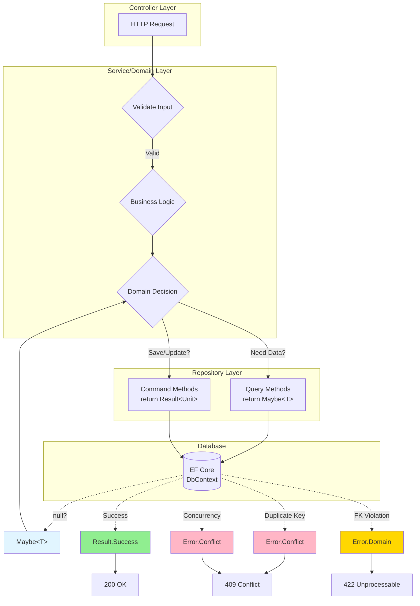
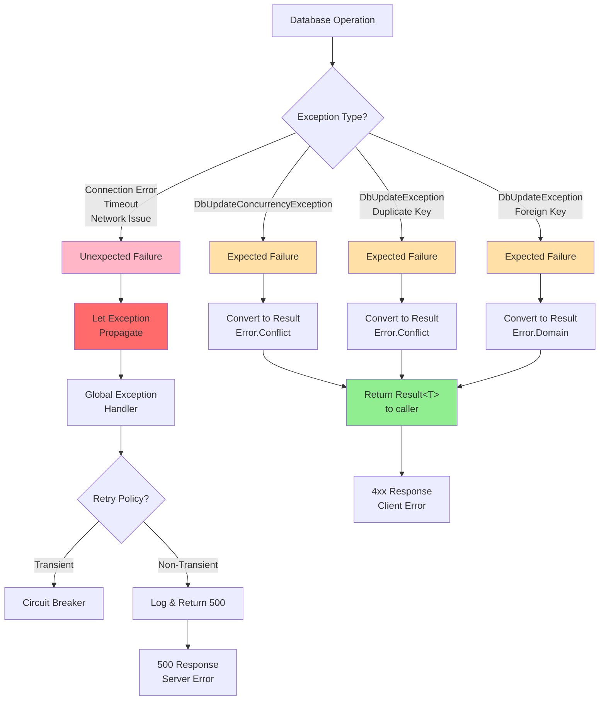
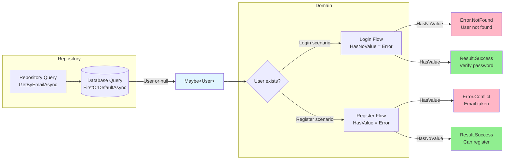
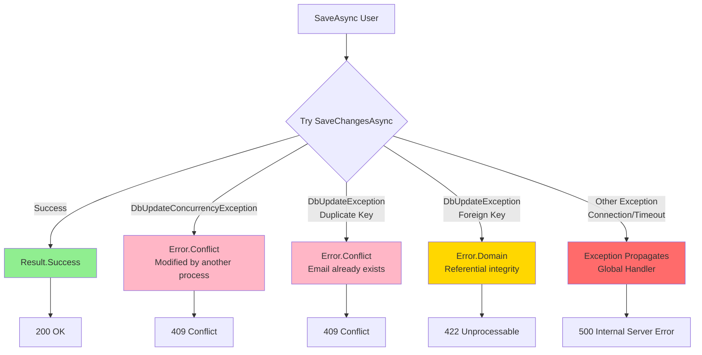

# Entity Framework Core Integration

**Level:** Intermediate 📚 | **Time:** 30-40 min | **Prerequisites:** [Basics](basics.md)

Integrate Railway-Oriented Programming with Entity Framework Core for type-safe repository patterns. Learn when to use `Result<T>` vs `Maybe<T>` in your repositories.

## Table of Contents

- [Repository Return Types](#repository-return-types)
- [Result vs Maybe Pattern](#result-vs-maybe-pattern)
- [Extension Methods for Nullable Conversion](#extension-methods-for-nullable-conversion)
- [Handling Database Exceptions](#handling-database-exceptions)
- [Value Object Configuration](#value-object-configuration)

## Repository Return Types

**Key Principle:** The repository (Anti-Corruption Layer) should not make domain decisions. Use the appropriate return type based on the operation's nature.

### When to Use Each Type

| Return Type | Use When | Example |
|-------------|----------|---------|
| `Result<T>` | Operation can fail due to **expected infrastructure failures** | Concurrency conflict, duplicate key, foreign key violation |
| `Maybe<T>` | Item may or may not exist (**domain's decision**) | Looking up by email (might be checking uniqueness) |
| `bool` | Simple existence check | `ExistsByEmailAsync(email)` |
| `Exception` | **Unexpected infrastructure failures** | Database connection failure, network timeout, disk full |
| `void`/`Task` | Fire-and-forget side effects | Publishing domain events |

### Repository Pattern Architecture



## Result vs Maybe Pattern

### ✅ Use Maybe<T> for Queries

**When the domain needs to interpret "not found":**

```csharp
public interface IUserRepository
{
    // ? Returns Maybe - domain decides if absence is good/bad
    Task<Maybe<User>> GetByEmailAsync(EmailAddress email, CancellationToken ct);
    Task<Maybe<User>> GetByIdAsync(UserId id, CancellationToken ct);
    
    // ? Simple existence check
    Task<bool> ExistsByEmailAsync(EmailAddress email, CancellationToken ct);
}

public class UserRepository : IUserRepository
{
    private readonly ApplicationDbContext _context;

    public async Task<Maybe<User>> GetByEmailAsync(
        EmailAddress email,
        CancellationToken ct)
    {
        var user = await _context.Users
            .FirstOrDefaultAsync(u => u.Email == email, ct);
        
        return Maybe.From(user);  // ? Neutral - just presence/absence
    }

    public async Task<bool> ExistsByEmailAsync(
        EmailAddress email,
        CancellationToken ct)
    {
        return await _context.Users
            .AnyAsync(u => u.Email == email, ct);
    }
}
```

**Domain layer interprets the Maybe:**

```csharp
// Example 1: Not found is BAD (user login)
public async Task<Result<User>> LoginAsync(
    EmailAddress email,
    Password password,
    CancellationToken ct)
{
    var maybeUser = await _repository.GetByEmailAsync(email, ct);
    
    // Domain decides: no user = error
    if (maybeUser.HasNoValue)
        return Error.NotFound($"User with email {email} not found");
    
    return maybeUser.Value.VerifyPassword(password);
}

// Example 2: Not found is GOOD (checking availability)
public async Task<Result<User>> RegisterUserAsync(
    RegisterUserCommand cmd,
    CancellationToken ct)
{
    var existingUser = await _repository.GetByEmailAsync(cmd.Email, ct);
    
    // Domain decides: user exists = error
    if (existingUser.HasValue)
        return Error.Conflict($"Email {cmd.Email} already in use");
    
    // No user = good, can register
    return User.Create(cmd.Email, cmd.FirstName, cmd.LastName);
}

// Example 3: Simple boolean check
public async Task<Result<Unit>> CheckEmailAvailabilityAsync(
    EmailAddress email,
    CancellationToken ct)
{
    var exists = await _repository.ExistsByEmailAsync(email, ct);
    
    if (exists)
        return Error.Conflict("Email already in use");
    
    return Result.Success();
}
```

### ? Use Result<T> for Commands

**When the operation can fail due to infrastructure:**

```csharp
public interface IUserRepository
{
    // ? Returns Result - can fail due to DB constraints, concurrency, etc.
    Task<Result<Unit>> SaveAsync(User user, CancellationToken ct);
    Task<Result<Unit>> DeleteAsync(UserId id, CancellationToken ct);
}

public class UserRepository : IUserRepository
{
    private readonly ApplicationDbContext _context;
    private readonly ILogger<UserRepository> _logger;

    public async Task<Result<Unit>> SaveAsync(
        User user,
        CancellationToken ct)
    {
        try
        {
            _context.Users.Update(user);
            await _context.SaveChangesAsync(ct);
            return Result.Success();
        }
        catch (DbUpdateConcurrencyException)
        {
            // Infrastructure failure
            return Error.Conflict("User was modified by another process");
        }
        catch (DbUpdateException ex) when (IsDuplicateKeyException(ex))
        {
            // Database constraint violation
            return Error.Conflict("User with this email already exists");
        }
        catch (Exception ex)
        {
            _logger.LogError(ex, "Error saving user {UserId}", user.Id);
            return Error.Unexpected("Failed to save user");
        }
    }

    public async Task<Result<Unit>> DeleteAsync(
        UserId id,
        CancellationToken ct)
    {
        try
        {
            var user = await _context.Users.FindAsync(new object[] { id }, ct);
            
            if (user == null)
                return Error.NotFound($"User {id} not found");
            
            _context.Users.Remove(user);
            await _context.SaveChangesAsync(ct);
            return Result.Success();
        }
        catch (DbUpdateException ex) when (IsForeignKeyViolation(ex))
        {
            // Database constraint violation
            return Error.Domain("Cannot delete user with active orders");
        }
        catch (Exception ex)
        {
            _logger.LogError(ex, "Error deleting user {UserId}", id);
            return Error.Unexpected("Failed to delete user");
        }
    }

    private static bool IsDuplicateKeyException(DbUpdateException ex)
        => ex.InnerException?.Message.Contains("duplicate key") ?? false;

    private static bool IsForeignKeyViolation(DbUpdateException ex)
        => ex.InnerException?.Message.Contains("FOREIGN KEY constraint") ?? false;
}
```

### Complete Repository Example

```csharp
using Microsoft.EntityFrameworkCore;
using FunctionalDdd;

public interface IUserRepository
{
    // Queries - return Maybe (domain interprets)
    Task<Maybe<User>> GetByIdAsync(UserId id, CancellationToken ct);
    Task<Maybe<User>> GetByEmailAsync(EmailAddress email, CancellationToken ct);
    Task<bool> ExistsByEmailAsync(EmailAddress email, CancellationToken ct);
    
    // Commands - return Result (infrastructure can fail)
    Task<Result<Unit>> SaveAsync(User user, CancellationToken ct);
    Task<Result<Unit>> DeleteAsync(UserId id, CancellationToken ct);
    
    // Pagination - return Result (query execution can fail)
    Task<Result<PagedResult<User>>> GetPagedAsync(
        int page, 
        int pageSize, 
        CancellationToken ct);
}

public class UserRepository : IUserRepository
{
    private readonly ApplicationDbContext _context;
    private readonly ILogger<UserRepository> _logger;

    public UserRepository(
        ApplicationDbContext context,
        ILogger<UserRepository> logger)
    {
        _context = context;
        _logger = logger;
    }

    // Maybe pattern - domain decides if "not found" is good/bad
    public async Task<Maybe<User>> GetByIdAsync(UserId id, CancellationToken ct)
    {
        var user = await _context.Users
            .FirstOrDefaultAsync(u => u.Id == id, ct);
        
        return Maybe.From(user);
    }

    public async Task<Maybe<User>> GetByEmailAsync(
        EmailAddress email,
        CancellationToken ct)
    {
        var user = await _context.Users
            .FirstOrDefaultAsync(u => u.Email == email, ct);
        
        return Maybe.From(user);
    }

    public async Task<bool> ExistsByEmailAsync(
        EmailAddress email,
        CancellationToken ct)
    {
        return await _context.Users
            .AnyAsync(u => u.Email == email, ct);
    }

    // Result pattern - infrastructure can fail
    public async Task<Result<Unit>> SaveAsync(User user, CancellationToken ct)
    {
        try
        {
            _context.Users.Update(user);
            await _context.SaveChangesAsync(ct);
            return Result.Success();
        }
        catch (DbUpdateConcurrencyException)
        {
            return Error.Conflict("User was modified by another process");
        }
        catch (DbUpdateException ex) when (IsDuplicateKeyException(ex))
        {
            return Error.Conflict("User with this email already exists");
        }
        catch (Exception ex)
        {
            _logger.LogError(ex, "Error saving user {UserId}", user.Id);
            return Error.Unexpected("Failed to save user");
        }
    }

    public async Task<Result<Unit>> DeleteAsync(UserId id, CancellationToken ct)
    {
        try
        {
            var user = await _context.Users.FindAsync(new object[] { id }, ct);
            
            if (user == null)
                return Error.NotFound($"User {id} not found");
            
            _context.Users.Remove(user);
            await _context.SaveChangesAsync(ct);
            return Result.Success();
        }
        catch (Exception ex)
        {
            _logger.LogError(ex, "Error deleting user {UserId}", id);
            return Error.Unexpected("Failed to delete user");
        }
    }

    public async Task<Result<PagedResult<User>>> GetPagedAsync(
        int page,
        int pageSize,
        CancellationToken ct)
    {
        try
        {
            if (page < 0)
                return Error.Validation("Page number must be non-negative", "page");
            
            if (pageSize <= 0 || pageSize > 100)
                return Error.Validation("Page size must be between 1 and 100", "pageSize");
            
            var skip = page * pageSize;
            var totalCount = await _context.Users.CountAsync(ct);
            
            var users = await _context.Users
                .AsNoTracking()
                .OrderBy(u => u.CreatedAt)
                .Skip(skip)
                .Take(pageSize)
                .ToListAsync(ct);
            
            var result = new PagedResult<User>(
                Items: users,
                From: skip,
                To: skip + users.Count - 1,
                TotalCount: totalCount
            );
            
            return Result.Success(result);
        }
        catch (Exception ex)
        {
            _logger.LogError(ex, "Error fetching paged users");
            return Error.Unexpected("Failed to retrieve users");
        }
    }

    private static bool IsDuplicateKeyException(DbUpdateException ex)
        => ex.InnerException?.Message.Contains("duplicate key") ?? false;
}

public record PagedResult<T>(
    IEnumerable<T> Items,
    long From,
    long To,
    long TotalCount);
```

## Extension Methods for Nullable Conversion

Create reusable extension methods for common nullable-to-Result conversions:

```csharp
public static class RepositoryExtensions
{
    /// <summary>
    /// Converts a task returning a nullable reference type to a Result.
    /// </summary>
    public static async Task<Result<T>> ToResultAsync<T>(
        this Task<T?> task,
        Error notFoundError) where T : class
    {
        var entity = await task;
        return entity != null
            ? Result.Success(entity)
            : Result.Failure<T>(notFoundError);
    }
    
    /// <summary>
    /// Converts a task returning a nullable value type to a Result.
    /// </summary>
    public static async Task<Result<T>> ToResultAsync<T>(
        this Task<T?> task,
        Error notFoundError) where T : struct
    {
        var entity = await task;
        return entity.HasValue
            ? Result.Success(entity.Value)
            : Result.Failure<T>(notFoundError);
    }
}
```

### Usage

```csharp
public async Task<Result<User>> GetByIdAsync(UserId id, CancellationToken ct)
{
    return await _context.Users
        .FirstOrDefaultAsync(u => u.Id == id, ct)
        .ToResultAsync(Error.NotFound($"User {id} not found"));
}

public async Task<Result<Order>> GetOrderByNumberAsync(string orderNumber, CancellationToken ct)
{
    return await _context.Orders
        .Include(o => o.Items)
        .Include(o => o.Customer)
        .FirstOrDefaultAsync(o => o.OrderNumber == orderNumber, ct)
        .ToResultAsync(Error.NotFound($"Order {orderNumber} not found"));
}
```

## Handling Database Exceptions

**Key Principle:** Only convert **expected failures** to `Result<T>`. Let **unexpected failures** (infrastructure exceptions) propagate as exceptions.

### Expected vs Unexpected Failures

| Type | Example | Handling |
|------|---------|----------|
| **Expected Failure** | Duplicate key, concurrency conflict, foreign key violation | Convert to `Result<T>` with appropriate error |
| **Unexpected Failure** | Database connection failure, network timeout | Let exception propagate (don't catch) |

### Exception Handling Strategy



### ✅ Convert Expected Failures to Result

```csharp
public async Task<Result<Unit>> SaveAsync(User user, CancellationToken ct)
{
    try
    {
        _context.Users.Update(user);
        await _context.SaveChangesAsync(ct);
        return Result.Success();
    }
    // Expected failure: concurrent modification
    catch (DbUpdateConcurrencyException)
    {
        return Error.Conflict("User was modified by another process");
    }
    // Expected failure: unique constraint violation
    catch (DbUpdateException ex) when (IsDuplicateKeyException(ex))
    {
        return Error.Conflict("User with this email already exists");
    }
    // Expected failure: foreign key violation
    catch (DbUpdateException ex) when (IsForeignKeyViolation(ex))
    {
        return Error.Domain("Cannot save user due to referential integrity");
    }
    // ?? Don't catch generic Exception - let infrastructure failures propagate
}

public async Task<Result<Unit>> DeleteAsync(UserId id, CancellationToken ct)
{
    try
    {
        var user = await _context.Users.FindAsync(new object[] { id }, ct);
        
        if (user == null)
            return Error.NotFound($"User {id} not found");
        
        _context.Users.Remove(user);
        await _context.SaveChangesAsync(ct);
        return Result.Success();
    }
    // Expected failure: foreign key violation (user has orders)
    catch (DbUpdateException ex) when (IsForeignKeyViolation(ex))
    {
        return Error.Domain("Cannot delete user with active orders");
    }
    // ?? Let unexpected failures (connection issues, etc.) propagate
}
```

### ❌ Don't Catch Unexpected Failures

```csharp
// ? Bad - catches ALL exceptions, even unexpected ones
public async Task<Result<User>> SaveAsync(User user, CancellationToken ct)
{
    try
    {
        _context.Users.Update(user);
        await _context.SaveChangesAsync(ct);
        return Result.Success(user);
    }
    catch (Exception ex)  // ? Too broad - hides infrastructure problems
    {
        _logger.LogError(ex, "Failed to save user");
        return Error.Unexpected("Failed to save user");
    }
}

// ? Good - only catches expected failures
public async Task<Result<Unit>> SaveAsync(User user, CancellationToken ct)
{
    try
    {
        _context.Users.Update(user);
        await _context.SaveChangesAsync(ct);
        return Result.Success();
    }
    catch (DbUpdateConcurrencyException)
    {
        return Error.Conflict("User was modified by another process");
    }
    catch (DbUpdateException ex) when (IsDuplicateKeyException(ex))
    {
        return Error.Conflict("User with this email already exists");
    }
    // Database connection failures, etc. will propagate as exceptions
}
```

### Why Let Unexpected Failures Propagate?

1. **Infrastructure problems need different handling** - Connection failures, timeouts, etc. should bubble up to global exception handlers, retry policies, or circuit breakers

2. **Hiding infrastructure failures is dangerous** - If the database is down, wrapping it in `Result<T>` makes it look like a normal business failure

3. **Let the infrastructure layer fail fast** - The calling layer can decide how to handle infrastructure exceptions (retry, circuit breaker, failover)

4. **Logging and monitoring** - Exception middleware, Application Insights, and monitoring tools can properly track infrastructure failures

### Exception Helper Methods

```csharp
public static class DbExceptionHelpers
{
    public static bool IsDuplicateKeyException(DbUpdateException ex)
    {
        // SQL Server
        if (ex.InnerException?.Message.Contains("duplicate key") ?? false)
            return true;
        
        // PostgreSQL
        if (ex.InnerException?.Message.Contains("duplicate key value violates unique constraint") ?? false)
            return true;
        
        // SQLite
        if (ex.InnerException?.Message.Contains("UNIQUE constraint failed") ?? false)
            return true;
        
        return false;
    }

    public static bool IsForeignKeyViolation(DbUpdateException ex)
    {
        // SQL Server
        if (ex.InnerException?.Message.Contains("FOREIGN KEY constraint") ?? false)
            return true;
        
        // PostgreSQL
        if (ex.InnerException?.Message.Contains("violates foreign key constraint") ?? false)
            return true;
        
        // SQLite
        if (ex.InnerException?.Message.Contains("FOREIGN KEY constraint") ?? false)
            return true;
        
        return false;
    }
}
```

### Global Exception Handling

Let unexpected infrastructure failures be handled by ASP.NET Core's global exception handler:

```csharp
// Program.cs
var app = builder.Build();

// Global exception handler for unexpected failures
app.UseExceptionHandler(errorApp =>
{
    errorApp.Run(async context =>
    {
        var exceptionHandlerFeature = context.Features.Get<IExceptionHandlerFeature>();
        var exception = exceptionHandlerFeature?.Error;

        // Log the infrastructure failure
        var logger = context.RequestServices.GetRequiredService<ILogger<Program>>();
        logger.LogError(exception, "Unhandled exception occurred");

        // Return Problem Details for infrastructure failures
        context.Response.StatusCode = StatusCodes.Status500InternalServerError;
        context.Response.ContentType = "application/problem+json";

        var problemDetails = new ProblemDetails
        {
            Status = StatusCodes.Status500InternalServerError,
            Title = "An error occurred",
            Detail = "An unexpected error occurred. Please try again later.",
            Instance = context.Request.Path
        };

        await context.Response.WriteAsJsonAsync(problemDetails);
    });
});
```

### Complete Example with Retry Policy

For transient failures (connection issues, timeouts), use a retry policy instead of catching exceptions:

```csharp
// Using Polly for retry logic
public class UserRepository : IUserRepository
{
    private readonly ApplicationDbContext _context;
    private readonly IAsyncPolicy _retryPolicy;

    public UserRepository(ApplicationDbContext context)
    {
        _context = context;
        
        // Retry transient failures (connection issues, timeouts)
        _retryPolicy = Policy
            .Handle<DbUpdateException>(ex => IsTransientFailure(ex))
            .Or<TimeoutException>()
            .WaitAndRetryAsync(3, retryAttempt => 
                TimeSpan.FromSeconds(Math.Pow(2, retryAttempt)));
    }

    public async Task<Result<Unit>> SaveAsync(User user, CancellationToken ct)
    {
        return await _retryPolicy.ExecuteAsync(async () =>
        {
            try
            {
                _context.Users.Update(user);
                await _context.SaveChangesAsync(ct);
                return Result.Success();
            }
            catch (DbUpdateConcurrencyException)
            {
                return Error.Conflict("User was modified by another process");
            }
            catch (DbUpdateException ex) when (IsDuplicateKeyException(ex))
            {
                return Error.Conflict("User with this email already exists");
            }
            // Transient failures will be retried by Polly
            // Non-transient failures will propagate as exceptions
        });
    }

    private static bool IsTransientFailure(DbUpdateException ex)
    {
        // SQL Server transient error codes
        var sqlErrorCodes = new[] { -1, -2, 1205, 49918, 49919, 49920, 4060, 40197, 40501, 40613, 49918, 49919, 49920 };
        // Check if it's a transient SQL error
        return false; // Implement based on your database provider
    }

    private static bool IsDuplicateKeyException(DbUpdateException ex)
        => ex.InnerException?.Message.Contains("duplicate key") ?? false;
}

```

### ✅ Use Maybe<T> for Queries

**When the domain needs to interpret "not found":**



**Implementation:**


### ✅ Use Result<T> for Commands

**When the operation can fail due to infrastructure:**



## Value Object Configuration

Configure strongly-typed value objects (`RequiredGuid`, `RequiredUlid`, `RequiredString`, `EmailAddress`) with EF Core using value converters.

### Value Converter Examples

```csharp
using Microsoft.EntityFrameworkCore;
using FunctionalDdd.PrimitiveValueObjects;

public class AppDbContext : DbContext
{
    public DbSet<Customer> Customers => Set<Customer>();
    public DbSet<Order> Orders => Set<Order>();
    public DbSet<Product> Products => Set<Product>();

    protected override void OnModelCreating(ModelBuilder modelBuilder)
    {
        ConfigureCustomer(modelBuilder);
        ConfigureOrder(modelBuilder);
        ConfigureProduct(modelBuilder);
    }

    private static void ConfigureCustomer(ModelBuilder modelBuilder) =>
        modelBuilder.Entity<Customer>(builder =>
        {
            builder.HasKey(c => c.Id);

            // RequiredUlid<CustomerId> -> string (26-char Crockford Base32)
            builder.Property(c => c.Id)
                .HasConversion(
                    id => id.Value.ToString(),
                    str => CustomerId.Create(Ulid.Parse(str, CultureInfo.InvariantCulture)))
                .HasMaxLength(26)
                .IsRequired();

            // RequiredString<CustomerName> -> string
            builder.Property(c => c.Name)
                .HasConversion(
                    name => name.Value,
                    str => CustomerName.Create(str))
                .HasMaxLength(100)
                .IsRequired();

            // EmailAddress -> string
            builder.Property(c => c.Email)
                .HasConversion(
                    email => email.Value,
                    str => EmailAddress.Create(str))
                .HasMaxLength(254)
                .IsRequired();
        });

    private static void ConfigureOrder(ModelBuilder modelBuilder) =>
        modelBuilder.Entity<Order>(builder =>
        {
            builder.HasKey(o => o.Id);

            // RequiredUlid<OrderId> -> string
            // ULIDs provide natural chronological ordering for queries!
            builder.Property(o => o.Id)
                .HasConversion(
                    id => id.Value.ToString(),
                    str => OrderId.Create(Ulid.Parse(str, CultureInfo.InvariantCulture)))
                .HasMaxLength(26)
                .IsRequired();

            // Foreign key using ULID
            builder.Property(o => o.CustomerId)
                .HasConversion(
                    id => id.Value.ToString(),
                    str => CustomerId.Create(Ulid.Parse(str, CultureInfo.InvariantCulture)))
                .HasMaxLength(26)
                .IsRequired();
        });

    private static void ConfigureProduct(ModelBuilder modelBuilder) =>
        modelBuilder.Entity<Product>(builder =>
        {
            builder.HasKey(p => p.Id);

            // RequiredGuid<ProductId> -> Guid
            builder.Property(p => p.Id)
                .HasConversion(
                    id => id.Value,
                    guid => ProductId.Create(guid))
                .IsRequired();

            // RequiredString<ProductName> -> string
            builder.Property(p => p.Name)
                .HasConversion(
                    name => name.Value,
                    str => ProductName.Create(str))
                .HasMaxLength(200)
                .IsRequired();
        });
}
```

### Value Object Types Quick Reference

| Value Object | EF Core Storage | Converter |
|--------------|-----------------|-----------|
| `RequiredGuid<T>` | `Guid` | `id => id.Value` ↔ `guid => T.Create(guid)` |
| `RequiredUlid<T>` | `string(26)` | `id => id.Value.ToString()` ↔ `str => T.Create(Ulid.Parse(str))` |
| `RequiredString<T>` | `string` | `val => val.Value` ↔ `str => T.Create(str)` |
| `RequiredInt<T>` | `int` | `val => val.Value` ↔ `num => T.Create(num)` |
| `RequiredDecimal<T>` | `decimal` | `val => val.Value` ↔ `num => T.Create(num)` |
| `EmailAddress` | `string(254)` | `email => email.Value` ↔ `str => EmailAddress.Create(str)` |

### Why Use ULID for Entity IDs?

ULIDs provide several advantages over GUIDs for entity identifiers:

```csharp
// Define ULID-based identifiers
public partial class OrderId : RequiredUlid<OrderId> { }
public partial class CustomerId : RequiredUlid<CustomerId> { }

// ULIDs sort chronologically - great for database indexes!
var orders = await context.Orders
    .OrderBy(o => o.Id)  // Natural creation-time ordering
    .Take(10)
    .ToListAsync();

// ULID format: 01ARZ3NDEKTSV4RRFFQ69G5FAV (26 chars, URL-safe)
// - First 10 chars: millisecond timestamp
// - Last 16 chars: random component
```

| Feature | ULID | GUID |
|---------|------|------|
| **Database Index Performance** | ✅ Sequential (better) | ❌ Random (fragmentation) |
| **Natural Ordering** | ✅ By creation time | ❌ Random |
| **Format** | 26 chars (URL-safe) | 36 chars (with dashes) |
| **Use Case** | Orders, Events, Logs | Legacy systems |

### Complete Example

See the [EF Core Example](https://github.com/xavierjohn/FunctionalDDD/tree/main/Examples/EfCoreExample) for a full working example demonstrating:

- `RequiredUlid<T>` for time-ordered identifiers (`OrderId`, `CustomerId`)
- `RequiredGuid<T>` for traditional identifiers (`ProductId`)
- `RequiredString<T>` for validated strings (`ProductName`, `CustomerName`)
- `EmailAddress` for RFC 5322 email validation
- Complete EF Core configuration with value converters
- Railway-Oriented Programming for entity creation and validation
