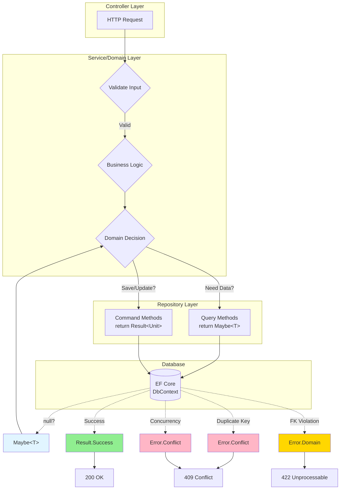
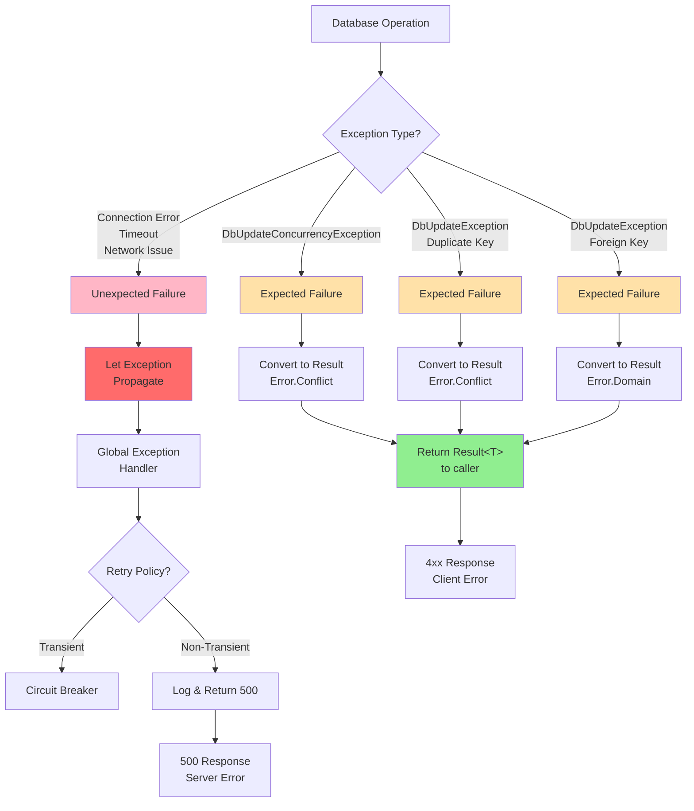
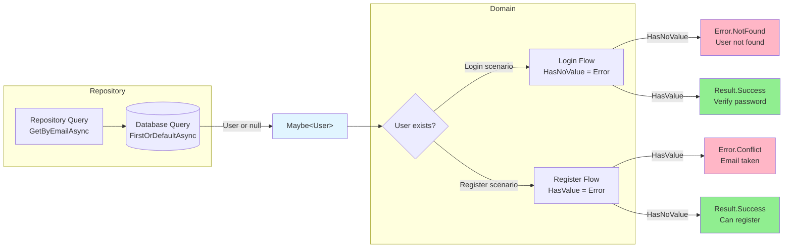
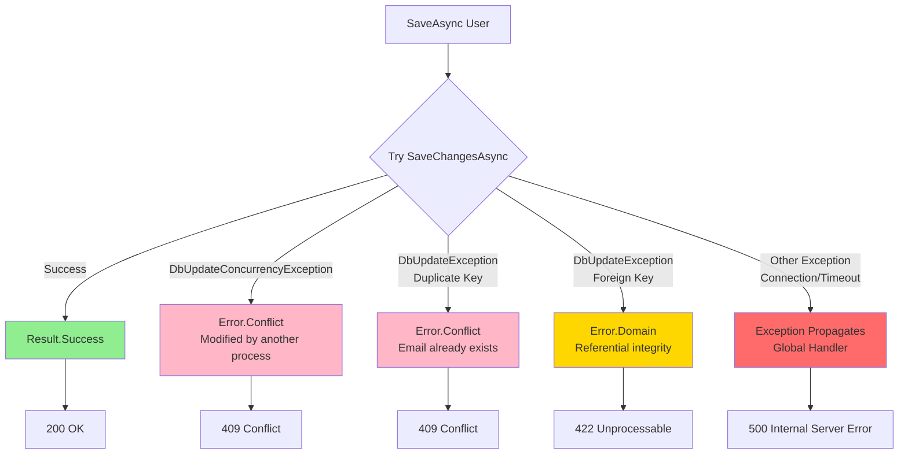

# Entity Framework Core Integration

**Level:** Intermediate 📚 | **Time:** 30-40 min | **Prerequisites:** [Basics](basics.md)

Integrate Railway-Oriented Programming with Entity Framework Core for type-safe repository patterns. Learn when to use `Result<T>` vs `Maybe<T>` in your repositories.

## Table of Contents

- [Installation](#installation)
- [Value Object Configuration](#value-object-configuration)
- [Repository Return Types](#repository-return-types)
- [Result vs Maybe Pattern](#result-vs-maybe-pattern)
- [Query Extensions](#query-extensions)
- [Handling Database Exceptions](#handling-database-exceptions)
- [Money Property Convention](#money-property-convention)
- [Maybe\<T\> Property Convention](#maybe-property-convention)
- [GUID V7 for Entity IDs](#guid-v7-for-entity-ids)

> [!TIP]
> This guide covers two approaches: using the **Trellis.EntityFrameworkCore** package (recommended) and a **manual** approach for teams that prefer not to take the dependency. Sections marked with 📦 use the package; sections marked with 🔧 show the manual equivalent.

## Installation

### 📦 With Trellis.EntityFrameworkCore (Recommended)

```bash
dotnet add package Trellis.EntityFrameworkCore
```

This package provides:

| Feature | Description |
|---------|-------------|
| `ApplyTrellisConventions` | Auto-registers EF Core value converters for all Trellis value objects and auto-maps `Money` as owned types |
| `SaveChangesResultAsync` | Wraps `SaveChangesAsync` — returns `Result<int>` instead of throwing |
| `SaveChangesResultUnitAsync` | Same as above but returns `Result<Unit>` |
| `DbExceptionClassifier` | Provider-agnostic exception classification (SQL Server, PostgreSQL, SQLite) |
| `FirstOrDefaultMaybeAsync` | Wraps query results in `Maybe<T>` |
| `FirstOrDefaultResultAsync` | Wraps query results in `Result<T>` with a not-found error |
| `SingleOrDefaultMaybeAsync` | Single-result variant returning `Maybe<T>` |
| `.Where(specification)` | Applies a `Specification<T>` as a LINQ Where clause |

### 🔧 Without the Package

No extra package needed — just reference `Trellis.Results` (or whichever Trellis packages you already use) and configure EF Core manually. Each section below shows the manual equivalent.

## Value Object Configuration

### 📦 Convention-Based (Recommended)

Override `ConfigureConventions` in your `DbContext` and call `ApplyTrellisConventions`. This registers value converters for all Trellis value objects **before** EF Core's convention engine runs, so properties are treated as scalars — not navigations.

```csharp
using Trellis.EntityFrameworkCore;

public class AppDbContext : DbContext
{
    public DbSet<Customer> Customers => Set<Customer>();
    public DbSet<Order> Orders => Set<Order>();

    protected override void ConfigureConventions(ModelConfigurationBuilder configurationBuilder) =>
        configurationBuilder.ApplyTrellisConventions(typeof(CustomerId).Assembly);

    protected override void OnModelCreating(ModelBuilder modelBuilder)
    {
        modelBuilder.Entity<Customer>(b =>
        {
            b.HasKey(c => c.Id);
            b.Property(c => c.Name).HasMaxLength(100).IsRequired();
            b.Property(c => c.Email).HasMaxLength(254).IsRequired();
        });
    }
}
```

`ApplyTrellisConventions` automatically:

- Scans your assemblies for types implementing `IScalarValue<TSelf, TPrimitive>` (e.g., `RequiredGuid<T>`, `RequiredString<T>`, `RequiredInt<T>`, `RequiredDecimal<T>`, custom `ScalarValueObject<,>` subclasses)
- Scans for `RequiredEnum<T>` types and stores them as strings (using `Name` / `TryFromName`)
- Always includes the `Trellis.Primitives` assembly (for `EmailAddress`, `Url`, `PhoneNumber`, etc.)

### Manual Override

If you need a custom converter for a specific property, use `HasConversion` in `OnModelCreating` — it takes precedence over the convention:

```csharp
protected override void OnModelCreating(ModelBuilder modelBuilder)
{
    modelBuilder.Entity<Customer>(b =>
    {
        // This overrides the convention-registered converter for Name
        b.Property(c => c.Name)
            .HasConversion(
                name => name.Value.ToUpperInvariant(),
                str => CustomerName.Create(str));
    });
}
```

### Value Object Types Quick Reference

| Value Object | Storage Type | Converter |
|--------------|-------------|-----------|
| `RequiredGuid<T>` | `Guid` | `v.Value` ↔ `T.Create(guid)` |
| `RequiredString<T>` | `string` | `v.Value` ↔ `T.Create(str)` |
| `RequiredInt<T>` | `int` | `v.Value` ↔ `T.Create(num)` |
| `RequiredDecimal<T>` | `decimal` | `v.Value` ↔ `T.Create(num)` |
| `RequiredEnum<T>` | `string` | `v.Name` ↔ `T.TryFromName(str).Value` |
| `EmailAddress` | `string(254)` | `v.Value` ↔ `EmailAddress.Create(str)` |
| Custom `ScalarValueObject<T,P>` | `P` | `v.Value` ↔ `T.Create(p)` |

### 🔧 Manual HasConversion (Without Package)

Register value converters per-property in `OnModelCreating`. You must add `HasConversion` for every Trellis value object property:

```csharp
public class AppDbContext : DbContext
{
    public DbSet<Customer> Customers => Set<Customer>();
    public DbSet<Order> Orders => Set<Order>();

    protected override void OnModelCreating(ModelBuilder modelBuilder)
    {
        modelBuilder.Entity<Customer>(b =>
        {
            b.HasKey(c => c.Id);

            // RequiredGuid<CustomerId> → Guid
            b.Property(c => c.Id)
                .HasConversion(id => id.Value, guid => CustomerId.Create(guid))
                .IsRequired();

            // RequiredString<CustomerName> → string
            b.Property(c => c.Name)
                .HasConversion(name => name.Value, str => CustomerName.Create(str))
                .HasMaxLength(100)
                .IsRequired();

            // EmailAddress → string
            b.Property(c => c.Email)
                .HasConversion(email => email.Value, str => EmailAddress.Create(str))
                .HasMaxLength(254)
                .IsRequired();
        });

        modelBuilder.Entity<Order>(b =>
        {
            b.HasKey(o => o.Id);
            b.Property(o => o.Id)
                .HasConversion(id => id.Value, guid => OrderId.Create(guid));
            b.Property(o => o.CustomerId)
                .HasConversion(id => id.Value, guid => CustomerId.Create(guid));
        });
    }
}
```

> [!NOTE]
> Without `ApplyTrellisConventions`, every Trellis value object property needs an explicit `HasConversion` call. Missing one causes EF Core to treat the property as a navigation (class-typed), resulting in runtime errors.

## Repository Return Types

**Key Principle:** The repository (Anti-Corruption Layer) should not make domain decisions. Use the appropriate return type based on the operation's nature.

### When to Use Each Type

| Return Type | Use When | Example |
|-------------|----------|---------|
| `Result<T>` | Operation can fail due to **expected infrastructure failures** | Concurrency conflict, duplicate key, foreign key violation |
| `Maybe<T>` | Item may or may not exist (**domain's decision**) | Looking up by email (might be checking uniqueness) |
| `bool` | Simple existence check | `ExistsByEmailAsync(email)` |
| `Exception` | **Unexpected infrastructure failures** | Database connection failure, network timeout, disk full |
| `void`/`Task` | Fire-and-forget side effects | Publishing domain events |

### Repository Pattern Architecture


```mermaid
graph TB
    subgraph Controller["Controller Layer"]
        REQ[HTTP Request]
    end
    
    subgraph Service["Service/Domain Layer"]
        VAL{Validate Input}
        LOGIC{Business Logic}
        DEC{Domain Decision}
    end
    
    subgraph Repository["Repository Layer"]
        QUERY[Query Methods<br/>return Maybe&lt;T&gt;]
        COMMAND[Command Methods<br/>return Result&lt;Unit&gt;]
    end
    
    subgraph Database["Database"]
        DB[(EF Core<br/>DbContext)]
    end
    
    REQ --> VAL
    VAL -->|Valid| LOGIC
    LOGIC --> DEC
    
    DEC -->|Need Data?| QUERY
    QUERY --> DB
    DB -.->|null?| MAYBE[Maybe&lt;T&gt;]
    MAYBE --> DEC
    
    DEC -->|Save/Update?| COMMAND
    COMMAND --> DB
    DB -.->|Success| RES_OK[Result.Success]
    DB -.->|Duplicate Key| RES_CONFLICT[Error.Conflict]
    DB -.->|FK Violation| RES_DOMAIN[Error.Domain]
    DB -.->|Concurrency| RES_CONFLICT2[Error.Conflict]
    
    RES_OK --> HTTP_OK[200 OK]
    RES_CONFLICT --> HTTP_409[409 Conflict]
    RES_DOMAIN --> HTTP_422[422 Unprocessable]
    RES_CONFLICT2 --> HTTP_409
    
    style MAYBE fill:#E1F5FF
    style RES_OK fill:#90EE90
    style RES_CONFLICT fill:#FFB6C6
    style RES_DOMAIN fill:#FFD700
    style RES_CONFLICT2 fill:#FFB6C6
```

## Result vs Maybe Pattern

### ✅ Use Maybe<T> for Queries

**When the domain needs to interpret "not found":**

```csharp
public interface IUserRepository
{
    // 🔍 Returns Maybe - domain decides if absence is good/bad
    Task<Maybe<User>> GetByEmailAsync(EmailAddress email, CancellationToken ct);
    Task<Maybe<User>> GetByIdAsync(UserId id, CancellationToken ct);
    
    // 🔍 Simple existence check
    Task<bool> ExistsByEmailAsync(EmailAddress email, CancellationToken ct);
}

public class UserRepository : IUserRepository
{
    private readonly ApplicationDbContext _context;

    public async Task<Maybe<User>> GetByEmailAsync(
        EmailAddress email,
        CancellationToken ct)
    {
        var user = await _context.Users
            .FirstOrDefaultAsync(u => u.Email == email, ct);
        
        return Maybe.From(user);  // ✅ Neutral - just presence/absence
    }

    public async Task<bool> ExistsByEmailAsync(
        EmailAddress email,
        CancellationToken ct)
    {
        return await _context.Users
            .AnyAsync(u => u.Email == email, ct);
    }
}
```

**Domain layer interprets the Maybe:**

```csharp
// Example 1: Not found is BAD (user login)
public async Task<Result<User>> LoginAsync(
    EmailAddress email,
    Password password,
    CancellationToken ct)
{
    var maybeUser = await _repository.GetByEmailAsync(email, ct);
    
    // Domain decides: no user = error
    if (maybeUser.HasNoValue)
        return Error.NotFound($"User with email {email} not found");
    
    return maybeUser.Value.VerifyPassword(password);
}

// Example 2: Not found is GOOD (checking availability)
public async Task<Result<User>> RegisterUserAsync(
    RegisterUserCommand cmd,
    CancellationToken ct)
{
    var existingUser = await _repository.GetByEmailAsync(cmd.Email, ct);
    
    // Domain decides: user exists = error
    if (existingUser.HasValue)
        return Error.Conflict($"Email {cmd.Email} already in use");
    
    // No user = good, can register
    return User.Create(cmd.Email, cmd.FirstName, cmd.LastName);
}

// Example 3: Simple boolean check
public async Task<Result<Unit>> CheckEmailAvailabilityAsync(
    EmailAddress email,
    CancellationToken ct)
{
    var exists = await _repository.ExistsByEmailAsync(email, ct);
    
    if (exists)
        return Error.Conflict("Email already in use");
    
    return Result.Success();
}
```

### ✅ Use Result<T> for Commands

**When the operation can fail due to infrastructure:**

```csharp
public interface IUserRepository
{
    // 🔑 Returns Result - can fail due to DB constraints, concurrency, etc.
    Task<Result<Unit>> SaveAsync(User user, CancellationToken ct);
    Task<Result<Unit>> DeleteAsync(UserId id, CancellationToken ct);
}

public class UserRepository : IUserRepository
{
    private readonly ApplicationDbContext _context;

    public async Task<Result<Unit>> SaveAsync(
        User user,
        CancellationToken ct)
    {
        _context.Users.Update(user);
        return await _context.SaveChangesResultUnitAsync(ct);
    }

    public async Task<Result<Unit>> DeleteAsync(
        UserId id,
        CancellationToken ct)
    {
        var user = await _context.Users.FindAsync(new object[] { id }, ct);
        
        if (user == null)
            return Error.NotFound($"User {id} not found");
        
        _context.Users.Remove(user);
        return await _context.SaveChangesResultUnitAsync(ct);
    }
}
```

### Complete Repository Example

```csharp
using Microsoft.EntityFrameworkCore;
using Trellis;
using Trellis.EntityFrameworkCore;

public interface IUserRepository
{
    // Queries - return Maybe (domain interprets)
    Task<Maybe<User>> GetByIdAsync(UserId id, CancellationToken ct);
    Task<Maybe<User>> GetByEmailAsync(EmailAddress email, CancellationToken ct);
    Task<bool> ExistsByEmailAsync(EmailAddress email, CancellationToken ct);
    
    // Commands - return Result (infrastructure can fail)
    Task<Result<Unit>> SaveAsync(User user, CancellationToken ct);
    Task<Result<Unit>> DeleteAsync(UserId id, CancellationToken ct);
}

public class UserRepository : IUserRepository
{
    private readonly ApplicationDbContext _context;

    public UserRepository(ApplicationDbContext context) => _context = context;

    // Maybe pattern - domain decides if "not found" is good/bad
    public async Task<Maybe<User>> GetByIdAsync(UserId id, CancellationToken ct) =>
        await _context.Users.FirstOrDefaultMaybeAsync(u => u.Id == id, ct);

    public async Task<Maybe<User>> GetByEmailAsync(EmailAddress email, CancellationToken ct) =>
        await _context.Users.FirstOrDefaultMaybeAsync(u => u.Email == email, ct);

    public async Task<bool> ExistsByEmailAsync(EmailAddress email, CancellationToken ct) =>
        await _context.Users.AnyAsync(u => u.Email == email, ct);

    // Result pattern - infrastructure can fail
    public async Task<Result<Unit>> SaveAsync(User user, CancellationToken ct)
    {
        _context.Users.Update(user);
        return await _context.SaveChangesResultUnitAsync(ct);
    }

    public async Task<Result<Unit>> DeleteAsync(UserId id, CancellationToken ct)
    {
        var user = await _context.Users.FindAsync(new object[] { id }, ct);
        
        if (user == null)
            return Error.NotFound($"User {id} not found");
        
        _context.Users.Remove(user);
        return await _context.SaveChangesResultUnitAsync(ct);
    }
}
```

## Query Extensions

### 📦 With Package

`Trellis.EntityFrameworkCore` provides query extension methods that wrap EF Core results in `Maybe<T>` or `Result<T>`, so you don't need to write your own nullable conversion helpers.

#### Maybe — When Absence Is Neutral

Use `FirstOrDefaultMaybeAsync` or `SingleOrDefaultMaybeAsync` when the domain layer should decide whether "not found" is good or bad:

```csharp
public async Task<Maybe<User>> GetByEmailAsync(
    EmailAddress email,
    CancellationToken ct) =>
    await _context.Users
        .FirstOrDefaultMaybeAsync(u => u.Email == email, ct);
```

#### Result — When "Not Found" Is the Error

Use `FirstOrDefaultResultAsync` when absence is always an error:

```csharp
public async Task<Result<User>> GetByIdAsync(
    UserId id,
    CancellationToken ct) =>
    await _context.Users
        .FirstOrDefaultResultAsync(
            u => u.Id == id,
            Error.NotFound($"User {id} not found"),
            ct);
```

#### Specification Integration

Apply a `Specification<T>` directly as a LINQ Where clause:

```csharp
public async Task<List<Order>> GetActiveOrdersAsync(CancellationToken ct) =>
    await _context.Orders
        .Where(new ActiveOrderSpecification())
        .ToListAsync(ct);
```

### 🔧 Without Package

Use `FirstOrDefaultAsync` and wrap the result with `Maybe.From` or check for null:

```csharp
// Maybe pattern
public async Task<Maybe<User>> GetByEmailAsync(
    EmailAddress email,
    CancellationToken ct)
{
    var user = await _context.Users
        .FirstOrDefaultAsync(u => u.Email == email, ct);
    return Maybe.From(user);
}

// Result pattern
public async Task<Result<User>> GetByIdAsync(
    UserId id,
    CancellationToken ct)
{
    var user = await _context.Users
        .FirstOrDefaultAsync(u => u.Id == id, ct);
    return user is not null
        ? Result.Success(user)
        : Result.Failure<User>(Error.NotFound($"User {id} not found"));
}
```

## Handling Database Exceptions

**Key Principle:** Only convert **expected failures** to `Result<T>`. Let **unexpected failures** (infrastructure exceptions) propagate as exceptions.

### 📦 With Package

#### SaveChangesResultAsync

The simplest approach — `SaveChangesResultAsync` handles exception classification for you:

```csharp
public async Task<Result<Unit>> SaveAsync(User user, CancellationToken ct)
{
    _context.Users.Update(user);
    return await _context.SaveChangesResultUnitAsync(ct);
    // Concurrency conflict → Error.Conflict
    // Duplicate key → Error.Conflict
    // Foreign key violation → Error.Domain
    // Connection failure, timeout → exception propagates
}
```

#### DbExceptionClassifier

For custom error messages per exception type, use `DbExceptionClassifier` directly. It works with SQL Server, PostgreSQL, and SQLite:

```csharp
public async Task<Result<Unit>> SaveAsync(User user, CancellationToken ct)
{
    try
    {
        _context.Users.Update(user);
        await _context.SaveChangesAsync(ct);
        return Result.Success();
    }
    catch (DbUpdateConcurrencyException)
    {
        return Error.Conflict("User was modified by another process");
    }
    catch (DbUpdateException ex) when (DbExceptionClassifier.IsDuplicateKey(ex))
    {
        return Error.Conflict("User with this email already exists");
    }
    catch (DbUpdateException ex) when (DbExceptionClassifier.IsForeignKeyViolation(ex))
    {
        return Error.Domain("Cannot save user due to referential integrity");
    }
    // Unexpected failures (connection, timeout) propagate as exceptions
}
```

### 🔧 Without Package

Write your own exception classification using `DbUpdateException.InnerException` message inspection:

```csharp
public async Task<Result<Unit>> SaveAsync(User user, CancellationToken ct)
{
    try
    {
        _context.Users.Update(user);
        await _context.SaveChangesAsync(ct);
        return Result.Success();
    }
    catch (DbUpdateConcurrencyException)
    {
        return Error.Conflict("User was modified by another process");
    }
    catch (DbUpdateException ex) when (IsDuplicateKey(ex))
    {
        return Error.Conflict("User with this email already exists");
    }
    catch (DbUpdateException ex) when (IsForeignKeyViolation(ex))
    {
        return Error.Domain("Cannot save user due to referential integrity");
    }
    // Don't catch generic Exception — let infrastructure failures propagate
}

private static bool IsDuplicateKey(DbUpdateException ex) =>
    ex.InnerException?.Message.Contains("duplicate key", StringComparison.OrdinalIgnoreCase) == true
    || ex.InnerException?.Message.Contains("UNIQUE constraint failed", StringComparison.OrdinalIgnoreCase) == true;

private static bool IsForeignKeyViolation(DbUpdateException ex) =>
    ex.InnerException?.Message.Contains("FOREIGN KEY constraint", StringComparison.OrdinalIgnoreCase) == true
    || ex.InnerException?.Message.Contains("violates foreign key", StringComparison.OrdinalIgnoreCase) == true;
```

> [!NOTE]
> The manual approach uses message-string matching which is fragile across database providers. `DbExceptionClassifier` in the package handles SQL Server error numbers, PostgreSQL SqlState codes, and SQLite messages correctly.

### Expected vs Unexpected Failures

| Type | Example | Handling |
|------|---------|----------|
| **Expected Failure** | Duplicate key, concurrency conflict, foreign key violation | Convert to `Result<T>` with appropriate error |
| **Unexpected Failure** | Database connection failure, network timeout | Let exception propagate (don't catch) |

### Exception Handling Strategy


```mermaid
flowchart TB
    START[Database Operation] --> CATCH{Exception Type?}
    
    CATCH -->|DbUpdateConcurrencyException| EXPECTED1[Expected Failure]
    CATCH -->|DbUpdateException<br/>Duplicate Key| EXPECTED2[Expected Failure]
    CATCH -->|DbUpdateException<br/>Foreign Key| EXPECTED3[Expected Failure]
    CATCH -->|Connection Error<br/>Timeout<br/>Network Issue| UNEXPECTED[Unexpected Failure]
    
    EXPECTED1 --> CONVERT1[Convert to Result<br/>Error.Conflict]
    EXPECTED2 --> CONVERT2[Convert to Result<br/>Error.Conflict]
    EXPECTED3 --> CONVERT3[Convert to Result<br/>Error.Domain]
    
    CONVERT1 --> RETURN[Return Result&lt;T&gt;<br/>to caller]
    CONVERT2 --> RETURN
    CONVERT3 --> RETURN
    
    UNEXPECTED --> PROPAGATE[Let Exception<br/>Propagate]
    PROPAGATE --> GLOBAL[Global Exception<br/>Handler]
    GLOBAL --> RETRY{Retry Policy?}
    RETRY -->|Transient| CIRCUIT[Circuit Breaker]
    RETRY -->|Non-Transient| LOG[Log & Return 500]
    
    RETURN --> HTTP_4XX[4xx Response<br/>Client Error]
    LOG --> HTTP_500[500 Response<br/>Server Error]
    
    style EXPECTED1 fill:#FFE1A8
    style EXPECTED2 fill:#FFE1A8
    style EXPECTED3 fill:#FFE1A8
    style UNEXPECTED fill:#FFB6C6
    style RETURN fill:#90EE90
    style PROPAGATE fill:#FF6B6B
```

### ❌ Don't Catch Unexpected Failures

```csharp
// ❌ Bad - catches ALL exceptions, even unexpected ones
public async Task<Result<User>> SaveAsync(User user, CancellationToken ct)
{
    try
    {
        _context.Users.Update(user);
        await _context.SaveChangesAsync(ct);
        return Result.Success(user);
    }
    catch (Exception ex)  // ❌ Too broad - hides infrastructure problems
    {
        _logger.LogError(ex, "Failed to save user");
        return Error.Unexpected("Failed to save user");
    }
}

// ✅ Good - only catch expected failures (or use SaveChangesResultUnitAsync)
public async Task<Result<Unit>> SaveAsync(User user, CancellationToken ct)
{
    _context.Users.Update(user);
    return await _context.SaveChangesResultUnitAsync(ct);
    // Database connection failures, etc. will propagate as exceptions
}
```

### Why Let Unexpected Failures Propagate?

1. **Infrastructure problems need different handling** - Connection failures, timeouts, etc. should bubble up to global exception handlers, retry policies, or circuit breakers

2. **Hiding infrastructure failures is dangerous** - If the database is down, wrapping it in `Result<T>` makes it look like a normal business failure

3. **Let the infrastructure layer fail fast** - The calling layer can decide how to handle infrastructure exceptions (retry, circuit breaker, failover)

4. **Logging and monitoring** - Exception middleware, Application Insights, and monitoring tools can properly track infrastructure failures

### Complete Repository Example with SaveChangesResultAsync

```csharp
// Configure EF Core retry policy for transient failures in Program.cs:
//   builder.Services.AddDbContext<ApplicationDbContext>(options =>
//       options.UseSqlServer(connectionString,
//           sqlOptions => sqlOptions.EnableRetryOnFailure()));

public class UserRepository : IUserRepository
{
    private readonly ApplicationDbContext _context;

    public UserRepository(ApplicationDbContext context) => _context = context;

    public async Task<Maybe<User>> GetByIdAsync(UserId id, CancellationToken ct) =>
        await _context.Users
            .FirstOrDefaultMaybeAsync(u => u.Id == id, ct);

    public async Task<Maybe<User>> GetByEmailAsync(EmailAddress email, CancellationToken ct) =>
        await _context.Users
            .FirstOrDefaultMaybeAsync(u => u.Email == email, ct);

    public async Task<Result<Unit>> SaveAsync(User user, CancellationToken ct)
    {
        _context.Users.Update(user);
        return await _context.SaveChangesResultUnitAsync(ct);
        // EF Core handles transient retries via EnableRetryOnFailure
        // Expected failures (duplicate key, concurrency) → Result error
        // Non-transient failures → exception propagates
    }
}
```

### ✅ Use Maybe<T> for Queries

**When the domain needs to interpret "not found":**


```mermaid
flowchart LR
    subgraph Repository
        REPO_QUERY[Repository Query<br/>GetByEmailAsync]
        DB_QUERY[(Database Query<br/>FirstOrDefaultAsync)]
    end
    
    subgraph Domain
        CHECK{User exists?}
        LOGIN[Login Flow<br/>HasNoValue = Error]
        REGISTER[Register Flow<br/>HasValue = Error]
    end
    
    REPO_QUERY --> DB_QUERY
    DB_QUERY -->|User or null| MAYBE[Maybe&lt;User&gt;]
    MAYBE --> CHECK
    
    CHECK -->|Login scenario| LOGIN
    CHECK -->|Register scenario| REGISTER
    
    LOGIN -->|HasNoValue| ERR1[Error.NotFound<br/>User not found]
    LOGIN -->|HasValue| OK1[Result.Success<br/>Verify password]
    
    REGISTER -->|HasValue| ERR2[Error.Conflict<br/>Email taken]
    REGISTER -->|HasNoValue| OK2[Result.Success<br/>Can register]
    
    style MAYBE fill:#E1F5FF
    style ERR1 fill:#FFB6C6
    style ERR2 fill:#FFB6C6
    style OK1 fill:#90EE90
    style OK2 fill:#90EE90
```

**Implementation:**


### ✅ Use Result<T> for Commands

**When the operation can fail due to infrastructure:**


```mermaid
flowchart TB
    START[SaveAsync User] --> TRY{Try SaveChangesAsync}
    
    TRY -->|Success| SUCCESS[Result.Success]
    
    TRY -->|DbUpdateConcurrencyException| CONFLICT1[Error.Conflict<br/>Modified by another process]
    
    TRY -->|DbUpdateException<br/>Duplicate Key| CONFLICT2[Error.Conflict<br/>Email already exists]
    
    TRY -->|DbUpdateException<br/>Foreign Key| DOMAIN[Error.Domain<br/>Referential integrity]
    
    TRY -->|Other Exception<br/>Connection/Timeout| PROPAGATE[Exception Propagates<br/>Global Handler]
    
    SUCCESS --> HTTP_200[200 OK]
    CONFLICT1 --> HTTP_409[409 Conflict]
    CONFLICT2 --> HTTP_409_2[409 Conflict]
    DOMAIN --> HTTP_422[422 Unprocessable]
    PROPAGATE --> HTTP_500[500 Internal Server Error]
    
    style SUCCESS fill:#90EE90
    style CONFLICT1 fill:#FFB6C6
    style CONFLICT2 fill:#FFB6C6
    style DOMAIN fill:#FFD700
    style PROPAGATE fill:#FF6B6B
```

## GUID V7 for Entity IDs

GUID V7 (`NewUniqueV7()`) provides the same benefits as ULIDs — time-ordered, sequential, timestamp-embedded — while using the standard `System.Guid` type with better database index performance than random GUIDs:

```csharp
// Define GUID-based identifiers
public partial class OrderId : RequiredGuid<OrderId> { }
public partial class CustomerId : RequiredGuid<CustomerId> { }

// GUID V7s sort chronologically - great for database indexes!
var orders = await context.Orders
    .OrderBy(o => o.Id)  // Natural creation-time ordering
    .Take(10)
    .ToListAsync();
```

| Feature | GUID V7 | GUID V4 |
|---------|---------|----------|
| **Database Index Performance** | ✅ Sequential (better) | ❌ Random (fragmentation) |
| **Natural Ordering** | ✅ By creation time | ❌ Random |
| **Use Case** | Orders, Events, Logs | Legacy systems |

## Money Property Convention

`Money` properties on entities are automatically mapped as owned types by `ApplyTrellisConventions` — no `OwnsOne` configuration needed.

### How It Works

The `MoneyConvention` (registered by `ApplyTrellisConventions`) uses two EF Core convention interfaces:
- `IModelInitializedConvention` — calls `modelBuilder.Owned(typeof(Money))` to pre-register Money as an owned type before entity discovery runs
- `IModelFinalizingConvention` — sets column names, precision, and max length on the owned Money properties

### Entity Declaration

Just declare `Money` properties on your entities:

```csharp
public class Order
{
    public OrderId Id { get; set; } = null!;
    public Money Price { get; set; } = null!;
    public Money ShippingCost { get; set; } = null!;
}
```

### Column Naming Convention

| Property Name | Amount Column | Currency Column |
|---------------|---------------|------------------|
| `Price` | `Price` | `PriceCurrency` |
| `ShippingCost` | `ShippingCost` | `ShippingCostCurrency` |

Amount columns use `decimal(18,3)` precision. Currency columns use `nvarchar(3)` (ISO 4217). Scale 3 accommodates all ISO 4217 minor units (0 for JPY, 2 for USD/EUR, 3 for BHD/KWD/OMR/TND).

### Explicit Override

If you need custom column names or precision, use `OwnsOne` in `OnModelCreating` — explicit configuration takes precedence:

```csharp
modelBuilder.Entity<Order>(b =>
{
    b.OwnsOne(o => o.Price, money =>
    {
        money.Property(m => m.Amount).HasColumnName("UnitPrice").HasPrecision(19, 4);
        money.Property(m => m.Currency).HasColumnName("UnitCurrency");
    });
});
```

> [!NOTE]
> Multiple `Money` properties on the same entity work automatically — each gets its own pair of columns.

## <a id="maybe-property-convention"></a>Maybe\<T\> Property Convention

`Maybe<T>` is a `readonly struct`. EF Core cannot mark non-nullable struct properties as optional — calling `IsRequired(false)` or setting `IsNullable = true` throws `InvalidOperationException`. The `Trellis.EntityFrameworkCore.Generator` source generator and `MaybeConvention` eliminate all boilerplate.

### Entity Declaration

Declare optional properties as `partial Maybe<T>`:

```csharp
public partial class Customer
{
    public CustomerId Id { get; set; } = null!;
    public CustomerName Name { get; set; } = null!;

    public partial Maybe<PhoneNumber> Phone { get; set; }
    public partial Maybe<DateTime> SubmittedAt { get; set; }
}
```

No `OnModelCreating` configuration needed — `MaybeConvention` (registered by `ApplyTrellisConventions`) handles everything automatically.

### How It Works

The **source generator** emits a private `_camelCase` backing field and getter/setter for each `partial Maybe<T>` property:

```csharp
// Auto-generated
private PhoneNumber? _phone;
public partial Maybe<PhoneNumber> Phone
{
    get => _phone is not null ? Maybe.From(_phone) : Maybe.None<PhoneNumber>();
    set => _phone = value.HasValue ? value.Value : null;
}
```

The **`MaybeConvention`** (`IModelFinalizingConvention`) then:

1. Always ignores the `Maybe<T>` CLR property (EF Core can't map structs as nullable)
2. Discovers the private `_camelCase` backing field
3. Maps the backing field as optional (`IsRequired(false)`)
4. Sets the column name to the original property name (`Phone`, not `_phone`)
5. Configures field-only access mode

### Column Naming

| Property | Backing Field | Column Name |
|----------|---------------|-------------|
| `Phone` | `_phone` | `Phone` |
| `SubmittedAt` | `_submittedAt` | `SubmittedAt` |
| `AlternateEmail` | `_alternateEmail` | `AlternateEmail` |

### Querying Maybe\<T\> Properties

Because `MaybeConvention` ignores the `Maybe<T>` CLR property, EF Core cannot translate direct LINQ references to it. Use the query extensions:

```csharp
// WhereNone — WHERE column IS NULL
var withoutPhone = await context.Customers.WhereNone(c => c.Phone).ToListAsync(ct);

// WhereHasValue — WHERE column IS NOT NULL
var withPhone = await context.Customers.WhereHasValue(c => c.Phone).ToListAsync(ct);

// WhereEquals — WHERE column = @value
var matches = await context.Customers.WhereEquals(c => c.Phone, phone).ToListAsync(ct);
```

> [!WARNING]
> Do not use direct property references like `.Where(c => c.Phone.HasValue)` — EF Core cannot translate them. Always use the query extensions above.

### TRLSGEN100 Diagnostic

If a `Maybe<T>` property is not declared `partial`, the source generator emits diagnostic `TRLSGEN100` prompting the developer to add the `partial` modifier.

## Complete Example

See the [EF Core Example](https://github.com/xavierjohn/Trellis/tree/main/Examples/EfCoreExample) for a full working example demonstrating:

- Convention-based value object configuration with `ApplyTrellisConventions`
- `RequiredGuid<T>` for identifiers (`OrderId`, `CustomerId`, `ProductId`)
- `RequiredString<T>` for validated strings (`ProductName`, `CustomerName`)
- `RequiredEnum<T>` for enum-like types stored as strings
- `EmailAddress` for RFC 5322 email validation
- Railway-Oriented Programming for entity creation and validation
