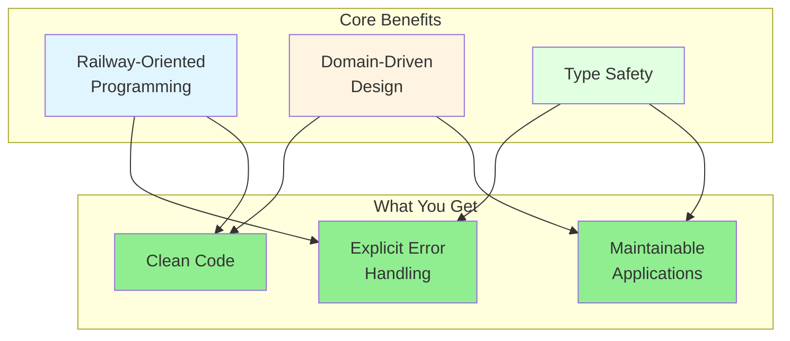
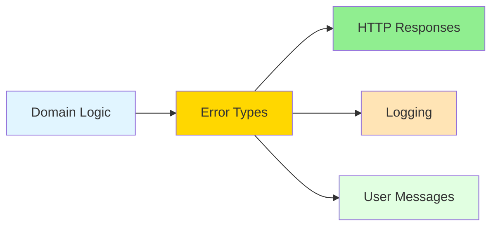
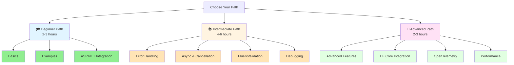

# Introduction

Learn why functional domain modeling with Railway-Oriented Programming makes your code cleaner, safer, and more maintainable.

## Table of Contents

- [Why Use This Library?](#why-use-this-library)
- [Functional Programming](#functional-programming)
- [Domain-Driven Design](#domain-driven-design)
- [Error Types](#error-types)
- [Key Features](#key-features)
  - [Reuse Domain Validation at the API Layer](#reuse-domain-validation-at-the-api-layer)
  - [Pagination Support](#pagination-support)
  - [Avoid Primitive Obsession](#avoid-primitive-obsession)
  - [Async & Cancellation Support](#async--cancellation-support)
  - [Parallel Execution](#parallel-execution)
- [Performance](#performance)
- [Next Steps](#next-steps)

## Why Use This Library?

Building robust applications requires explicit error handling, type safety, and clean code. This library combines **Railway-Oriented Programming** with **Domain-Driven Design** to achieve all three—without sacrificing performance or readability.



## Functional Programming

Railway-Oriented Programming (ROP) is a pattern for explicit error handling that **eliminates nested if-statements** and **makes your code read like a story**.

**The problem with traditional code:**
- ❌ Scattered error checks interrupt the flow
- ❌ Easy to forget a validation step
- ❌ Hard to see the "happy path"
- ❌ Verbose and repetitive

**Instead of this:**
```csharp
// ❌ Traditional approach - 15+ lines, hard to follow the logic
var firstName = ValidateFirstName(input.FirstName);
if (firstName == null) return BadRequest("Invalid first name");

var lastName = ValidateLastName(input.LastName);
if (lastName == null) return BadRequest("Invalid last name");

var user = CreateUser(firstName, lastName);
if (user == null) return BadRequest("Cannot create user");

if (_repository.EmailExists(user.Email))
    return Conflict("Email exists");

_repository.Save(user);
return Ok(user);
```

**You write this:**
```csharp
// ✅ ROP approach - 6 lines that read like English
return FirstName.TryCreate(input.FirstName)
    .Combine(LastName.TryCreate(input.LastName))
    .Bind((first, last) => User.TryCreate(first, last))
    .Ensure(user => !_repository.EmailExists(user.Email), Error.Conflict("Email exists"))
    .Tap(user => _repository.Save(user))
    .Match(onSuccess: user => Ok(user), onFailure: error => BadRequest(error.Detail));
```

**What you gain:**
- 📖 **60% less code** - More readable, less to maintain
- 🎯 **Self-documenting** - Chain reads like a recipe
- 🔒 **Compiler-enforced** - Can't skip error handling
- ✨ **Zero hidden logic** - Every step is visible

👉 **Learn the fundamentals:** [Basics](basics.md) - Complete ROP tutorial with all core operations

## Domain-Driven Design

Build rich domain models with **Aggregates**, **Entities**, and **Value Objects** that enforce business rules and maintain valid state.

**Key DDD building blocks:**
- **Aggregates** - Consistency boundaries with domain events (e.g., `Order`, `Customer`)
- **Entities** - Objects with identity that change over time (e.g., `User`, `Product`)
- **Value Objects** - Immutable objects defined by their values (e.g., `EmailAddress`, `Money`)
- **Scalar Value Objects** - Single-value wrappers with validation (e.g., `FirstName`, `Age`)

**Quick example:**
```csharp
// Value object with validation
public partial class EmailAddress : RequiredString { }

// Use in domain entity
public class User : Entity<UserId>
{
    public EmailAddress Email { get; private set; }
    public FirstName FirstName { get; private set; }
    
    public static Result<User> Create(EmailAddress email, FirstName firstName)
    {
        var user = new User(email, firstName);
        return Validator.ValidateToResult(user);
    }
}
```

👉 **See patterns in action:** [Clean Architecture](clean-architecture.md) - DDD with ROP in layered applications  
👉 **Integrate validation:** [FluentValidation Integration](integration-fluentvalidation.md) - Domain validation patterns

## Error Types

The library provides **11 specialized error types** that automatically map to HTTP status codes, giving you a single source of truth for error handling across your application.



**Common error types:**
- `ValidationError` → 400 Bad Request (with field-level details)
- `NotFoundError` → 404 Not Found
- `UnauthorizedError` → 401 Unauthorized
- `ConflictError` → 409 Conflict
- `DomainError` → 422 Unprocessable Entity

**Example - Discriminated union matching:**
```csharp
return ProcessOrder(order).MatchError(
    onValidation: err => BadRequest(err.FieldErrors),
    onNotFound: err => NotFound(err.Detail),
    onConflict: err => Conflict(err.Detail),
    onSuccess: order => Ok(order)
);
```

👉 **Complete error catalog:** [Error Handling](error-handling.md) - All 11 error types, custom errors, aggregation

## Key Features

The library provides several powerful features that work together to simplify your code:

### Reuse Domain Validation at the API Layer

Domain validation rules automatically translate to HTTP standard error responses. ValidationError becomes BadRequest with detailed errors, NotFoundError becomes HTTP 404. This creates a **single source of truth**, eliminating duplication between domain and API layers.

### Pagination Support

Automatic HTTP header management with proper status codes: 200 (OK) for complete results, 206 (Partial Content) for paginated responses per [RFC 9110](https://www.rfc-editor.org/rfc/rfc9110#field.content-range).

### Avoid Primitive Obsession

Use strongly-typed value objects instead of primitive types. RequiredString provides type-safe string properties with automatic source generation. Additional value object types are available for common scenarios.

**Benefits:**
- **Type safety** - Compiler prevents parameter mix-ups
- **Self-documenting** - `FirstName` vs `string` is clearer
- **Validation once** - Create validated objects, use everywhere
- **Source generation** - Minimal boilerplate

**Example:**
```csharp
// ❌ Easy to swap parameters
Person CreatePerson(string firstName, string lastName);

// ✅ Compiler catches mistakes
Person CreatePerson(FirstName firstName, LastName lastName);
```

See [Basics](basics.md) to learn how to create type-safe value objects.

### Async & Cancellation Support

All async operations support `CancellationToken` for graceful shutdown and request timeouts:

```csharp
await GetCustomerByIdAsync(id, cancellationToken)
   .EnsureAsync(
      (customer, ct) => customer.CanBePromotedAsync(ct),
      Error.Validation("Cannot promote"),
      cancellationToken)
   .TapAsync(
      async (customer, ct) => await customer.PromoteAsync(ct),
      cancellationToken)
   .MatchAsync(
      onSuccess: ok => "Success", 
      onFailure: error => error.Detail,
      cancellationToken: cancellationToken);
```

Learn about async patterns in [Working with Async Operations](basics.md#working-with-async-operations).

### Parallel Execution

Fetch data from multiple sources in parallel while maintaining Railway Oriented Programming style:

```csharp
// Execute multiple async operations in parallel using ParallelAsync
var result = await GetUserAsync(userId, cancellationToken)
    .ParallelAsync(GetOrdersAsync(userId, cancellationToken))
    .ParallelAsync(GetPreferencesAsync(userId, cancellationToken))
    .AwaitAsync()
    .Bind((user, orders, preferences) => 
        Result.Success(new UserProfile(user, orders, preferences)));
```

See [Advanced Features](advanced-features.md) for parallel operations, LINQ syntax, and more.

## Performance

The library adds only **~11-16 nanoseconds** of overhead compared to imperative code—less than 0.002% of typical I/O operations. You get cleaner, more maintainable code with virtually zero performance cost.

**Typical operation costs:**

```mermaid
%%{init: {'theme':'base'}}%%
gantt
    title Operation Time Comparison (Log Scale)
    dateFormat X
    axisFormat %s
    
    section I/O Operations
    HTTP Request (10-100ms)    :milestone, 100000000, 0
    Database Query (1-10ms)    :milestone, 10000000, 0
    
    section Library Overhead
    ROP Overhead (11-16ns)     :milestone, 16, 0
```



| Operation | Time (nanoseconds) | Relative Cost |
|-----------|-------------------|---------------|
| **HTTP Request** | 10,000,000 - 100,000,000 | 625,000x - 6,250,000x |
| **Database Query** | 1,000,000 - 10,000,000 | 62,500x - 625,000x |
| **ROP Overhead** | 11 - 16 | 1x (baseline) |

The overhead is **negligible** compared to real-world I/O operations. See [Performance & Benchmarks](performance.md) for detailed performance analysis.

## Next Steps

Ready to get started? Choose your learning path:



### 🎓 Beginner Path (Start Here!)
**Time:** 2-3 hours | **Goal:** Understand ROP basics and build your first features

1. 📖 **[Basics](basics.md)** - Learn Railway-Oriented Programming fundamentals
   - Result type, Combine, Bind, Map, Tap, Match
   - Safe error handling patterns
   - Complete working examples

2. 💡 **[Examples](examples.md)** - See real-world patterns and code snippets
   - User registration, form validation
   - HTTP response handling
   - Common patterns library

3. 🔗 **[ASP.NET Core Integration](integration-aspnet.md)** - Connect to your API
   - ToActionResult, ToHttpResult
   - Automatic error-to-HTTP mapping
   - MVC and Minimal API examples

### 📚 Intermediate Path
**Time:** 4-6 hours | **Prerequisites:** Basics | **Goal:** Master error handling and async patterns

1. 🚨 **[Error Handling](error-handling.md)** - Discriminated unions, error aggregation
   - Custom error types
   - MatchError patterns
   - ValidationError fluent API

2. ⚡ **[Working with Async Operations](basics.md#working-with-async-operations)** - CancellationToken patterns, timeouts
   - Async operation chains
   - Parallel execution
   - Timeout and retry patterns

3. ✅ **[FluentValidation Integration](integration-fluentvalidation.md)** - Domain validation
   - InlineValidator
   - Async validation rules
   - Reuse domain validation at API layer

4. 🔍 **[Debugging](debugging.md)** - Tools and techniques for debugging ROP chains
   - Built-in debug extensions
   - OpenTelemetry tracing
   - Common pitfalls and solutions

### 🚀 Advanced Path
**Time:** 2-3 hours | **Prerequisites:** Intermediate | **Goal:** Expert-level patterns and optimization

1. 🎯 **[Advanced Features](advanced-features.md)** - LINQ, parallel operations, Maybe type
   - LINQ query syntax
   - Parallel async operations
   - Pattern matching
   - Exception capture

2. 🏗️ **[Entity Framework Core](integration-ef.md)** - Repository patterns
   - Result-based repositories
   - Async database operations
   - Transaction handling

3. 📊 **[OpenTelemetry Integration](integration-observability.md)** - Observability
   - Automatic ROP tracing
   - Distributed tracing
   - Performance monitoring

4. ⚡ **[Performance](performance.md)** - Optimization and benchmarks
   - Performance characteristics
   - Benchmarking results
   - Optimization tips

### 📚 Reference Materials (Jump to as Needed)

- **[Error Handling Reference](error-handling.md)** - Complete error type catalog
- **[Debugging Guide](debugging.md)** - Troubleshooting and tools
- **[Performance & Benchmarks](performance.md)** - Detailed performance analysis
- **[Integration Guides](integration.md)** - ASP.NET, EF Core, FluentValidation, OpenTelemetry

---

## Quick Links by Experience Level

**Never used functional programming?** Start with [Introduction](intro.md) then [Basics](basics.md)

**Coming from F# or Haskell?** Jump to [Advanced Features](advanced-features.md) and [Examples](examples.md)

**Need to integrate with existing code?** See [Integration](integration.md) and [FluentValidation](integration-fluentvalidation.md)

**Looking for specific patterns?** Check [Examples](examples.md) and [Error Handling](error-handling.md)
