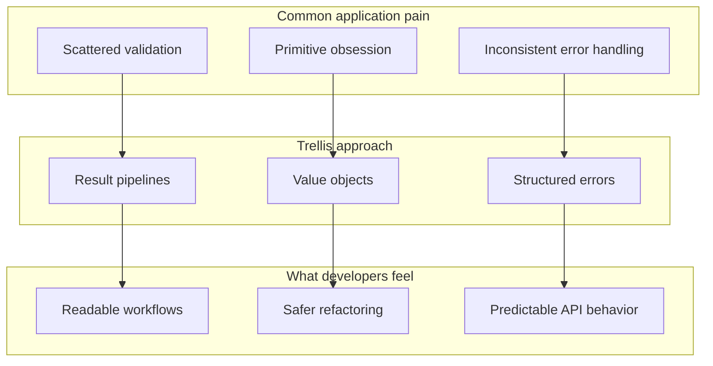
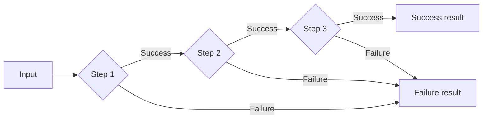

---
title: Introduction
package: Trellis (multiple)
topics: [overview, railway-oriented-programming, ddd, value-objects, error-handling, getting-started]
related_api_reference: [trellis-api-core.md, trellis-api-primitives.md]
last_verified: 2026-05-01
audience: [developer]
---
# Introduction

Trellis is for the moment when your codebase has outgrown "just use strings and throw exceptions." It gives you a structure for writing application code that stays readable as validation, business rules, persistence, and HTTP concerns pile up.

## Table of Contents

- [Why Trellis?](#why-trellis)
- [Start with a concrete problem](#start-with-a-concrete-problem)
- [Railway-Oriented Programming](#railway-oriented-programming)
- [Domain-Driven Design without ceremony](#domain-driven-design-without-ceremony)
- [Error types that carry intent](#error-types-that-carry-intent)
- [Why this works well in real systems](#why-this-works-well-in-real-systems)
- [Performance](#performance)
- [Next steps](#next-steps)

## Why Trellis?

The short answer: **Trellis helps you express business rules directly in code without losing control of errors.**

Most application code becomes hard to read for three predictable reasons:

1. **Validation is scattered** across controllers, services, and database checks.
2. **Primitives hide meaning** so `string`, `Guid`, and `int` get passed around with no protection.
3. **Failure handling interrupts the happy path** with nested `if` statements, null checks, and exception plumbing.

Trellis combines **Railway-Oriented Programming (ROP)** and **Domain-Driven Design (DDD)** so those concerns become part of the structure instead of ad-hoc conventions.


```mermaid
graph TB
    subgraph Problems[Common application pain]
        A[Primitive obsession]
        B[Scattered validation]
        C[Inconsistent error handling]
    end

    subgraph Trellis[Trellis approach]
        D[Value objects]
        E[Result pipelines]
        F[Structured errors]
    end

    subgraph Outcomes[What developers feel]
        G[Readable workflows]
        H[Safer refactoring]
        I[Predictable API behavior]
    end

    A --> D
    B --> E
    C --> F
    D --> H
    E --> G
    F --> I
```

## Start with a concrete problem

The easiest way to understand Trellis is to start with code you probably already have.

**Problem:** You need to register a user, reject invalid fields, block duplicate emails, and send a welcome email only when the save succeeds.

### Traditional flow

```csharp
var firstName = ValidateFirstName(input.FirstName);
if (firstName is null)
    return BadRequest("Invalid first name.");

var lastName = ValidateLastName(input.LastName);
if (lastName is null)
    return BadRequest("Invalid last name.");

var email = ValidateEmail(input.Email);
if (email is null)
    return BadRequest("Invalid email.");

if (_repository.EmailExists(email))
    return Conflict("Email already registered.");

var user = new User(firstName, lastName, email);
_repository.Save(user);
_emailService.SendWelcome(email);

return Ok(user);
```

### Trellis flow

```csharp
using Trellis;

public partial class FirstName : RequiredString<FirstName> { }
public partial class LastName : RequiredString<LastName> { }
public partial class CustomerEmail : RequiredString<CustomerEmail> { }

public sealed record RegisterUserInput(string FirstName, string LastName, string Email);

public sealed record User(FirstName FirstName, LastName LastName, CustomerEmail Email)
{
    public static Result<User> TryCreate(FirstName firstName, LastName lastName, CustomerEmail email) =>
        Result.Ok(new User(firstName, lastName, email));
}

public static Result<User> RegisterUser(
    RegisterUserInput input,
    Func<CustomerEmail, bool> emailExists,
    Action<User> saveUser,
    Action<CustomerEmail> sendWelcomeEmail)
{
    return FirstName.TryCreate(input.FirstName)
        .Combine(LastName.TryCreate(input.LastName))
        .Combine(CustomerEmail.TryCreate(input.Email, fieldName: "email"))
        .Bind((firstName, lastName, email) => User.TryCreate(firstName, lastName, email))
        .Ensure(user => !emailExists(user.Email), new Error.Conflict(null, "conflict") { Detail = "Email already registered." })
        .Tap(saveUser)
        .Tap(user => sendWelcomeEmail(user.Email));
}
```

The important part is not that the code is shorter. The important part is that **the business story is visible**.

- Validate the inputs
- Create the user
- Enforce the duplicate-email rule
- Save
- Send the email

When any step fails, the rest of the chain is skipped automatically.

> [!TIP]
> Start by reading the pipeline left to right. If it reads like a business workflow, you are using Trellis the way it was designed.

## Railway-Oriented Programming

The problem ROP solves is simple: **errors should not force you to rewrite the happy path over and over.**

With Trellis, a `Result<T>` is either a success with a value or a failure with an `Error`. The pipeline operators decide what happens next.


```mermaid
graph LR
    A[Input] --> B{Step 1}
    B -->|Success| C{Step 2}
    B -->|Failure| F[Failure result]
    C -->|Success| D{Step 3}
    C -->|Failure| F
    D -->|Success| E[Success result]
    D -->|Failure| F
```

That gives you a small vocabulary for most workflows:

- **`Combine`** - validate independent inputs together
- **`Bind`** - call the next operation when the current step succeeded
- **`Ensure`** - add a business rule
- **`Tap`** - run a side effect without changing the result
- **`Match`** - turn the final result into a plain value, HTTP response, or message

If you want the hands-on tutorial version, go straight to [Basics](basics.md).

## Domain-Driven Design without ceremony

DDD can become heavy when every concept requires pages of plumbing. Trellis keeps the useful parts and reduces the boilerplate.

### Start with value objects

The problem value objects solve is **meaningless primitives**.

```csharp
using Trellis;

[StringLength(100)]
public partial class FirstName : RequiredString<FirstName> { }

[StringLength(100)]
public partial class LastName : RequiredString<LastName> { }

public sealed record Person(FirstName FirstName, LastName LastName);
```

Now the compiler can protect you from mistakes that `string` never could.

```csharp
Person CreatePerson(FirstName firstName, LastName lastName) =>
    new(firstName, lastName);
```

> [!NOTE]
> For your own scalar value objects, use the generic base classes such as `RequiredString<FirstName>` and `RequiredGuid<OrderId>`. The generic parameter is part of the contract.

### Then grow into aggregates and entities

When the domain gets richer, Trellis gives you `Aggregate<TId>`, `Entity<TId>`, `ValueObject`, and `Specification<T>` so the language in your code can match the language in the business.

That is where order lifecycles, payment rules, and customer policies start feeling natural instead of bolted on.

For deeper DDD guidance, see [Clean Architecture](clean-architecture.md) and [Aggregate Factory Pattern](aggregate-factory-pattern.md).

## Error types that carry intent

The problem with plain strings and generic exceptions is that they tell humans something went wrong but tell the program almost nothing useful.

Trellis uses concrete error types such as:

- `Error.InvalidInput`
- `Error.NotFound`
- `Error.Conflict`
- `Error.Forbidden`
- `Error.Unexpected`

Each one carries intent, and the defaults map naturally to HTTP semantics.

| Factory | Default `Kind` | Typical meaning |
| --- | --- | --- |
| `new Error.InvalidInput(EquatableArray<FieldViolation>.Empty) { Detail = ... }` | `unprocessable-content` | Input or rule validation failed |
| `new Error.NotFound(ResourceRef.For<Order>("42")) { Detail = ... }` | `not-found` | The resource does not exist |
| `new Error.Conflict(ResourceRef.For<Order>("42")) { Detail = ... }` | `conflict` | Current state prevents the operation |
| `new Error.Forbidden("policy.id") { Detail = ... }` | `forbidden` | Caller is authenticated but not allowed |
| `new Error.Unexpected("unexpected_fault", "fault-id") { Detail = ... }` | `internal-server-error` | Something unplanned failed |

> The `Kind` column shows the `Error.Kind` constant the case exposes; this is what the closed-ADT pattern-match dispatches on. See [`error-handling.md`](error-handling.md) for the full case catalog and HTTP-status mapping.

```csharp
using Trellis;

var message = new Error.NotFound(ResourceRef.For("Order", "42")) { Detail = "Order not found." } == new Error.NotFound(ResourceRef.For("Customer", "17")) { Detail = "Customer not found." }
    ? "Same programmatic error code"
    : "Different error code";
```

That comparison returns the first branch because **`Error.Equals` compares only `Code`**.

> [!WARNING]
> Do not treat `Error.Equals` as a comparison of the full message. It is intentionally code-based equality.

If you want a full catalog of error types and HTTP mappings, read [Error Handling](error-handling.md).

## Why this works well in real systems

The value of Trellis becomes clearer as your application grows.

### Reuse domain rules at the edge

You can validate in the domain and reuse those failures at the API layer instead of duplicating rules in controllers. See [FluentValidation Integration](integration-fluentvalidation.md) and [ASP.NET Core Integration](integration-aspnet.md).

### Keep async code readable

Async flows still read left to right with `BindAsync`, `TapAsync`, and `MatchAsync`. You do not have to abandon the model once I/O enters the picture. See [Basics](basics.md#working-with-async-operations).

### Give AI and humans the same rails

Trellis works well for AI-assisted development because the framework encourages explicit structure:

- inputs become value objects
- workflows become result pipelines
- failures become typed errors
- endpoints become thin adapters over domain logic

That is useful for generators, but it is even more useful for the humans who maintain the code later.

## Performance

The framework cost is tiny compared to network calls, database queries, or serialization. Trellis is designed so you can choose clarity without paying a meaningful runtime penalty for ordinary application work.

For benchmark details, see [Performance](performance.md).

## Next steps

Choose the path that matches what you need right now:

- **I want to learn the syntax** -> [Basics](basics.md)
- **I want copy-pasteable scenarios** -> [Examples](examples.md)
- **I am building APIs** -> [ASP.NET Core Integration](integration-aspnet.md)
- **I want the full surface area** -> [API Documentation](../api/index.md)
