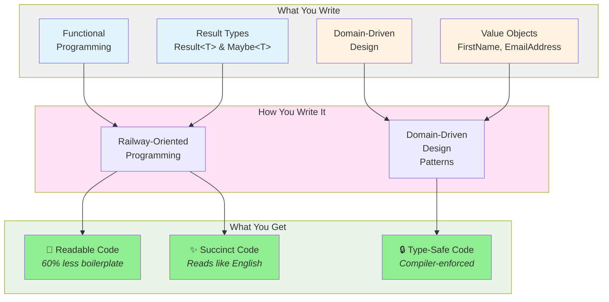
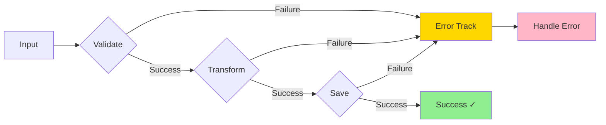

# Functional Programming with Domain-Driven Design

**Build robust, type-safe applications** with Railway-Oriented Programming and Domain-Driven Design—combining the best of functional programming with clean architecture principles.



## Why This Library?

Traditional error handling creates **nested if-statements** and **scattered error checks** that make code hard to read and maintain. This library provides a better way: **write less code that reads like English**.

### Before: Traditional Approach ❌

```csharp
// 20 lines of repetitive error checking - easy to miss a check!
var firstName = ValidateFirstName(input.FirstName);
if (firstName == null) return BadRequest("Invalid first name");

var lastName = ValidateLastName(input.LastName);
if (lastName == null) return BadRequest("Invalid last name");

var email = ValidateEmail(input.Email);
if (email == null) return BadRequest("Invalid email");

var user = CreateUser(firstName, lastName, email);
if (user == null) return BadRequest("Cannot create user");

if (!_repository.EmailExists(email))
{
    return Conflict("Email already registered");
}

_repository.Save(user);
_emailService.SendWelcome(user.Email);

return Ok(user);
```

### After: Railway-Oriented Programming ✅

```csharp
// 8 lines - reads like a story: validate → create → check → save → notify
return FirstName.TryCreate(input.FirstName)
    .Combine(LastName.TryCreate(input.LastName))
    .Combine(EmailAddress.TryCreate(input.Email))
    .Bind((first, last, email) => User.TryCreate(first, last, email))
    .Ensure(user => !_repository.EmailExists(user.Email), Error.Conflict("Email registered"))
    .Tap(user => _repository.Save(user))
    .Tap(user => _emailService.SendWelcome(user.Email))
    .Match(onSuccess: user => Ok(user), onFailure: error => BadRequest(error.Detail));
```

**Result:** 
- 📖 **60% less code** - 8 lines vs 20 lines
- 🎯 **Reads like English** - "Create name, combine with email, create user, ensure unique, save, notify"
- ✨ **Zero hidden logic** - Every step visible in the chain
- 🔒 **Impossible to forget** - Can't skip error handling steps
- ⚡ **Zero performance cost** - Only 11-16 nanoseconds overhead

---

## Core Types

### Result&lt;T&gt; — Success or Failure

The foundation of Railway-Oriented Programming. A `Result<T>` represents either a **successful value** or an **error**—never null, never ambiguous.

```csharp
// Create results
Result<User> success = user;                           // Implicit conversion
Result<User> failure = Error.NotFound("User not found"); // From error

// Safe access
if (result.TryGetValue(out var user))
    Console.WriteLine(user.Name);

// Pattern matching
var message = result.Match(
    onSuccess: user => $"Hello, {user.Name}!",
    onFailure: error => $"Error: {error.Detail}"
);
```

### Maybe&lt;T&gt; — Optional Values

Represents a value that **may or may not exist**—eliminating null reference exceptions.

```csharp
Maybe<string> name = "John";           // Has value
Maybe<string> noName = Maybe.None<string>();  // No value

string greeting = name.GetValueOrDefault("Guest");  // "John"
if (name.TryGetValue(out var value))
    Console.WriteLine(value);
```

---

## Domain-Driven Design Building Blocks

### Value Objects — Immutable, Validated Types

Replace primitive strings and ints with **type-safe domain concepts**. The compiler catches mistakes that runtime never would.

```csharp
// Define once with the source generator
public partial class FirstName : RequiredString { }
public partial class LastName : RequiredString { }

// Compiler prevents parameter mix-ups
CreateUser(lastName, firstName);  // ❌ Compile error!
CreateUser(firstName, lastName);  // ✅ Correct
```

### Entities — Identity-Based Objects

Objects with a **unique identity** that persists through state changes.

```csharp
public class Customer : Entity<CustomerId>
{
    public FirstName Name { get; private set; }
    
    public Result<Customer> UpdateName(FirstName newName) =>
        newName.ToResult()
            .Tap(name => Name = name)
            .Map(_ => this);
}
```

### Aggregates — Consistency Boundaries

**Cluster related objects** and enforce business rules. Aggregates raise **domain events** to communicate changes.

```csharp
public class Order : Aggregate<OrderId>
{
    public Result<Order> Submit() =>
        this.ToResult()
            .Ensure(_ => Lines.Any(), Error.Validation("Order must have items"))
            .Tap(_ => {
                Status = OrderStatus.Submitted;
                DomainEvents.Add(new OrderSubmittedEvent(Id));
            });
}
```

---

## Rich Error Types

Structured errors that map naturally to HTTP status codes and enable **precise error handling**.

```csharp
// Built-in error types
Error.Validation("Email is required", "email")  // 400 Bad Request
Error.NotFound("User not found")                // 404 Not Found  
Error.Conflict("Email already exists")          // 409 Conflict
Error.Unauthorized("Please login")              // 401 Unauthorized
Error.Forbidden("Access denied")                // 403 Forbidden
Error.Domain("Insufficient balance")            // 422 Unprocessable

// Pattern match on error types
result.MatchError(
    onValidation: err => BadRequest(err.FieldErrors),
    onNotFound: err => NotFound(err.Detail),
    onConflict: err => Conflict(err.Detail),
    onSuccess: order => Ok(order)
);
```

---

## Key Operations at a Glance

| Operation | Track | Purpose | Example |
|-----------|-------|---------|---------|
| **Bind** | 🟢 Success | Chain operations that can fail | `.Bind(user => ValidateAge(user))` |
| **Map** | 🟢 Success | Transform success values | `.Map(user => user.Name)` |
| **Tap** | 🟢 Success | Side effects (logging, saving) | `.Tap(user => _repo.Save(user))` |
| **TapOnFailure** | 🔴 Failure | Side effects on errors | `.TapOnFailure(err => _logger.LogError(err))` |
| **MapOnFailure** | 🔴 Failure | Transform errors | `.MapOnFailure(err => AddContext(err))` |
| **RecoverOnFailure** | 🔴 Failure | Recover from errors | `.RecoverOnFailure(() => GetDefault())` |
| **Ensure** | 🟢→🔴 | Validate conditions | `.Ensure(u => u.Age >= 18, Error.Validation("Too young"))` |
| **Combine** | ✅ Both | Merge multiple results | `.Combine(lastName).Combine(email)` |
| **Match** | ✅ Terminal | Handle success/failure | `.Match(onSuccess: Ok, onFailure: BadRequest)` |

**Track Legend:**
- 🟢 **Success** - Only runs when result is successful
- 🔴 **Failure** - Only runs when result is a failure  
- ✅ **Both/Terminal** - Runs on both tracks or handles both

**Naming Pattern:** Success track operations have **no suffix**. Failure track operations have **`OnFailure` suffix**.

All operations have **async variants** (`BindAsync`, `MapAsync`, `TapOnFailureAsync`, etc.) for seamless async/await support.

---

## Core Concepts

### 🎯 Functional Programming

**Pure functions** take inputs and produce outputs without side effects, making code:
- **Predictable** - Same inputs always produce same outputs
- **Testable** - No hidden dependencies or state
- **Composable** - Functions chain together naturally

**Learn more:** [Applying Functional Principles in C# (Pluralsight)](https://enterprisecraftsmanship.com/ps-func)

### 🚂 Railway-Oriented Programming

**The key insight:** Your code should read like a story, not a maze of if-statements.

Railway-Oriented Programming uses a **railway track metaphor**: operations flow along the success track, automatically switching to the error track when something fails. **You write what should happen, not what could go wrong.**



**Key benefit:** Code reads top-to-bottom like a recipe:
1. Validate input
2. Transform data
3. Save to database
4. Return result

**If any step fails, the rest are skipped automatically.** No `if (error) return` after every line!

### 🏗️ Domain-Driven Design

Model your **business domain** with rich types that enforce rules at compile time:

- **Value Objects** - Immutable, validated primitives (`EmailAddress`, `Money`)
- **Entities** - Objects with identity (`Customer`, `Order`)
- **Aggregates** - Consistency boundaries with domain events

**Learn more:** [Domain-Driven Design in Practice (Pluralsight)](https://app.pluralsight.com/library/courses/domain-driven-design-in-practice/table-of-contents)

---

## Get Started

```bash
# Core library - Railway Oriented Programming
dotnet add package FunctionalDDD.RailwayOrientedProgramming

# Domain-Driven Design - Entities, Aggregates, Value Objects
dotnet add package FunctionalDDD.DomainDrivenDesign

# ASP.NET Core integration - ToActionResult, ToHttpResult
dotnet add package FunctionalDDD.Asp

# Value objects with source generator - RequiredString, etc.
dotnet add package FunctionalDDD.CommonValueObjects
dotnet add package FunctionalDDD.CommonValueObjectGenerator
```

**Ready to dive deeper?** Check out the [Introduction](articles/intro.md) or browse the [API Documentation](api/index.md).
