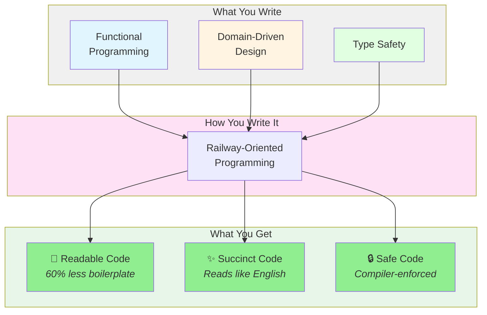
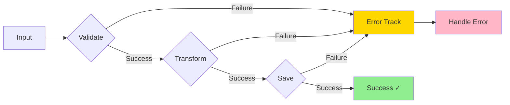

# Functional Programming with Domain-Driven Design

**Build robust, type-safe applications** with Railway-Oriented Programming and Domain-Driven Design—combining the best of functional programming with clean architecture principles.



## Why This Library?

Traditional error handling creates **nested if-statements** and **scattered error checks** that make code hard to read and maintain. This library provides a better way: **write less code that reads like English**.

### Before: Traditional Approach ❌

```csharp
// 20 lines of repetitive error checking - easy to miss a check!
var firstName = ValidateFirstName(input.FirstName);
if (firstName == null) return BadRequest("Invalid first name");

var lastName = ValidateLastName(input.LastName);
if (lastName == null) return BadRequest("Invalid last name");

var email = ValidateEmail(input.Email);
if (email == null) return BadRequest("Invalid email");

var user = CreateUser(firstName, lastName, email);
if (user == null) return BadRequest("Cannot create user");

if (!_repository.EmailExists(email))
{
    return Conflict("Email already registered");
}

_repository.Save(user);
_emailService.SendWelcome(user.Email);

return Ok(user);
```

### After: Railway-Oriented Programming ✅

```csharp
// 8 lines - reads like a story: validate → create → check → save → notify
return FirstName.TryCreate(input.FirstName)
    .Combine(LastName.TryCreate(input.LastName))
    .Combine(EmailAddress.TryCreate(input.Email))
    .Bind((first, last, email) => User.TryCreate(first, last, email))
    .Ensure(user => !_repository.EmailExists(user.Email), Error.Conflict("Email registered"))
    .Tap(user => _repository.Save(user))
    .Tap(user => _emailService.SendWelcome(user.Email))
    .Match(onSuccess: user => Ok(user), onFailure: error => BadRequest(error.Detail));
```

**Result:** 
- 📖 **60% less code** - 8 lines vs 20 lines
- 🎯 **Reads like English** - "Create name, combine with email, create user, ensure unique, save, notify"
- ✨ **Zero hidden logic** - Every step visible in the chain
- 🔒 **Impossible to forget** - Can't skip error handling steps
- ⚡ **Zero performance cost** - Only 11-16 nanoseconds overhead

## Core Concepts

This library combines three powerful approaches that work better together:

### 🎯 Functional Programming

**Pure functions** take inputs and produce outputs without side effects, making code:
- **Predictable** - Same inputs always produce same outputs
- **Testable** - No hidden dependencies or state
- **Composable** - Functions chain together naturally

**Learn more:** [Applying Functional Principles in C# (Pluralsight)](https://enterprisecraftsmanship.com/ps-func)

### 🚂 Railway-Oriented Programming

**The key insight:** Your code should read like a story, not a maze of if-statements.

Railway-Oriented Programming uses a **railway track metaphor**: operations flow along the success track, automatically switching to the error track when something fails. **You write what should happen, not what could go wrong.**



**Key benefit:** Code reads top-to-bottom like a recipe:
1. Validate input
2. Transform data
3. Save to database
4. Return result

**If any step fails, the rest are skipped automatically.** No `if (error) return` after every line!